# Architecture — Document-Generation Pipeline (studio.runner and collaborators)

**Date:** 2026-07-03
**Scope:** `backend/studio/runner.py` (~3419 lines when originally traced; **4352 lines** as of
2026-07-03 after WORKLOG entries 157-165 and then 166/176/177 landed — see §10's drift note) +
immediate collaborators (`epoch_gate.py`, `section_workspace.py`, `tools.py`, `task_runs.py`,
`rubric.py`, `artifact_lint.py`, `findings.py`, `prompts.py`, `report_quality.py`, `relevance.py`,
`requirement_compliance.py`, `markdown_format.py`).
**Purpose:** a detailed, code-traced process map for review — accuracy over polish.
Every box cites `file.py:line` so you can jump to the real code.

> **This revision (2026-07-03) folds in three post-trace change waves**, re-traced against the
> current source: **entry 166** (mid-run death → partial-state persistence — new §5c, plus §1/§2
> touch-ups), **entry 176** (`strip_unverified_lines` at both neutralize call sites, the
> diagram-shaped compliance downgrade, and read-only-streak forcing in `ToolAugmentedClient.chat`),
> and **entry 177** (`_prefetch_cited` cross-thread grounding recovery). Line cites inside boxes
> NOT touched by these three waves were not individually re-walked and remain subject to §10's
> drift note.

> **Concurrent-work caveat.** This was traced off the `build-research-report-generator-plan`
> branch while a separate agent is mid-edit on the *relevance-refinement / publish-readiness*
> feature. The **deterministic publish gate** (`report_quality.evaluate_publish_readiness`,
> `report_quality.py:241`), the **publish-revision pass** (`runner.py:2952-3073`), profile-based
> templates + score-profile changes (`rubric.py`), and section-ownership tweaks are all part of
> that landing feature. Diagrams reflect the code **as read on 2026-07-02**; the publish-gate /
> revision boxes in the post-run chain are the most likely to shift under you.

---

## 0. Terminology map (read this first)

The word "reducer" and the roles are used loosely in conversation. Precise mapping to real code:

| Conversational name | Real code | What it actually is |
|---|---|---|
| **Orchestrator** | `Runner._run_phase_loop` (`runner.py:1841`) + `agentkit.topology.dynamic.run_plan` (called `runner.py:2172`) | Studio's per-phase driver. Walks the plan DAG one step at a time, builds a single-step sub-plan per phase, and delegates the *actual* fan-out to `run_plan`. |
| **Hub** | The STAR/MESH coordinator **inside** `run_plan` (external `agentkit.topology.*`) | NOT a separate Studio object. Studio only feeds it an *executor* system-prompt (`prompts._build_executor_prompt`) + `worker_foci`. The "hub CoT" prompt was deliberately replaced by executor framing (`runner.py:2034-2050`). |
| **Worker / Executor / spoke** | The per-section agent run by `run_plan`, driven by `ToolAugmentedClient` (`tools.py:601`, loop `chat` at `tools.py:665`) | Goal-*bounded* (sees the goal for search relevance only), additive-only, emits `RESEARCH_FINDING` blocks. Tools default to **web_search + web_fetch only** (`tools.py:577`). The shared `chat` loop has a **read-only-streak forcing** mechanism (entry 176, `tools.py:696-782`) but it only arms when a *write* tool is offered (`_write_names = names & _WRITE_TOOL_NAMES`, `tools.py:695`); spokes get no write tool, so it never fires for them — it forces the **editor** (§7), which carries `patch_artifact`/`edit_file`, to commit an edit after `max(2, max_iters//2)` consecutive read-only turns instead of re-reading forever. |
| **Reducer (a) — the deterministic one** | `findings._make_section_reducer` (`findings.py:177`) → `reduce_patches` + `section_workspace.assemble_artifact_from_sections` (`section_workspace.py:178`) | Non-LLM section merge. Folds `RESEARCH_FINDING` blocks into `sections/*.md`, then assembles `artifact.md`. Additive-only; runs **every phase**. This is what the codebase's own docstrings call "the section-aware reducer". Before parsing findings it calls `_prefetch_cited(drafts)` (entry 177, `findings.py:100`, called `findings.py:290`) to re-fetch cited-but-uncached URLs into the reducer thread's fetch cache so the grounding gate does not drop real findings (§5's Reducer (a) note). |
| **Reducer (b) — the "editor phase"** | `_run_editor_pass` (`runner.py:1133`) | NEW goal-aware LLM quality pass. Patch-based (`patch_artifact`), ≤2 rounds, full-revert-on-regression. **Conditional** (gated on rubric matrix + tools + artifact). Colloquially called "the reducer" in conversation but is a distinct, LLM, edit-based stage. |
| **The LLM refine inside reducer (a)** | `_refine_fn` / `_build_reducer_refine_prompt` (`runner.py:2559`, `prompts.py:264`) | An *optional* Phase-2 whole-doc echo, **gated to docs ≤ 8 000 chars** (`runner.py:2553`). Large docs skip it (echo truncates them). |

The `agentkit.topology.*` package is external/unresolvable via pyright, but the call sites in
`runner.py` (`assign_topologies_with_choices` `runner.py:1268`, `run_plan(... reducer=_reducer)`
`runner.py:2172`) fully determine how it is used.

---

## 1. Top-level overview

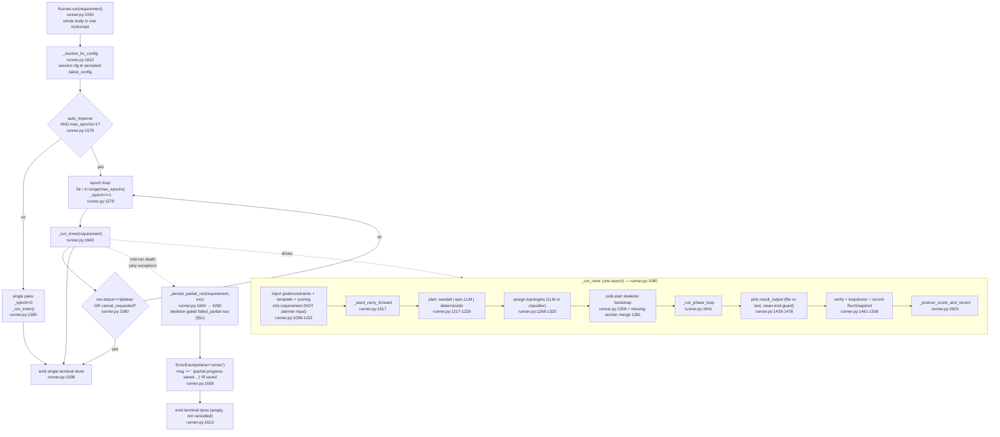

**Conditions that matter.**
- The epoch loop (`runner.py:1578`) only engages when **both** `auto_improve` is truthy **and**
  `max_epochs > 1`. Otherwise `_epoch = 0` (single pass, step-ids un-prefixed for back-compat).
- Stop is on **plateau OR cancel only** — NOT on `"converged"`. The long comment at
  `runner.py:1582-1589` documents the "1+1 ≠ 2 epochs" trap: `"converged"` is derived from the
  *cumulative all-time version* (`next_version = MAX(version)+1`), which fires on epoch 1 of any
  task with history. `_epoch_status` (`planning._epoch_status`, called `runner.py:3241`) uses the
  **per-run** epoch index to avoid that.
- The terminal `done` event is emitted **once**, in `run()` after the loop (`runner.py:1598`) — it
  was deliberately moved out of `_run_inner`. Each epoch stashes `self._last_result` /
  `self._last_cancelled` (`runner.py:1613`).
- **Entry 166 — the whole `run()` body is one `try/except` (`runner.py:1573/1601`).** Any
  exception that unwinds past the epoch loop (a backend death mid-generation) now routes through
  `_persist_partial_run` (`runner.py:1604`) BEFORE the `ErrorEvent` and a final empty terminal
  `done` (`runner.py:1608-1610`) — so partial research is snapshotted for carry-forward instead of
  lost (§5c). The `ErrorEvent` message is suffixed `" (partial progress saved for carry-forward)"`
  only when a row was actually written.

---

## 2. Seed-source precedence (the branch that decides cold-start vs improvement)

All of this lives in `_seed_carry_forward` (`runner.py:1617`), gated on `_hc_cfg["auto_improve"]`
(`runner.py:1638`). The base task identity is `task_hash(base_identity(_base_requirement))`
(`runner.py:1646`) — the **goal-invariant** base, so attaching a goal/template never forks the lineage.

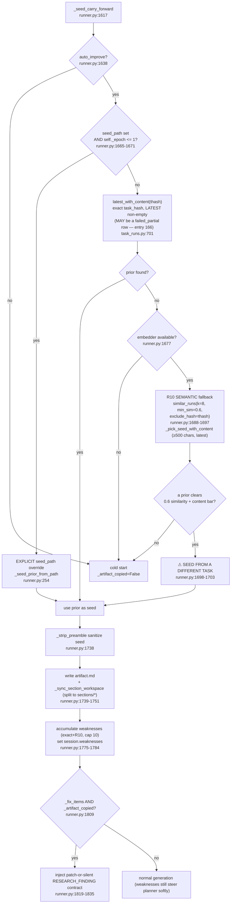

**Precedence order (highest wins):**
1. **Explicit `seed_path`** — but ONLY on `self._epoch <= 1` (`runner.py:1669`). This is the
   session-fixed bug: epoch 2+ must carry forward its **own** prior epoch's result (persisted by
   `_store.record` at the end of the previous epoch) via `latest_with_content`, or every epoch would
   re-seed from the same static file and discard its own progress.
2. **Exact `task_hash`** via `latest_with_content` (`task_runs.py:701`) — the *latest* run with
   non-empty content (NOT best-score; self-eval scores are noisy). Prefers on-disk `artifact.md`,
   falls back to DB `result_text` (workspaces are ephemeral cross-session).
3. **R10 semantic similarity** (`runner.py:1688`) — `similar_runs` cosine over
   `requirement_embedding`, threshold **0.6** (stricter than R10 weakness retrieval's 0.35),
   `_pick_seed_with_content` requires ≥500 chars and prefers the latest.
4. **Cold start** — nothing cleared the bars.

> ### ⚠ ENTRY-166 NUANCE — the seed reader and the lesson readers now diverge on `status`
> `latest_with_content` (precedence #2) deliberately carries **NO `status` filter**
> (`task_runs.py:715`), so it MAY return a `failed_partial` row — that is the whole point of
> partial carry-forward (§5c): a mid-flight death's partial artifact is a strictly better seed than
> a cold start. The lesson/history consumers do the opposite and see **completed rows only**:
> `similar_runs` (`task_runs.py:805`, `AND status = 'completed'`), `accumulated_weaknesses`
> (`task_runs.py:899`, iterates `completed_runs`), `repeat_failures` (`task_runs.py:870`, iterates
> `completed_runs`), and `latest_config` (`task_runs.py:670`). Rationale: a death row carries a
> partial *document* worth seeding, but its (empty) weakness list and `config={"failure": …}` are
> not real hill-climb signal and must not feed the planner or the epoch-budget lookup.

> ### ⚠ FLAGGED RISK — R10 cross-task seed contamination (`runner.py:1686-1703`)
> When there is no exact-hash prior, the run will **seed a whole artifact from a *different* task**
> whose requirement embeds ≥0.6 similar. The downstream Phase-1 keep/discard gate is
> **topic-blind** (§6), so an off-topic-but-structurally-strong seed can be kept on rubric grounds
> alone. Confirmed a real contamination risk this session. The 0.6 threshold + content bar mitigate
> but do not eliminate it. Worth auditing: what happens when two loosely-related report tasks share
> a Studio DB.
>
> **Mitigations shipped this session** (WORKLOG entries 159-162, 165 — see §2b below and §4's
> repair-clause detail): a per-section binary LLM relevance check + repair clause, a coarser
> whole-document seed gate that can drop the seed entirely before generation starts, an
> unconditional cross-task-seed adaptation notice independent of classifier detection, and a
> `relevance_checked` DB flag that deprioritizes unchecked historical runs as future R10 seed
> candidates. None of these make the R10 threshold itself topic-aware — they are defense-in-depth
> around it, not a fix to the gate's fundamental topic-blindness.

---

## 2b. Coarse whole-document seed-relevance gate (WORKLOG entry 161)

A NEW, earlier, cheaper defense that sits BEFORE the seed is ever written into the workspace —
distinct from, and additive to, the per-section `relevance_issues()` check that runs every epoch
inside `_run_phase_loop` (§5, `runner.py:2078-2111`).

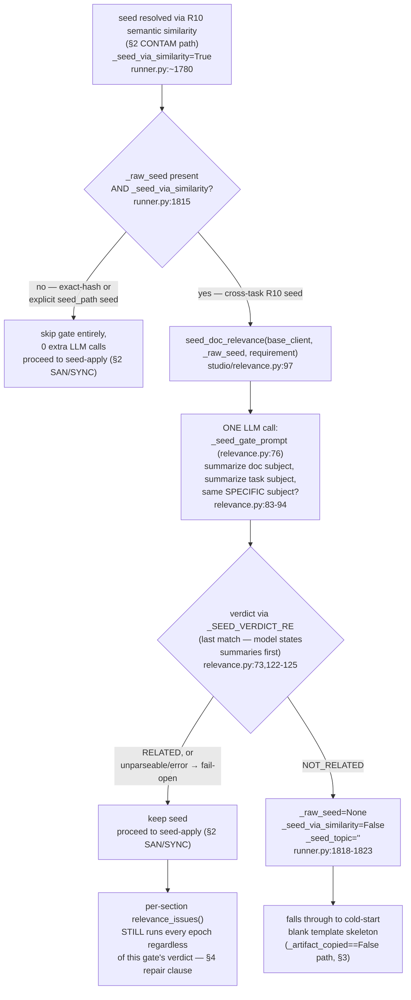

**Conditions that matter.**
- Fires exactly ONCE, at seed-resolution time in `_seed_carry_forward` (`runner.py:1806-1823`),
  BEFORE epoch 1's worker/orchestrator ever runs — not inside the phase loop. Epochs 2+ reuse
  epoch 1's own output via the existing `_epoch <= 1` guard, so this gate never re-fires
  mid-hill-climb.
- Gated strictly on `_seed_via_similarity` (the R10 cross-task flag) — an exact-`task_hash` seed
  or an explicit `seed_path` override never pays for this LLM call.
- **Fail-open on every error path** (`relevance.py:114-127`): missing client, empty seed/requirement,
  a raised exception, or an unparseable reply all KEEP the seed. A gate failure must never silently
  blank a document.
- **ADDITIVE, not a replacement.** Calibration proved a whole-doc RELATED verdict can coexist with
  real section-level contamination (same-broad-field-different-specific-subject is explicitly a
  known non-goal of this gate — that is exactly what the per-section check still covers). Neither
  `epoch_gate.py` nor the `relevance_issues()` call site were touched by this addition.
- Calibrated on `tmp/probe_coarse_seed_gate.py` against real gemma (10 fixtures × 3 samples = 30
  real samples): 100% recall on cross-field mismatch, 0/6 false-reject across genuine-reuse
  positives (same-subject rehash, reworded requirement, same-task lineage). **NOT yet e2e-validated
  against a live cross-field-seed run** as of WORKLOG entry 161 — only unit-tested.

---

## 3. Cold-start path (no prior artifact)

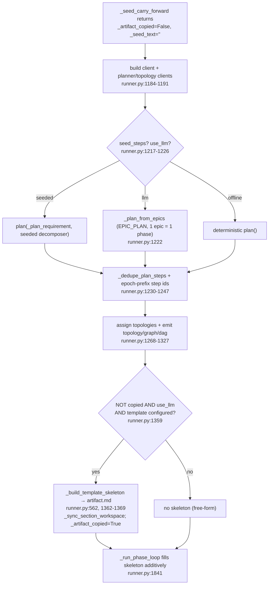

**Conditions that matter.**
- The skeleton bootstrap (`runner.py:1359`) is what makes "create == improve": when a rubric
  **template** exists, a placeholder skeleton is written so the *same* additive section-reducer
  pipeline used for seeded runs has a base to grow. It flips `_artifact_copied=True` even on a cold
  start. Without a configured template, generation is free-form and the section pipeline is largely
  bypassed.
- Planning always runs on `_plan_requirement` (the goal-free base + template/scoring), never on the
  goal-injected `requirement` — see the duplicate-phase "Pi/Craft" comment at `runner.py:1210-1216`.

---

## 4. Seed-based improvement path + Phase-1 keep/discard gate

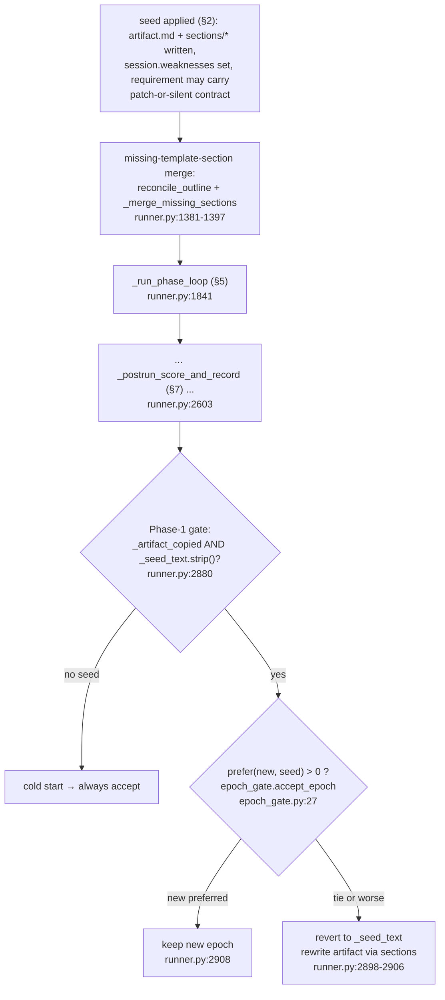

**Conditions that matter.**
- The gate only engages when this epoch actually seeded from a prior (`_artifact_copied` and a
  non-empty `_seed_text`). Cold start always accepts (`epoch_gate.py:38`).
- `accept_epoch` (`epoch_gate.py:27`): no prior → accept; empty-new vs real-prior → reject; else
  accept iff `prefer(new, prior) > 0`. A **tie keeps the prior**.
- Default judge is **deterministic** `make_rubric_preference` (`epoch_gate.py:64`, selected
  `runner.py:2892`): `sign(rubric_score(new) − rubric_score(prior))` with an `eps=0.01` margin.
  The LLM judge `make_preference` (`epoch_gate.py:45`) exists but is **not default** — its own
  docstring (`epoch_gate.py:72-78`) records that an LLM "which is better?" judge *ties a strong
  report with a stub even on sonnet*.

> ### ⚠ KNOWN CHARACTERISTIC — the gate is deterministic and TOPIC-BLIND by design
> `make_rubric_preference` scores structure/citations/length via `rubric.rubric_score`
> (`rubric.py:528`). It never reads the *topic*. Combined with the R10 semantic seed (§2), a
> structurally-strong but off-topic artifact can pass the gate. This is deliberate (the docstring at
> `epoch_gate.py:71-78` explains why: reproducibility beats a flaky LLM judge) — flag it, do not
> "fix" it without accounting for the LLM-judge unreliability it replaced.

> ### ✅ FIXED (WORKLOG entry 158, 2026-07-02) — `_seed_text` gate-baseline clobber
> This box originally described a real bug: `_run_phase_loop`'s last-phase seed block reassigned
> `_seed_text` to the current on-disk `artifact.md` — which by the last phase already held THIS
> epoch's own folded findings — so `epoch_gate.accept_epoch` compared the epoch against itself and
> could never reject a regression. **Fixed and regression-tested this session.** The on-disk read is
> now a LOCAL `_seed_on_disk` variable (`runner.py:2041-2046`), used only by the seed-lint
> (`runner.py:2053-2066`) and cross-task relevance repair clauses (`runner.py:2078-2111`) — its only
> real consumers. The epoch-seed parameter `_seed_text` (the actual carried-forward seed from
> `_seed_carry_forward`, `runner.py:1682`) now flows through to
> `epoch_gate.accept_epoch` (called `runner.py:3079-3090`) untouched. Cold-start behavior is
> unchanged — an empty seed still hits `accept_epoch`'s documented "no prior → accept" branch. Test:
> `test_epoch_gate_baseline_is_the_seed_not_this_epochs_own_output` (seeds a distinctive sentinel
> prior, grounds a fresh epoch-only finding, monkeypatches `accept_epoch` to capture the baseline it
> actually receives, asserts it is the seed not the fresh output; confirmed to fail if the clobber is
> reintroduced).

The seeded seed is sanitized with `_strip_preamble` before `_seed_len` is measured
(`runner.py:1738`) — the seed-shrink bug (a lossless split→assemble round-trip that used to collapse
a 22K seed to ~5K) is **resolved** by the `_sync_section_workspace` call at `runner.py:1751`.

---

## 5. Phase loop — orchestrator + roles (`_run_phase_loop`, runner.py:1841)

```mermaid
flowchart TD
    L0["for step in plan_obj.steps<br/>runner.py:1875"] --> L1{"cancel_requested?"}
    L1 -->|yes| LEND["break → cancelled=True"]
    L1 -->|no| L2["emit phase_start / router / memory.recall<br/>runner.py:1885-1891"]
    L2 --> L3["fold upstream: [dep] outputs[dep]<br/>runner.py:1894"]
    L3 --> L4{"_worker_phase?<br/>_lc set AND topo in (STAR,MAP,MESH)<br/>runner.py:1911"}

    L4 -->|worker phase| W1["build EXECUTOR prompt (goal-bounded)<br/>prompts._build_executor_prompt<br/>runner.py:2046 / prompts.py:205"]
    W1 --> W2["build section assignment queue (one file/worker)<br/>build_section_assignment_rows<br/>runner.py:2112-2124"]
    W2 --> W3["inject DETERMINISTIC section reducer (a)<br/>_make_section_reducer<br/>runner.py:2160 / findings.py:147"]

    L4 -->|final SINGLE/PIPELINE| F1["_final_step_instruction OR seeded EXECUTOR desc<br/>runner.py:1919-2010"]

    W3 --> RP["run_plan(sub_plan, client, reducer=_reducer,<br/>max_workers, max_agents)<br/>runner.py:2172"]
    F1 --> RP
    RP --> RPX["HUB + spokes run INSIDE run_plan (external agentkit)<br/>spokes = ToolAugmentedClient, tools=web_search/web_fetch<br/>tools.py:577"]
    RPX --> OUT["outputs[step.id]=sr.output; final_output=sr.output<br/>runner.py:2190"]
    OUT --> G1{"_phase_search_failed?<br/>runner.py:2196"}
    G1 -->|yes| GE1["emit search-availability FAIL gate (no regression)"]
    OUT --> RATCHET{"WRITEBACK RATCHET:<br/>_artifact_copied AND len&gt;0 AND<br/>accept_rewrite(old, candidate)?<br/>runner.py:2270"}
    RATCHET -->|accept| WB["_write_artifact_through_sections<br/>_seed_len=len(new)<br/>runner.py:2274-2279"]
    RATCHET -->|reject| WBR["keep prior doc (a sourced section was gutted)<br/>runner.py:2282"]
    WB --> NORM["normalize_artifact + strip placeholders (clean, never grow)<br/>runner.py:2292-2304"]
    WBR --> NORM
    NORM --> COV["verify_assignment_coverage → unmet = next-epoch weaknesses<br/>runner.py:2311-2336"]
    COV --> PSC["per-phase rubric scorecard → remaining_scoring_matrix,<br/>prepend phase weaknesses to session.weaknesses<br/>runner.py:2340-2368"]
    PSC --> PD["emit phase_done / dag / evolve / gate; ledger.mark_done<br/>runner.py:2377-2512"]
    PD --> GOAL{"session.goal set AND check_goal.met?<br/>runner.py:2515"}
    GOAL -->|met| LEND
    GOAL -->|no| L0

    LEND --> POST["POST-LOOP atomic patch-apply<br/>runner.py:2530-2600"]
    POST --> PP["reduce_patches(cur, PATCHES + RESEARCH_FINDING→patches)<br/>runner.py:2540-2572"]
    PP --> PPG{"_rr.text AND len &gt;= _seed_len?<br/>runner.py:2575"}
    PPG -->|yes| PPW["write_artifact"]
    PPG -->|no| PPK["keep prior (anti-regression)"]
    PPW --> GAPS["_detect_gaps → non-last: ledger tasks;<br/>last: _reducer_gaps → next-run weaknesses<br/>runner.py:2583-2600"]
    PPK --> GAPS
```

**Roles as they actually execute here.**
- **Orchestrator** = this loop. It never talks to an LLM directly for content; it constructs a
  `Plan(task, steps=(sub_step,))` (`runner.py:2014`) per phase and hands it to `run_plan`.
- **Worker/executor spokes** run *inside* `run_plan`. Studio controls them only through (1) the
  executor system prompt prepended to `sub_step.description` (`runner.py:2051-2054`), (2)
  `worker_foci` (`runner.py:2124`), and (3) the injected reducer. Their tool surface is
  **web_search + web_fetch** (`tools.py:577`; workers get no artifact/file write in the fan-out
  path). They are goal-*bounded*, not fully goal-blind: `_build_executor_prompt` gives them the goal
  "for search relevance and WHY" only (`prompts.py:228`), and the global TASK is **not** prepended
  for worker phases (`runner.py:1912`, gated on the same `_worker_phase` flag).
- **Reducer (a)** = the injected `_reducer` closure (`runner.py:2160`). Additive-only, patch-based,
  runs under **every** topology (the force-STAR override was deleted — `runner.py:1294`).
- **Reducer (a) grounding recovery (entry 177).** Because the per-run fetch cache is now
  `contextvars`-scoped (entry 165, §9 item 8), a spoke's fetches live in the spoke thread and are
  **invisible** to the reducer thread — so the reducer's grounding gate (`_parse_findings`,
  `findings.py:395`, which accepts a finding only if its URL/quote is in `_fetch_cache`,
  `findings.py:407`) was dropping real, correctly-cited findings. The reducer now calls
  `_prefetch_cited(drafts)` (`findings.py:100`, invoked at `findings.py:290`) at the top of the
  merge: `_cited_urls` (`findings.py:71`) harvests every cited URL from the drafts — plain
  `URL:` lines **and** JSON-shaped `{"RESEARCH_FINDING": {"URL": …}}` blocks (oMLX/qwen) — and it
  re-fetches up to `_PREFETCH_LIMIT = 24` (`findings.py:68`, raised 8→24) into the reducer thread's
  own cache so the grounding gate sees them. It always attempts prefetch regardless of current
  cache state — a non-empty cache seeded by the reducer's own `client.chat()` makes `cache_active`
  True without holding the spokes' real URLs, which is exactly the miss this fixes. A 404 or
  fabricated URL still fails to fetch and is still dropped.

**The `accept_rewrite` writeback ratchet (`runner.py:2270`).** This is the per-phase additive-only
guard. `accept_rewrite(old, candidate)` (from `agentkit.artifacts.sections`) ACCEPTs a rewrite —
even a shorter one — as long as no section that *had content* is deleted or gutted; otherwise the
phase's output is REJECTED and the prior doc kept (`runner.py:2282`). This replaced the old
whole-doc `len >= _seed_len` rule that blocked all dedup/repair. Note the **post-loop** patch apply
(`runner.py:2575`) still uses the cruder `len >= _seed_len` guard.

---

## 5b. Heading-level standardization at the section-fold boundary (WORKLOG entry 162)

A root-caused, regression-tested fix inside `split_artifact_to_sections`
(`section_workspace.py:94`), the entry point reducer (a)'s output passes through on its way into
`sections/*.md`.

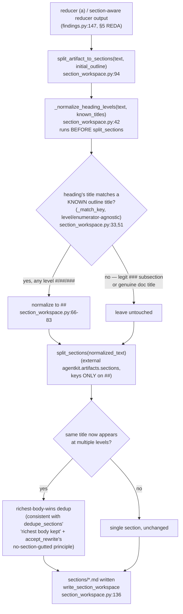

**The bug this fixes (real live evidence, session `s_089481ef5161`).** Every top-level section
title appeared TWICE in the assembled `artifact.md` — once at `#` (H1) and once at `##` (H2, the
canonical scaffold): `# Executive Summary` … `## Executive Summary`, same for
Scope/Background/Key Findings. Root cause: `split_sections` keys ONLY on `##`. When a
section-aware reducer synthesized a full standalone report at `#` H1 instead of patching the `##`
sections it was supposed to, the H1 blocks were parsed as `(intro)` **preamble**, while the
outline still generated a thin `##` **placeholder** of the same title — rich content orphaned in
preamble, thin placeholder left in its place. No heading-level normalization existed anywhere on
the fold path before this fix.

**Why richest-body-wins, not first-wins.** The reducer's H1 dump carried real synthesis, not pure
duplication — the pre-fix bug left that value stranded in preamble while the H2 scaffold version
was a `_(pending)_` placeholder. Dedup keeps the richer body so the reducer's genuine work is
preserved and SUPERSEDES the placeholder, matching `accept_rewrite`'s general "don't discard a
sourced section" principle (§5) rather than a naive first-section-wins merge.

**Scope — NOT a blanket demote.** `_normalize_heading_levels` only touches headings whose title
matches a KNOWN outline title (level- and enumerator-agnostic key match, `_match_key`,
`section_workspace.py:33`). A legitimate `### 1. The Power of the Agent Loop` subsection or a
genuine top-of-document title heading matches no outline title and keeps its original level.

**Test.** `tests/test_section_workspace.py::test_reducer_h1_dump_folds_into_single_sections` uses
`tests/fixtures/reducer_h1_dump.md` — verbatim bytes of the live `s_089481ef5161` reducer output —
and asserts each of the 8 outline titles appears exactly once (all at `##`, no orphan `#`), the
Executive Summary section is the rich synthesis (not a placeholder), and the legit `### 1.`
subsection keeps its level. Confirmed to fail pre-fix.

---

## 5c. Mid-run death and partial-state persistence (WORKLOG entry 166)

Before this entry, a backend death mid-generation unwound straight to `run()`'s top-level `except`,
emitted an `ErrorEvent`, and recorded **nothing** — all partial research was lost and the next run
of the task cold-started. Entry 166 snapshots that partial artifact as a `failed_partial` row so
the next run carries it forward.

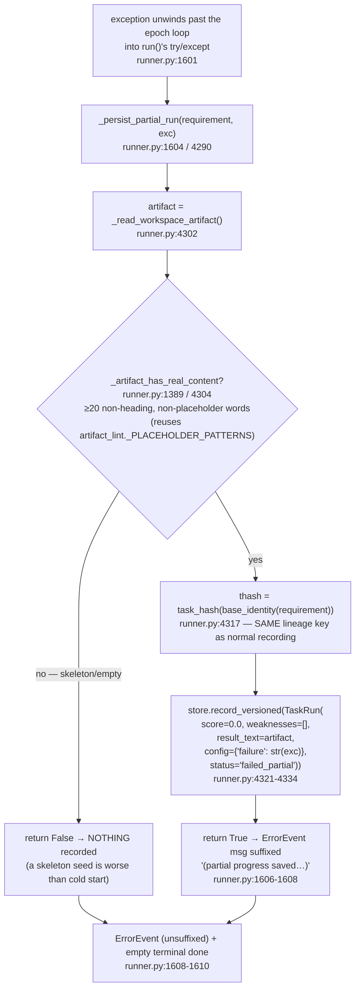

**Conditions that matter.**
- **Skeleton gate.** `_artifact_has_real_content` (`runner.py:1389`) strips heading lines and any
  line matching a known placeholder marker (imported `artifact_lint._PLACEHOLDER_PATTERNS`, so both
  the hyphen and em-dash `(pending … needs sourced content)` spellings are caught) and requires
  `_MIN_PARTIAL_CONTENT_WORDS = 20` (`runner.py:1386`) of residual body words. A pure skeleton
  yields zero body words → not recorded. This is the guard against a partial row being a worse seed
  than nothing.
- **Lineage never forks.** `_persist_partial_run` hashes `task_hash(base_identity(requirement))`
  (`runner.py:4317`) — identical to the normal post-run path — and `run()`'s `requirement` IS the
  base requirement (goal/template injection happens inside `_run_inner`), so the partial row lands
  in the same carry-forward queries, not a sibling lineage.
- **Row shape.** `score=0.0`, `weaknesses=[]` (the death reason must NOT enter the weakness
  feed-forward), `result_text` = the workspace artifact, `config={"failure": str(exc)}` (kept for
  human inspection only), `status="failed_partial"`. `version=0` is a placeholder — `record_versioned`
  allocates the real next version race-safely (`task_runs.py:577`).
- **Doubly fail-open.** The whole `_persist_partial_run` body is wrapped so any exception returns
  `False` (`runner.py:4336`) — persistence must never mask the original failure.

### Storage + consumer-filtering matrix

`TaskRun` grew a `status` field (default `"completed"`, `task_runs.py:498`); the SQLite table grew a
`status TEXT NOT NULL DEFAULT 'completed'` column with an idempotent PRAGMA migration
(`task_runs.py:524` schema, `task_runs.py:550-554` `ALTER TABLE` on absent column), and every
standard `SELECT` now trails `status` so `_row_to_run` can hydrate it (`task_runs.py:644`). Which
store methods SEE a `failed_partial` row is deliberate:

| Store method | Sees `failed_partial`? | Why |
|---|---|---|
| `latest_with_content` (`task_runs.py:701`) | **YES** (no `status` filter, `:715`) | The carry-forward win — a partial artifact is the best available seed. |
| `all_runs` (`task_runs.py:~630`) / `latest` / `best` | YES (unfiltered history) | Raw version history; `/task-runs` surfaces `status` per row. |
| `completed_runs` (`task_runs.py:738`) | NO (`:745` filters `status=='completed'`) | The completed-only helper the lesson readers route through. |
| `similar_runs` (`task_runs.py:770`) | NO (`:805` `AND status='completed'`) | R10 semantic lessons must come from finished runs only. |
| `accumulated_weaknesses` (`task_runs.py:876`) | NO (`:899` iterates `completed_runs`) | A death row's empty weakness list is not planner signal. |
| `repeat_failures` (`task_runs.py:861`) | NO (`:870` iterates `completed_runs`) | Loop-closure counting must ignore incomplete rows. |
| `latest_config` (`task_runs.py:657`) | NO (`:670` `AND status='completed'`) | `config={"failure": …}` is non-empty but is NOT a hill-climb budget — the filter stops it shadowing a real prior config. |

`app.py`'s `GET /task-runs/{hash}` (`app.py:825`) now emits `"status": r.status` per row
(`app.py:841`) so the GUI can distinguish partial rows from real history.

**Tests: 668 passing** as of 2026-07-03 (per the entry-166 landing note; not yet in the WORKLOG).

---

## 6. Post-run scoring + recording chain (`_postrun_score_and_record`, runner.py:3384)

The stage **order is load-bearing** (docstring `runner.py:2619-2624`). Each stage writes back
through `_write_artifact_through_sections` so section files stay the source of truth.

```mermaid
flowchart TD
    P0["pick _scored_text: artifact.md if ≥ result_output else result_output<br/>runner.py:2656-2663"] --> P1["normalize_artifact (dedupe glued/duplicate headings)<br/>runner.py:2671-2684"]
    P1 --> P2{"use_llm AND last epoch AND len&gt;800 AND 'http'?<br/>runner.py:2700-2704"}
    P2 -->|yes| P3["_synthesize_analysis + _refine_readability<br/>(windowed, base_client, no tools)<br/>runner.py:2706-2717"]
    P2 -->|no| P4
    P3 --> P4["_repair_lints (repair malformed mermaid etc., NOT gated on use_llm)<br/>runner.py:2733-2759"]
    P4 --> P5["strip_unverified_lines(neutralize_unverified_urls(…))<br/>on BOTH _scored_text (runner.py:3558) and result_output (runner.py:3563)<br/>cache=oracle, fail-open + distinguishable warning (entry 165 f6)<br/>strip_unverified_lines added entry 176 — task_runs.py:196<br/>runner.py:3544-3576"]
    P5 --> P6["score_result (LLM judge on base_client, verified_urls)<br/>runner.py:3577 / task_runs.py:915"]
    P6 --> P7["mine_weaknesses_from_outputs + prepend _reducer_gaps + lints<br/>runner.py:2792-2818"]
    P7 --> P8["refute/dedupe weaknesses (sections_present, refute_false_weaknesses,<br/>semantic cosine≥0.85)<br/>runner.py:2826-2865"]
    P8 --> GATE["PHASE-1 KEEP/DISCARD GATE (§4)<br/>runner.py:2880-2910"]
    GATE --> P9["POST-GATE FINALIZE: normalize+repair (+synth/readability on last epoch);<br/>archive grounded-full → result.md<br/>runner.py:2918-2951"]
    P9 --> PUB["DETERMINISTIC PUBLISH GATE (concurrent feature)<br/>evaluate_publish_readiness + combined_publish_issues<br/>runner.py:2952-2972 / report_quality.py:241"]
    PUB --> REV{"use_llm AND revision issues AND evidence?<br/>runner.py:2973"}
    REV -->|yes| REV2["build_publish_revision_prompt → base_client.chat;<br/>ACCEPT revised only if it clears issues<br/>runner.py:2974-3032"]
    REV -->|no| PUB2
    REV2 --> PUB2["add_missing_section_citations; re-evaluate;<br/>residual issues → publish-ready gate + weaknesses<br/>runner.py:3033-3073"]
    PUB2 --> PRUNE["_prune_resolved_weaknesses<br/>runner.py:3078"]
    PRUNE --> EDIT["EDITOR PHASE (§8) — _run_editor_pass<br/>runner.py:3088-3118"]
    EDIT --> SCORE["rubric_score → adjusted_score(base, weaknesses)<br/>runner.py:3146-3179 / rubric.py:685"]
    SCORE --> REC["_store.record(TaskRun ...) + template save if score≥0.6<br/>runner.py:3185-3229 / task_runs.py:458"]
    REC --> HC["_epoch_status + emit HillClimbEvent<br/>runner.py:3241-3256"]
```

**Conditions / gates to call out.**
- **`_is_last_epoch`** (`runner.py:2700`) gates the expensive synthesize/readability polish: true when
  `_epoch == 0` (single pass) or `_epoch >= max_epochs`. So mid-epochs skip readability rewriting.
- **`_repair_lints`** (`runner.py:2733`) is **not** gated on `use_llm` — output validity (mermaid,
  code fences) matters even in "auto" mode; `base_client` is always built.
- **Publish gate** (`report_quality.py:241`) only fires for report-like requests (`is_report_request`).
  It flags: evidence requested but no URL, URLs present but none verified, <120 words, unfinished
  placeholders, unresolved title, missing outline sections, duplicate headings, extra titles, missing
  request terms. `combined_publish_issues` (`report_quality.py:308`) folds in `lint_artifact` +
  `synthesis_depth_issues`. **Publish-revision** (`runner.py:2973`) does one LLM rewrite and ACCEPTs
  it **only if it fully clears** the issues (`runner.py:3012`) — otherwise the original is kept.
- **URL-line stripping before scoring AND serving (entry 176).** The P5 neutralize step now wraps
  `neutralize_unverified_urls` in `strip_unverified_lines` (`task_runs.py:196`) at **both** call
  sites — `_scored_text` (`runner.py:3558`) and `result_output` (`runner.py:3563`) — so a reducer-
  invented link is not merely de-linked but its whole unverified line is removed before it can earn
  citation credit or reach the user. Still fail-open: an empty verified set (search down) changes
  nothing, and finding-6's "cache unreadable vs. no citations" warning (`runner.py:3553`) is intact.
- **Diagram-shaped requirement compliance downgrade (entry 176).** In `requirement_compliance_issues`
  (`requirement_compliance.py:232`, called in the post-run compliance step near `runner.py:3911`), a
  deterministic post-parse gate runs before group aggregation: when the artifact contains **no**
  fenced `mermaid` block (`_MERMAID_BLOCK_RE` matches a triple-backtick `mermaid` fence,
  `requirement_compliance.py:84`), any already-parsed
  SATISFIED verdict on a **diagram-shaped** branch (`_DIAGRAM_SHAPED_RE` — `diagram|architecture|
  topology|blueprint|wireframe|flowchart`, `requirement_compliance.py:81`) is flipped to
  NOT_SATISFIED (`requirement_compliance.py:308-313`). Rationale: a real gemma run marked such a
  branch SATISFIED on a markdown table + prose alone. A mandatory diagram-shaped requirement then
  becomes a hard issue; an OR-sibling becomes a quality opportunity — and the emitted issue string
  is annotated to say a real fenced `mermaid` block is required (`requirement_compliance.py:180`) so
  the editor adds the diagram instead of re-touching prose.
- **Recorded score** = `adjusted_score(rubric_base, final_weaknesses)` (`runner.py:3179`,
  `rubric.py:685`). Invariant: any remaining weakness forces score < 1.0; hard defects (malformed
  mermaid, unbalanced fence, fabricated citations — `rubric.py:674`) cost double. The old
  count-based `solved/total` was retired (`runner.py:2866-2870`).
- Whole `_postrun_score_and_record` body is wrapped in one broad `except` (`runner.py:3257`) — a
  scoring failure silently returns the un-updated `_outcome` (score 0.0, status "improving").

> ### ⚠ ODDITY — two different revert oracles in the same epoch
> The **Phase-1 gate** (`runner.py:2880`) reverts on `rubric_score` delta only (no lint). The
> **editor phase** (`runner.py:833`, §8) reverts on `_editor_scored_issues` =
> `adjusted_score` (rubric + lint) **and** weakness-count. And the **recorded** score is
> `adjusted_score`. So three related-but-different metrics judge the same artifact within one epoch.
> An artifact can pass the topic-blind gate on `rubric_score` yet be judged a regression by the
> editor's lint-aware oracle (or vice-versa). Worth confirming the intended precedence.

---

## 7. Editor phase — detailed sub-flow (`_run_editor_pass`, runner.py:1133)

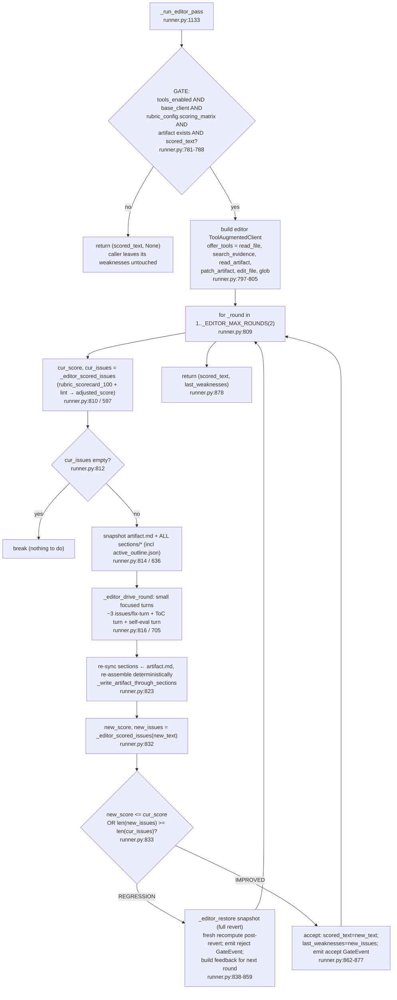

**Conditions that matter.**
- **Gated off** → returns `(scored_text, None)`; the `None` tells the caller (`runner.py:3115`) to
  leave the miner/lint weakness list intact. When it ran, the returned fresh list **replaces** the
  caller's list wholesale (`runner.py:3116`).
- **Round 2 always runs** when budget + issues remain — whether round 1 improved (kept as new
  baseline) or reverted (its failure is ingested as `feedback` into round 2's fix-turns,
  `runner.py:854-858`, so it doesn't blindly repeat). Only an empty issue list short-circuits early;
  the hard cap `_EDITOR_MAX_ROUNDS=2` (`runner.py:580`) is what actually stops it — no round 3.
- **Regression test** is `new_score <= cur_score OR new_issue_count >= cur_issue_count`
  (`runner.py:833`) — a partial improvement (fewer issues *and* higher score) counts as success.
- **Weaknesses are freshly recomputed at every boundary** (`_editor_scored_issues` after every round,
  and again after every revert — `runner.py:830, 843`). Nothing carries a stale pre-round list forward.
- **Snapshot is full** (`_editor_snapshot`, `runner.py:636`): the artifact string AND every
  `sections/*` file incl `active_outline.json` — a string-only snapshot re-diverges on the next
  `assemble_artifact_from_sections` (the HANDOFF-documented class of bug). Restore drops files created
  during the round (`runner.py:656-658`).
- Editor edits **only** through `patch_artifact` / `edit_file` (scoped find/replace); it never
  re-emits the whole document (persona `runner.py:582-594`). `patch_artifact` is OCC-guarded
  (`tools.py:1174`); `edit_file` is a plain unique-find/replace with no OCC (`tools.py:340`).
- **Read-only-streak forcing (entry 176).** The editor's `ToolAugmentedClient.chat` loop
  (`tools.py:665`) is where this arms: because the editor offers write tools, `_write_names`
  (`tools.py:695`) is non-empty, so the loop counts consecutive read-only tool turns
  (`_read_only_streak`, `tools.py:696/737-741`) and once it reaches `max(2, max_iters//2)`
  (`tools.py:697`) injects a forcing user turn — "you have gathered enough context through reads;
  call a write tool now or say no change is needed" (`tools.py:768-782`) — then resets the streak.
  This targets the observed failure of a model (gemma) re-reading the same sections 24/24 times
  across retries without ever calling `patch_artifact`. Research spokes never hit it (no write tool
  offered → `_write_names` empty).

---

## 8. Role-disambiguation diagram (who sees what, who can write what)

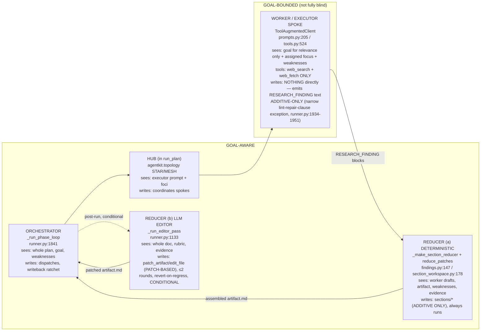

**Key distinctions to keep straight during review.**
- "Reducer" in the codebase's own docstrings = **reducer (a)**, the deterministic section merge
  (`findings.py:155` calls it "the section-aware STAR reducer"). The LLM **editor** (reducer (b)) is
  a distinct, newer stage; conversation has called it "reducer" loosely.
- The worker's additive-only property is enforced two ways: it has **no write tool** in the fan-out
  path (only web tools, `tools.py:577`), and the reducer's `_sanitize_llm_patches` / grow-only
  `accept_rewrite` reject any destructive change. The **only** rewrite exception is the narrow
  seed-lint repair clause on the final seeded step (`runner.py:1934-1951`).
- "Hub" and "orchestrator" are **not** the same object: the orchestrator is Studio's Python loop; the
  hub is the STAR/MESH coordinator that lives inside `agentkit`'s `run_plan`. Studio never
  instantiates a hub — it only shapes the sub-plan and prompt handed to `run_plan`.

---

## 9. Other genuine risks / oddities noticed while tracing (beyond those flagged inline)

1. **Broad fail-open `except` blocks everywhere.** `run()` (`runner.py:1044`), the entire
   `_postrun_score_and_record` body (`runner.py:3257`), and dozens of stage-level guards swallow
   exceptions. This is deliberate ("never crash the run") but means a systematically-failing stage
   (e.g. scoring, publish gate, editor) degrades **silently** to no-op — the only signal is the
   `_dbg` file (active only when `OMC_THROUGHPUT_DEBUG` is set, `runner.py:545`). During review,
   a "why did nothing improve" symptom should first suspect a swallowed exception, not logic.
   **One instance partially addressed this session (WORKLOG entry 165, finding 6):** URL
   verification's fail-open specifically (P5 in §6) could not distinguish "no citations to verify"
   from "verification couldn't run" (missing/unreadable `.web_cache.json`), silently masking
   fabrication during an outage. `runner.py::_web_cache_available()` now distinguishes the two
   cases and emits a warning on the ambiguous one — the deliberate fail-open itself is unchanged
   (an outage must never blank real citations), only its silence in the ambiguous case is fixed.
   The general pattern (broad `except` swallowing) is otherwise untouched and remains a real
   review risk elsewhere in the chain. **Partially addressed again (entry 166, 2026-07-03):** the
   most damaging instance — the top-level `run()` catch (`runner.py:1601`) that used to record
   nothing on a mid-flight death — now snapshots the partial artifact via `_persist_partial_run`
   (§5c) so a swallowed fatal error at least carries its research forward. The broad-`except`
   pattern itself is unchanged everywhere else.

2. **✅ FIXED (WORKLOG entry 158, 2026-07-02) — post-loop patch-apply length-ratchet inconsistency.**
   This item originally flagged the post-loop patch-apply path's crude `len(_rr.text) >= _seed_len`
   floor coexisting inconsistently with the smarter per-phase `accept_rewrite` guard, silently
   dropping a legitimate dedup/repair that shortened the doc. **Fixed this session**: the post-loop
   guard now imports and calls the SAME `accept_rewrite(_cur_text, _rr.text)` guard
   (`runner.py:2759-2760`, mirroring the per-phase writeback ratchet), with matching `writeback
   ACCEPT/REJECT` `_dbg` logging. A shorter-but-better merge (dedup, synthesis replacing verbatim
   quote-dumping) is now kept where the length floor would have discarded it purely for being
   shorter; a merge that guts/deletes a content-bearing section is still rejected. One consistent
   anti-regression mechanism across both writeback paths. Test:
   `test_postloop_guard_accepts_shorter_but_improved_rewrite`.

3. **`result.md` vs `artifact.md` divergence.** `_postrun` archives the "grounded-full"
   (normalized+repaired, pre-readability) to `result.md` (`runner.py:2935-2937`), while `artifact.md`
   holds the readable+deduped version that seeds the next epoch. The terminal `done` writes
   `result.md` again from `final_output` (`_write_result`, `runner.py:3406`). Two files, two
   slightly different documents — confirm which one downstream consumers/export read.

4. **`normalize_artifact` runs many times per epoch** (seed sync, every phase writeback, every
   post-run stage, editor re-sync). It is claimed idempotent, but any non-idempotence would compound.
   Cheap to audit: run it twice on a fixture and diff.

5. **Weakness list is rebuilt/re-ordered ~8 times** in `_postrun` (mine → +reducer_gaps → +lints →
   section-present filter → refute → semantic dedup → +scorecard → editor replace → +publish
   residual). The final recorded/handed-forward set depends on this exact order; a reordering would
   change what the next epoch's planner sees. It is correct today but fragile.

6. **The editor phase runs AFTER the epoch keep/discard gate** (`runner.py:3088` vs `2880`). So the
   editor can mutate an artifact the gate already decided to *revert to the prior seed* — i.e. it
   edits the reverted prior, which is fine, but its accept/revert uses a different oracle (§6 oddity).
   The recorded score is computed after the editor, so the number reflects the edited state.

7. **`similar_runs` / `latest_config` open a `TaskRunStore` per call** (`runner.py:1071, 1649, 2639`)
   — three separate SQLite connections to `tmp/task_runs.db` within one run. Fine at current scale;
   note it if concurrency on the DB ever grows.

8. **✅ FIXED (WORKLOG entry 165, findings 2 & 4) — per-run state isolation across concurrent
   sessions.** Studio runs each session on its own `threading.Thread`, but two collaborators had
   process-wide mutable state that a real independent Codex adversarial review (`/codex challenge`
   against the full branch diff) found could bleed across concurrent sessions:
   - `agentkit/topology/dynamic.py::run_plan` (`dynamic.py:667`) wrote `_POOL_WORKERS` /
     `_MAX_SPOKES` / `_REDUCER` as **module globals** on every call — two concurrent runs with
     different reducers/sizing could overwrite each other's config mid-run. Fixed: converted to
     `contextvars.ContextVar` (`_pool_workers_var` `dynamic.py:265`, `_reducer_var` `dynamic.py:289`,
     a third breadth-cap var referenced at `dynamic.py:535`), `.set()` at the top of `run_plan`
     (`dynamic.py:716-717`) and `.reset()` in a `finally` (`dynamic.py:756-757`) — isolated per
     call/thread, safe for nested calls too. Test:
     `tests/test_dynamic_topology_concurrency.py` (two concurrent `run_plan` calls with distinct
     reducers + `max_agents`, barrier-forced overlap, asserts no bleed).
   - `studio/tools.py::_fetch_cache` was a single **process-global dict**; `findings.py` grounding
     accepts a citation if its URL matches ANYTHING in that cache, so one session could "verify" a
     citation against a DIFFERENT session's fetches. Fixed: `_ContextFetchCache`
     (`tools.py:73`, instantiated at `tools.py:144`) — a `contextvars`-backed dict proxy giving each
     run-thread its own backing store while preserving the full dict interface, so the ~50 existing
     internal/`findings.py`/test call sites needed no changes. Test:
     `test_codex_findings.py::test_fetch_cache_isolated_across_sessions`.
   - Neither fix changes single-session behavior; both close a real cross-session
     data-integrity gap that only manifests under genuine concurrent load (multiple GUI sessions,
     or an auto-improve run overlapping a manual run).
   - **Follow-on regression this created, fixed in entry 177 (2026-07-03):** making `_fetch_cache`
     `contextvars`-scoped meant the reducer thread could no longer see the spoke threads' fetches,
     so the grounding gate silently dropped real cited findings. The `_prefetch_cited` re-fetch in
     the reducer (`findings.py:100/290`, cap raised 8→24) restores grounding by pulling the cited
     URLs into the reducer thread's own cache — see §5's "Reducer (a) grounding recovery" note.
     Isolation and grounding are now both satisfied.

---

## 10. Quick file:line index

> **Line-number drift note (updated 2026-07-03).** `runner.py` grew from ~3419 lines (this doc's
> original trace) to 3642 (entries 157-165) and now to **4352 lines** after entries 166/176/177
> landed (partial-run persistence, `strip_unverified_lines`, diagram-compliance downgrade,
> read-only-streak forcing, `_prefetch_cited`). Rows below and every §§1-9 box touched by the
> 2026-07-03 revision were re-verified against the current source; §§1-9 inline mermaid citations
> for code NOT touched by entries 157-177 were not individually re-walked and may be off by roughly
> a ~900-line cumulative offset — treat this index (and the re-verified boxes) as the current source
> of truth over an un-re-verified diagram citation if the two disagree.

| Concern | Entry point |
|---|---|
| Epoch loop / stop conditions | `runner.py:1062` (`run`), nearby stop-condition checks |
| One epoch | `runner.py:1149` (`_run_inner`) |
| Seed precedence | `runner.py:1682` (`_seed_carry_forward`), `269` (`_seed_prior_from_path`) |
| Coarse whole-doc seed gate (entry 161) | `studio/relevance.py:97` (`seed_doc_relevance`), `76` (`_seed_gate_prompt`); call site `runner.py:1806-1823` |
| Cold-start skeleton | `runner.py:577` (`_build_template_skeleton`) |
| Phase loop / roles | `runner.py:1937` (`_run_phase_loop`) |
| Per-section relevance check + repair clause | `studio/relevance.py:156` (`relevance_issues`), `130` (`_build_prompt`); call site `runner.py:2078-2111` |
| Heading standardization at fold boundary (entry 162) | `studio/section_workspace.py:42` (`_normalize_heading_levels`), `33` (`_match_key`); call site `section_workspace.py:94` (`split_artifact_to_sections`) |
| Writeback ratchet | `runner.py:2449` (`accept_rewrite` import), ratchet check nearby |
| Post-loop guard (unified on `accept_rewrite`, entry 158 fix 2) | `runner.py:2759-2765` |
| Post-run chain | `runner.py:2792` (`_postrun_score_and_record`) |
| Post-run markdown beautification (entry 163) | `studio/markdown_format.py:16` (`beautify_markdown`); call site = final return of `_postrun_score_and_record` |
| Report-title derivation + comma-anchor fix (entry 164) | `studio/artifact_text.py:32` (`_TITLE_STOP_RE`), `63` (`resolve_report_title`) |
| Phase-1 gate | `runner.py:3079` (`accept_epoch`/`make_rubric_preference` import + call), `epoch_gate.py:27/64` |
| Gate-baseline fix / seed-lint local snapshot (entry 158 fix 1) | `runner.py:2041` (`_seed_on_disk`) |
| Editor phase | `runner.py:1133` (`_run_editor_pass`); call site `runner.py:3287` |
| Deterministic reducer | `findings.py:147`, `section_workspace.py:94/136` (`split_artifact_to_sections`/`write_section_workspace`) |
| Executor prompt | `prompts.py:205` |
| Worker tool surface | `tools.py:524/577` (`ToolAugmentedClient`) |
| Per-thread fetch cache (entry 165 finding 4) | `tools.py:73` (`_ContextFetchCache` class), `144` (`_fetch_cache` instance) |
| `search_evidence` tool | `tools.py:997` (`_run_search_evidence`) |
| Scoring primitives | `rubric.py:528` (`rubric_score`), `685` (`adjusted_score`) |
| Seed lookup DB | `task_runs.py:553` (`latest_with_content`), `609` (`similar_runs`) |
| Versioned insert, race-safe (entry 165 finding 3) | `task_runs.py:483` (`next_version`), `489` (`record_versioned`), `509` (`record`) |
| Catalog admin auth (entry 165 finding 1) | `app.py:666` (`_ADMIN_KEY_ENV`), `669` (`require_catalog_admin`); mutation/export routes `app.py:687-761` |
| Concurrent-session topology isolation (entry 165 finding 2) | `agentkit/topology/dynamic.py:265` (`_pool_workers_var`), `289` (`_reducer_var`), `667` (`run_plan`), `.set()`/`.reset()` at `716-717`/`756-757` |
| Mid-run partial persistence (entry 166) | `runner.py:4290` (`_persist_partial_run`), `1389` (`_artifact_has_real_content`), `1386` (`_MIN_PARTIAL_CONTENT_WORDS`); catch/call site `runner.py:1601/1604` |
| `status` column + consumer filtering (entry 166) | `task_runs.py:498` (`TaskRun.status`), `550-554` (PRAGMA migration), `738` (`completed_runs`), `701`/`715` (`latest_with_content`, no filter), `805` (`similar_runs`), `899` (`accumulated_weaknesses`), `870` (`repeat_failures`), `670` (`latest_config`); route `app.py:825/841` |
| `strip_unverified_lines` at neutralize sites (entry 176) | `task_runs.py:196`; call sites `runner.py:3558` (`_scored_text`), `3563` (`result_output`) |
| Diagram-shaped compliance downgrade (entry 176) | `requirement_compliance.py:81` (`_DIAGRAM_SHAPED_RE`), `84` (`_MERMAID_BLOCK_RE`), `308-313` (gate), `180` (annotation), `232` (`requirement_compliance_issues`); call site near `runner.py:3911` |
| Read-only-streak forcing (entry 176) | `tools.py:665` (`ToolAugmentedClient.chat`), `695` (`_write_names`/`_WRITE_TOOL_NAMES` `502`), `696-697` (streak init/threshold), `737-741` (count), `768-782` (forcing turn) |
| Cited-URL prefetch grounding recovery (entry 177) | `findings.py:71` (`_cited_urls`), `100` (`_prefetch_cited`), `68` (`_PREFETCH_LIMIT` 8→24), call site `findings.py:290`; grounding gate `findings.py:395/407` (`_parse_findings`, `cache_active`) |
