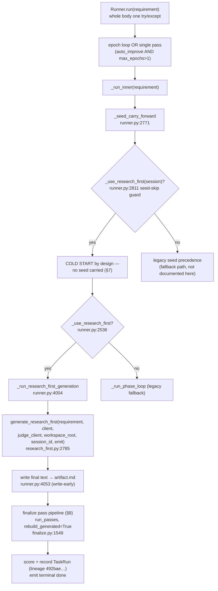
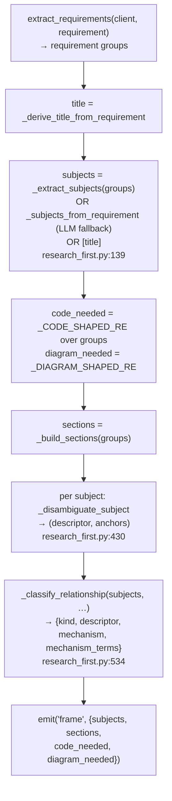
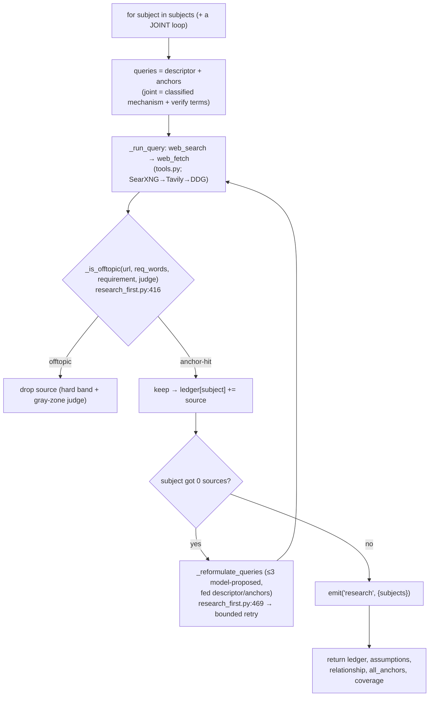
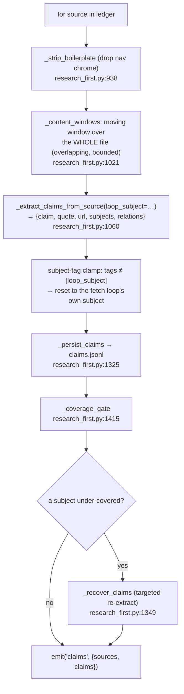
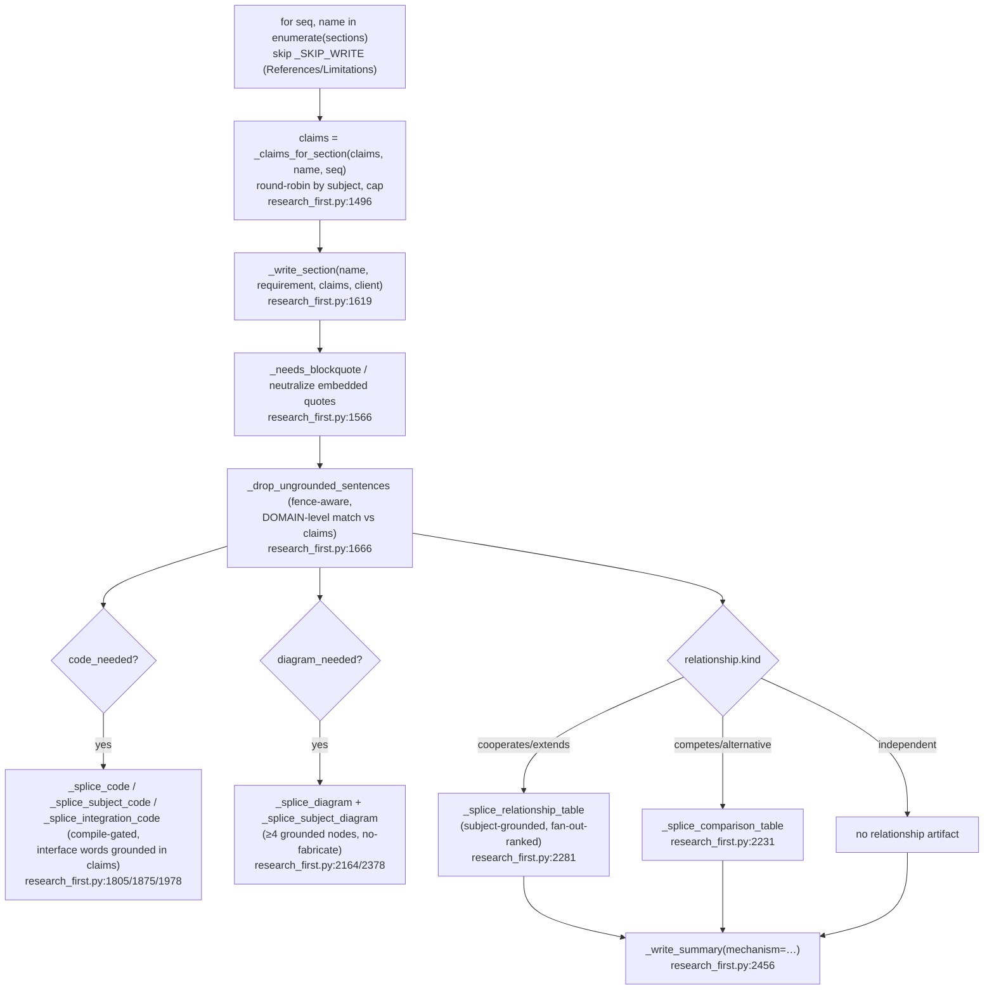
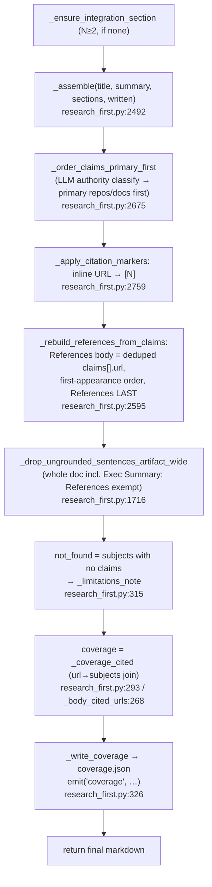
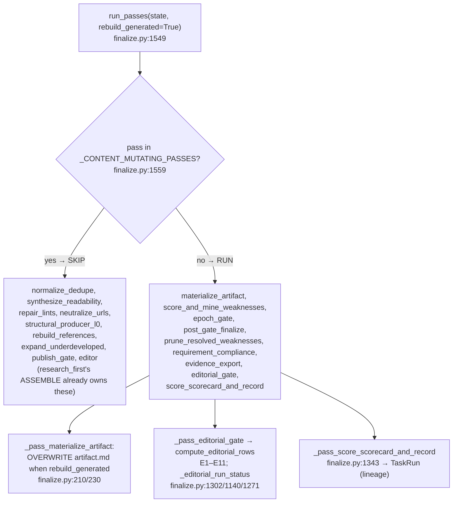

# Architecture — Research-Report Generation Pipeline (`research_first`)

**Date:** 2026-07-10
**Scope:** `backend/studio/research_first.py` (3039 lines) — the **linear** generation pipeline —
plus the shared runner shell it rides (`runner.py` dispatch + epoch loop) and the finalize
pass-pipeline tail (`finalize.py`, 1613 lines). Immediate collaborators: `tools.py` (fetch),
`artifact_text.py` (title/references regex), `diagram_render.py` (mermaid), `task_runs.py`
(scoring/recording), `artifact_lint.py` (E-row lints).
**Purpose:** a code-traced process map for review — accuracy over polish. Every box cites
`file.py:line`.

> **What this doc covers.** `research_first` is the **default** generation path for
> research-report tasks, dispatched at `runner.py:2536` when `_use_research_first(session)`
> (`runner.py:1826`) is true. It **replaced** the legacy hub/spoke `_run_phase_loop` by user
> ruling (2026-07-05) and reached deterministic acceptance (task_hash `492bae60177b`, 0.92–1.0).
> The prior version of this doc traced the legacy path; that trace was removed 2026-07-10 — the
> hub/spoke loop still exists in `runner.py` as the fallback for non-flagged sessions, but it is
> no longer the live path for a research report and is not documented here.

---

## 0. Terminology + dispatch

`research_first` is a single function, `generate_research_first` (`research_first.py:2785`), run
in place of the hub/spoke fan-out. It is **linear**: five stages, each feeding the next, no
topology/hub/spoke, no per-phase LLM orchestration.

| Stage | Entry | One line |
|---|---|---|
| **FRAME** | inline `research_first.py:2800-2812` | Extract subjects, sections, code/diagram needs; disambiguate each subject; classify the inter-subject relationship. |
| **RESEARCH** | `_research` (`research_first.py:721`) | Per-subject fetch loop, offtopic/anchor gated, question-critic reformulation on a 0-source subject; returns a per-subject source ledger + coverage. |
| **CLAIMS** | `_build_claims` (`research_first.py:1284`) | Extract `{claim, quote, url, subjects, relations}` from each source; coverage-gate + recover. |
| **WRITE** | `_write_section` (`research_first.py:1619`) per section | One section per skeleton heading from its own claims; splice code / diagrams / relations or comparison table / summary. |
| **ASSEMBLE** | `_assemble` (`research_first.py:2492`) | Stitch title + summary + sections; build References **from claims**; References last; write coverage sink. |

**Dispatch + kill-switch.**
- `_use_research_first(session)` (`runner.py:1826`): true only when `session.use_research_first`
  is set (registry default **False**; set by `POST /session`) AND the env kill-switch
  `STUDIO_DISABLE_RESEARCH_FIRST` (`runner.py:1829`) is not `1/true/yes`.
- Dispatch site `runner.py:2536`: `if _use_research_first(session): … _run_research_first_generation(...)`.
  `_run_research_first_generation` (`runner.py:4004`) calls `generate_research_first`
  (`runner.py:4033`) and **writes the returned text to `artifact.md` immediately**
  (`runner.py:4053`, the wiring-HIGH fix — see §8).
- **Fail-visible, not fail-silent.** An opted-in research_first run that errors does NOT fall back
  to `_run_phase_loop` (that silent fallback was removed in review) — it surfaces the error. The
  legacy loop only runs for sessions where the flag is off.

---

## 1. Top-level — runner shell around `generate_research_first`



**What research_first reuses from the shell** — the run epoch loop + one terminal `done`, the
`task_hash`/lineage recording, the SSE `emit` callback (each stage emits a phase event:
`frame`/`research`/`claims`/`write` + `coverage`), and the **finalize pass tail** (§8). What it
**does not** use: seed carry-forward (§7), the hub/spoke phase loop, the cold-start template
skeleton, the writeback ratchet, and the 9 content-mutating finalize passes.

---

## 2. FRAME — subjects, sections, relationship (`research_first.py:2800-2812`)



**Conditions that matter.**
- **Subjects are the unit of research** (not sections). `_extract_subjects` pulls the real
  referents (e.g. `Pi`, `Craft`); the LLM fallback `_subjects_from_requirement`
  (`research_first.py:139`) is deterministically validated (verbatim substring, ≤4 words,
  ≠ whole-task, compound-split after the whole-task check) so a whole-task-shaped string never
  becomes a subject.
- **Disambiguation** (`_disambiguate_subject`, `research_first.py:430`) resolves each subject to a
  concrete referent + search anchors, fail-open. Descriptor + anchors persist into the coverage
  ledger (§6) and the Scope assumption line — they are what keeps "Pi" resolving to
  `earendil-works/pi`, not the π constant.
- **Relationship is CLASSIFIED, not presumed** (`_classify_relationship`, `research_first.py:534`).
  Returns a `kind` (`cooperates/competes/extends/alternative/independent/unknown`) grounded in
  joint evidence, fail-open `unknown`. The prompt weighs task framing over subject similarity
  ("use X and Y together" → cooperates/extends). Downstream, cooperate/extends → integration
  section + diagram; competes/alternative → comparison table; independent → no forced relationship
  artifact. The old hardcoded interface enum (`api|cli|mcp|sdk|…`) was removed here.

---

## 3. RESEARCH — per-subject fetch loop (`_research`, `research_first.py:721`)



**Conditions that matter.**
- **Coverage by construction.** Every subject is searched unconditionally; a subject is never
  silently skipped. The joint loop searches the classified relationship mechanism.
- **Offtopic gate** (`_is_offtopic`, `research_first.py:416`) = a hard keyword band + a gray-zone
  LLM judge (`judge_client`). Drops wrong-referent sources (π-Wikipedia, unrelated same-name
  products) at selection, not after they pollute claims.
- **Question-critic** (`_reformulate_queries`, `research_first.py:469`, D2). A 0-source subject
  triggers ≤3 model-proposed reformulated queries (fed the descriptor/anchors so a retry never
  regresses to the bare ambiguous name), sharing the same offtopic/anchor gates via an extracted
  `_run_query` closure. Fail-open `[]` — a 0-source subject never stalls the run; it becomes a
  Limitations line instead (§6).

---

## 4. CLAIMS — extract, coverage-gate, recover (`_build_claims`, `research_first.py:1284`)



**Conditions that matter.**
- **Full-file read, moving window.** The old `content[:8000]` head-cut saw only nav chrome; the
  architecture sentence was at char ~93k. `_content_windows` (`research_first.py:1021`) reads the
  whole boilerplate-stripped file in overlapping bounded windows — this is what made the real
  Pi↔Craft joint claim extractable (joint 0→7).
- **Claim schema carries `relations:[{head,rel,tail}]`.** The LLM emits triples; code keeps only
  those whose BOTH endpoints are whole-token grounded in the verbatim quote. Feeds the relations
  fan-out table (§5) and the integration diagram edge.
- **Subject-tag clamp.** A single-subject fetch loop vets sources against only its own anchors, so
  any claim tagged with anything other than that subject is unvetted → reset to the loop's subject.
  Kills the wrong-referent leak class (Microsoft "agent-framework" mistagged as a subject).

---

## 5. WRITE — one section per heading (`research_first.py:2820-2870`)



**Conditions that matter.**
- **Sections are written once, from their own claims.** `_claims_for_section`
  (`research_first.py:1496`) round-robins subjects into the per-section cap so subject-2 is never
  starved ("names two subjects, covers one" cannot reappear at WRITE).
- **Grounding is enforced at write time.** `_drop_ungrounded_sentences`
  (`research_first.py:1666`, fence-aware) keeps a sentence only if it cites a URL whose **domain**
  matches the section's claims — domain-level (not exact) because weak models truncate real URL
  paths; cross-domain fabrication still dies. Never cites "a URL from memory".
- **Code / diagrams / tables are grounded, not invented.** Code is compile-gated and its interface
  vocabulary must appear in claims (`_splice_integration_code`, `research_first.py:1978`); diagrams
  need ≥4 claim-grounded nodes or no diagram is drawn (`_splice_subject_diagram`,
  `research_first.py:2378`); the relationship table/comparison branch is chosen by the classified
  `kind`, never force-fit.
- **Self-heading sanitize (ruling c).** A section response that prepends its own heading is
  stripped at the source; other in-body headings matching a skeleton name are dropped (echo),
  else demoted — fence-aware. Makes "one section per heading" true by construction.

---

## 6. ASSEMBLE — stitch + References-from-claims + coverage (`_assemble`, `research_first.py:2492`)



**Conditions that matter.**
- **References BUILT from claims, never scraped from body** (`_rebuild_references_from_claims`,
  `research_first.py:2595`, defect-F fix). References = exactly the deduped `claims[].url` set, both
  directions, References always last. This is why a real repo (e.g. `craft-agents-oss`) lands in
  References once it is a claim, and why LaTeX/SVG link-texts from a rendered page never do.
- **Inline `[N]` markers are a render of a declared citation** (`_apply_citation_markers`,
  `research_first.py:2759`): the writer emits explicit URLs, code maps each to its reference number.
  Zero false attribution; also de-stuffs raw-URL clutter.
- **Coverage ledger (P1)** — `_coverage_cited` (`research_first.py:293`) computes, per subject,
  `{queries_issued, sources_fetched, cited_in_artifact}`. `cited_in_artifact` uses
  `_body_cited_urls` (`research_first.py:268`): a URL counts as cited only if it (or its `[N]`
  marker) appears in the **body** — References-only presence is NOT counted (codex HIGH fix
  `e8e3da7`). Written to `coverage.json` + an SSE `coverage` event.
- **Not-found contract (P4)** — a subject that yielded no claims (`not_found`, computed from
  post-recovery `claims`, not the pre-recovery ledger) auto-emits a Limitations line
  (`_limitations_note`, `research_first.py:315`, match-only home so it never splices into a wrong
  section). Silent when both subjects are sourced.

---

## 7. Cold-start by design — why there is no seed carry-forward

`research_first` never seeds from a prior artifact. The guard is one line in `_seed_carry_forward`
(`runner.py:2811`):

```python
if _hc_cfg.get("auto_improve") and not _use_research_first(session):
    …  # legacy seed carry-forward
```

When the flag is on, the whole carry-forward block is skipped → the run cold-starts every epoch.
Rationale (D4): the legacy runner used to **merge the carried-forward seed into the rebuild
output**, which accumulated stale sections across a lineage (a prior "Architectural Comparison"
section surviving into a fresh "Integrated Workflow" run) and pushed References off the end. A
linear pipeline that writes each section once from fresh claims is only correct if nothing
pre-seeds it. Fixed + regression-tested (`test_research_first_seed_carry_forward_is_skipped`);
live-verified v48 (References last, no accumulation).

**Consequence:** improvement across epochs comes from the finalize scoring/recording tail and the
editorial gate (§8) feeding weaknesses forward — not from artifact carry-forward. Attaching a goal
or a loop-seed rotates `task_hash` → a fresh cold-start v1 lineage (a known trap: run the bare
end-state to resume a lineage).

---

## 8. Finalize tail — the `rebuild_generated` marker (`finalize.py`)

The post-generation chain is a pass pipeline: `run_passes(state)` (`finalize.py:1549`) walks
`PASSES` (`finalize.py:1529`) in order, fail-open per pass. On a research_first run the state
carries `rebuild_generated=True` (`runner.py:4150/4189`), which **skips every content-mutating
pass** and runs only the recording/scoring tail.



**Conditions that matter.**
- **Trust inverts on rebuild.** For a normal run the finalize passes repair/dedupe/rebuild the
  document; for a rebuild_generated run the ASSEMBLE stage already owns dedupe, references,
  fence/citation repair, and structural production, so those 9 passes are skipped
  (`_CONTENT_MUTATING_PASSES`, `finalize.py:1559`). The recording/scoring tail is deliberately NOT
  in that set.
- **Write-early + materialize overwrite (wiring-HIGH fix).** `_run_research_first_generation`
  writes the returned text to `artifact.md` right after the generate returns (`runner.py:4053`);
  `_pass_materialize_artifact` (`finalize.py:210`) then OVERWRITES `artifact.md` on rebuild
  (`finalize.py:230`) so a stale seed can never win the post-gen preference and get re-recorded.
  Verified byte-exact (recorded `result_text` == workspace `artifact.md`).
- **Editorial gate L1** (`compute_editorial_rows`, `finalize.py:1140`; router
  `_editorial_run_status`, `finalize.py:1271`). Computes rows E1–E11 over the assembled artifact.
  Invariant: a could-not-verify check **SKIPs, never records a pass** — a crashed lint leaves
  E6/E11 `could_not_verify` (not a false `pass`), and an empty-rows gate returns `unverified` (not
  `completed`) so it never poisons the lineage median. `rebuild_generated` marks E3 (coverage)
  grounded-by-construction (`finalize.py:1215-1220`).
- **Structure gate.** `_artifact_structure_ok` (`finalize.py:151`) rejects a rewrite candidate with
  detached language-tag lines, unclosed/malformed fences, `##` headings inside fences, or known
  placeholders — reject-don't-repair, keeping prior clean text.
- **`post_gate_finalize` stays UNSKIPPED** (`finalize.py:628`) for archiving to `result.md`; its
  merge path is kept cold by the WRITE-side self-heading sanitize (§5), with a
  `_find_duplicate_headings` tripwire that fires only if the construction guarantee ever breaks.

---

## 9. Quick file:line index

| Concern | Entry point |
|---|---|
| Pipeline entry (5 stages) | `research_first.py:2785` (`generate_research_first`) |
| Dispatch + kill-switch | `runner.py:1826` (`_use_research_first`), `1829` (`STUDIO_DISABLE_RESEARCH_FIRST`), `2536` (dispatch), `4004` (`_run_research_first_generation`), `4053` (write-early) |
| Seed-skip (cold-start by design) | `runner.py:2811` (`and not _use_research_first(session)`) |
| FRAME — subjects | `research_first.py:139` (`_subjects_from_requirement`), `_extract_subjects`/`_build_sections` inline `2800-2812` |
| FRAME — disambiguation | `research_first.py:430` (`_disambiguate_subject`) |
| FRAME — relationship classify | `research_first.py:534` (`_classify_relationship`) |
| RESEARCH loop | `research_first.py:721` (`_research`), `416` (`_is_offtopic`), `469` (`_reformulate_queries`, D2 critic) |
| CLAIMS extract | `research_first.py:938` (`_strip_boilerplate`), `1021` (`_content_windows`), `1060` (`_extract_claims_from_source`) |
| CLAIMS gate/recover/persist | `research_first.py:1415` (`_coverage_gate`), `1349` (`_recover_claims`), `1325` (`_persist_claims`) |
| WRITE section | `research_first.py:1619` (`_write_section`), `1496` (`_claims_for_section`), `1566` (`_needs_blockquote`), `1666`/`1716` (`_drop_ungrounded_sentences[_artifact_wide]`) |
| WRITE code | `research_first.py:1805`/`1875`/`1978` (`_splice_code`/`_splice_subject_code`/`_splice_integration_code`) |
| WRITE diagrams | `research_first.py:2164`/`2378` (`_splice_diagram`/`_splice_subject_diagram`) |
| WRITE relationship/comparison | `research_first.py:2281` (`_splice_relationship_table`), `2231` (`_splice_comparison_table`) |
| WRITE summary | `research_first.py:2456` (`_write_summary`) |
| ASSEMBLE | `research_first.py:2492` (`_assemble`), `2675` (`_order_claims_primary_first`), `2759` (`_apply_citation_markers`), `2595` (`_rebuild_references_from_claims`) |
| Coverage ledger (P1) | `research_first.py:293` (`_coverage_cited`), `268` (`_body_cited_urls`), `326` (`_write_coverage`) |
| Not-found contract (P4) | `research_first.py:315` (`_limitations_note`) |
| Finalize pipeline | `finalize.py:1529` (`PASSES`), `1549` (`run_passes`), `1559` (`_CONTENT_MUTATING_PASSES`) |
| Materialize (write-early overwrite) | `finalize.py:210` (`_pass_materialize_artifact`), `230` (rebuild overwrite) |
| Editorial gate (L1) | `finalize.py:1140` (`compute_editorial_rows`), `1271` (`_editorial_run_status`), `1302` (`_pass_editorial_gate`) |
| Structure gate | `finalize.py:151` (`_artifact_structure_ok`) |
| Record / lineage | `finalize.py:1343` (`_pass_score_scorecard_and_record`), `628` (`_pass_post_gate_finalize`) |
