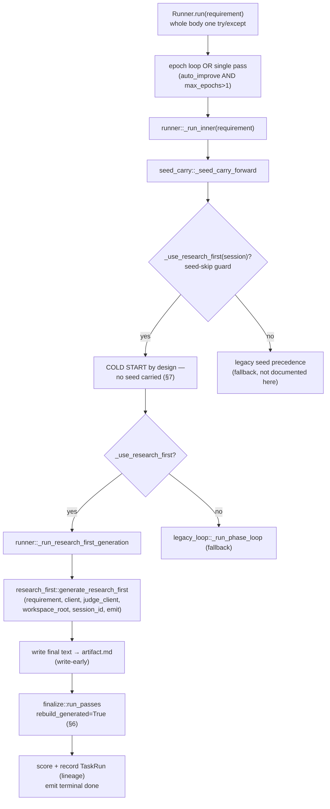
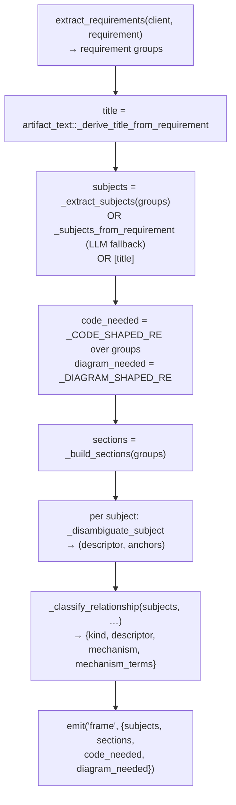
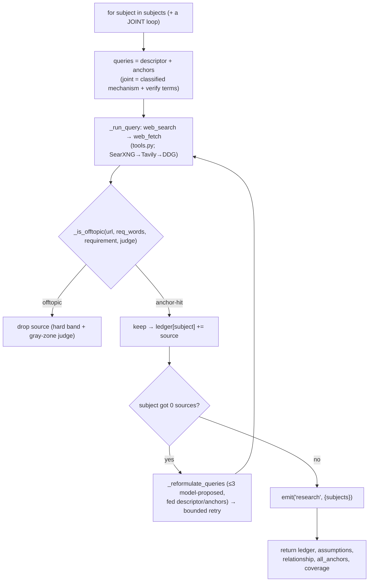
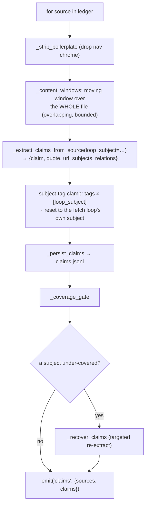
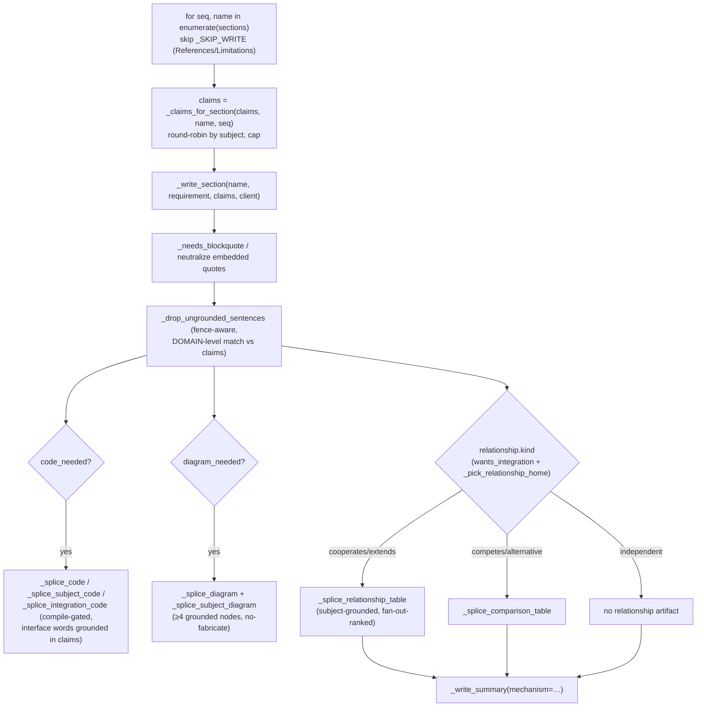
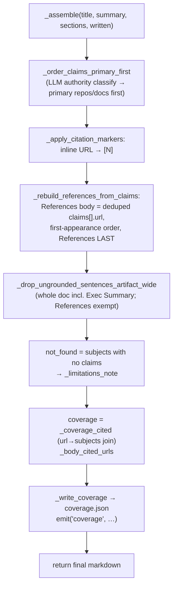
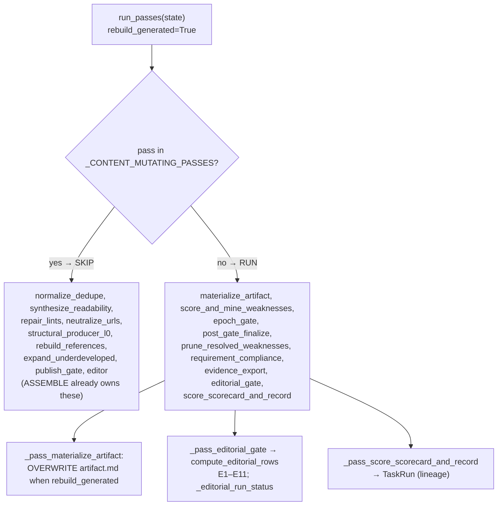

# AgentKit Studio — Design (research-report generation)

**Status:** current design authority (supersedes `DESIGN-v2.md`, which documents the
retired hub/spoke "Section-Ownership" architecture).
**Last rewritten:** 2026-07-12, against the code as it stands after the `research_first`
rebuild + the `runner.py` decomposition.
**Companion:** `SPEC.md` owns milestone/route contracts; `PLAN-CONSOLIDATED.md` owns the
backlog + decision history. (The former `ARCHITECTURE-doc-generation-pipeline.md` process map
is superseded — its per-stage detail lives in §3 below; recover the old mermaid deep-dive from
git history at commit `4de0e9c` if ever needed.)

Refs below are by **module::function** (durable across refactors), not line numbers. Diagram
nodes (§3, §6) use a bare function name where the module is the section's own file
(`research_first.py` in §3, `finalize.py` in §6) and `module::function` when a node crosses into
another module.

---

## 1. Objective & success metric

**What it is.** AgentKit Studio is a local, single-user platform that turns a plain-language
requirement into an **evidence-backed research report** — sections, code, diagrams, a
comparison/integration artifact, and a References list built from real fetched sources — and
**improves it across runs** (hill-climb) without human editing.

**"Good", measured.** A run is judged by a rubric-scored self-eval (0–1) plus a deterministic
**editorial gate** (E1–E11). The canonical acceptance bar (task_hash `492bae60177b`, the
Pi/Craft report): every requested subject resolved + cited from a distinct real source, an
integration diagram or comparison table that names every subject, References built from the
cited claim set (last, both-directions consistent), and no fabricated/ungrounded prose. Live
runs reach 0.8–1.0 on that lineage.

**Non-negotiables (the whole system exists to enforce these).**
- **No fabrication.** Content enters the artifact only if it is grounded in a fetched source's
  verbatim quote. Absence of evidence becomes an honest *Limitations* line, never invented prose.
- **No grader-gaming.** Guards are structural / distance-based; there are no hardcoded
  task/subject phrase lists in production code (test-enforced).
- **Honest failure.** A check that cannot verify records `could_not_verify`, never a false
  pass; a crashed run records `unverified`, never a `0.0` that would poison the lineage.

---

## 2. System architecture — module map

Studio is a FastAPI backend (`studio/`) + a Vite/React frontend (`frontend/`), riding a shared
engine (`agentkit/`, §12). Durable state is layered (full data design in §17): `tmp/task_runs.db` holds the **lineage**
(`task_runs`) + **learned-template** (`report_templates`) tables; two agentkit-owned SQLite stores
back GUI panels (`shared_memory.db`, per-session temp `dag.db`); per-run deliverables (`artifact.md`,
`claims.jsonl`, `coverage.json`) are durable **workspace files** under `tmp/`; scheduler/chain trigger
state is **process-local and non-durable** (§9), lost on restart. §17 enumerates all four SQLite
stores and their columns.

| Module | Role | Path in the live path? |
|---|---|---|
| `research_first.py` | **The generation core** — the linear FRAME→RESEARCH→CLAIMS→WRITE→ASSEMBLE pipeline. | ✅ default |
| `runner.py` | The run shell: session dispatch, the epoch loop, SSE `emit`, scoring/recording. | ✅ shared |
| `finalize.py` | The epoch-end **pass pipeline** (materialize, score, editorial gate, record). | ✅ shared |
| `task_runs.py` | `TaskRunStore` — lineage, seeding, weakness mining, cross-task similarity (SQLite + numpy). | ✅ shared |
| `rubric.py` | The research-report evaluation rubric + adjusted scoring. | ✅ shared |
| `tools.py` | `ToolAugmentedClient` — the web_search/web_fetch tool loop over any LLM client. | ✅ shared |
| `triggers.py` | Scheduler trigger registry + chain registry + cron firing (§10). | ✅ (loop automation) |
| `app.py` | FastAPI routes + the SSE run stream. | ✅ shared |
| `backends.py` / `client.py` | `PROFILES` menu → `StudioChatClient`; usage capture. | ✅ shared |
| `legacy_loop.py` | The retired hub/spoke seed-and-patch loop — **rollback fallback only**. | ⛔ fallback |
| `seed_carry.py` | Hill-climb artifact carry-forward — **skipped by research_first** (cold-start). | ⛔ fallback |
| `editor_pass.py` | The editor/structural-retry subsystem — a **content-mutating finalize pass, skipped on research_first** (§7). | ⛔ fallback |

**The decomposition (2026-07-12).** `runner.py` was a 4,443-line god module; it was carved to
2,187 lines by extracting three cohesive, behavior-preserving units — `legacy_loop.py`
(the legacy `_run_phase_loop`), `seed_carry.py` (`_seed_carry_forward`), and `editor_pass.py`
(the 16-function editor subsystem, re-exported from `runner` so consumers are unchanged). Each
is a verbatim move (AST-identical bodies) behind a late-import / re-export seam so nothing that
imports from `studio.runner` breaks. Rationale: the god module taxed every session with
navigation + merge-conflict cost; isolating "the legacy loop", "seed carry-forward", and "the
editor" into findable files is the win — the line count is a proxy.

**Two generation modes, one shell.** The runner dispatches to `research_first` when
`_use_research_first(session)` is true (registry default is **off**; `POST /session` sets it,
and the env kill-switch `STUDIO_DISABLE_RESEARCH_FIRST` forces the legacy path for instant
rollback). The legacy hub/spoke loop (`legacy_loop.py`) exists only as that fallback and is not
documented here. **Fail-visible:** an opted-in research_first run that errors surfaces the error;
it does not silently fall back.

---

## 3. The generation core — `research_first`

`generate_research_first` (`research_first.py`) runs **linearly**: five stages, each feeding the
next. No topology, no hub/spoke fan-out, no per-phase LLM orchestration. The unit of research is
the **subject** (the real referent, e.g. `Pi`, `Craft`), not the section.

```
FRAME → RESEARCH → CLAIMS → WRITE → ASSEMBLE
```

| Stage | Entry | One line |
|---|---|---|
| **FRAME** | inline in `generate_research_first` | Extract subjects + sections + code/diagram needs; disambiguate each subject; classify the inter-subject relationship. |
| **RESEARCH** | `_research` | Per-subject fetch loop (offtopic/anchor-gated), a 0-source subject triggers a question-critic reformulation; returns a per-subject source ledger + coverage. |
| **CLAIMS** | `_build_claims` | Extract `{claim, quote, url, subjects, relations}` from each source over a moving window; coverage-gate + recover. |
| **WRITE** | `_write_section` per section | Write each skeleton heading from its own claims; splice grounded code / diagrams / a relations or comparison table / the summary (last). |
| **ASSEMBLE** | `_assemble` | Stitch title + summary + sections; build References **from claims** (last, both directions); write the coverage sink. |

SSE surfaces each stage as a `phase_start` (`research_first_frame/research/claims/write/assemble`)
plus data events (`frame`, `research`, `claims`, `write`, `coverage`), then `hill_climb`, then a
single terminal `done`.

### 3.0 The pipeline in the run shell

The runner dispatches to `research_first` and reuses the shell's epoch loop, lineage recording, SSE
`emit`, and the finalize tail (§6) — but **not** seed carry-forward (§7), the hub/spoke loop, or the
content-mutating finalize passes.



### 3.1 FRAME — subjects, sections, relationship



- **Subjects are the unit of research.** `_extract_subjects` pulls the real referents; the LLM
  fallback is deterministically validated (verbatim substring, ≤4 words, ≠ whole-task,
  compound-split *after* the whole-task check) so a whole-task string never becomes a subject.
- **Disambiguation** (`_disambiguate_subject`) resolves each subject to a concrete referent +
  search anchors (fail-open). Descriptor + anchors persist into the coverage ledger and the Scope
  assumption line — this is what keeps "Pi" resolving to `earendil-works/pi`, not the π constant.
- **Relationship is classified, not presumed** (`_classify_relationship`): a `kind` ∈
  {cooperates, competes, extends, alternative, independent, unknown}, grounded in joint evidence,
  fail-open `unknown`. Task framing outweighs subject similarity ("use X and Y together" →
  cooperates/extends). Downstream: cooperate/extends → integration section + diagram;
  competes/alternative → comparison table; independent → no forced relationship artifact. (The old
  hardcoded interface enum `api|cli|mcp|sdk` was removed — D-level MVP-8.)

### 3.2 RESEARCH — per-subject fetch loop (`_research`)



- **Coverage by construction.** Every subject is searched unconditionally; a joint loop searches
  the classified relationship mechanism. No subject is silently skipped.
- **Offtopic gate** (`_is_offtopic`) = a hard keyword band + a gray-zone LLM judge (on the strong
  judge client). Wrong-referent sources (π-Wikipedia, same-name products) are dropped at selection,
  before they pollute claims.
- **Question-critic** (`_reformulate_queries`, D2): a 0-source subject triggers ≤3 model-proposed
  reformulated queries (fed the descriptor/anchors so a retry never regresses to the bare ambiguous
  name), sharing the same gates. Fail-open — a 0-source subject never stalls; it becomes a
  Limitations line.

### 3.3 CLAIMS — extract, coverage-gate, recover (`_build_claims`)



- **Full-file moving window.** The old `content[:8000]` head-cut saw only nav chrome (the
  architecture sentence was at char ~93k). `_content_windows` reads the whole boilerplate-stripped
  file in overlapping bounded windows — this is what made the real Pi↔Craft joint claim
  extractable (joint 0→7).
- **Claim schema carries `relations:[{head,rel,tail}]`.** The LLM emits triples; code keeps only
  those whose *both* endpoints are whole-token-grounded in the verbatim quote. Feeds the relations
  fan-out table and the integration diagram edge.
- **Subject-tag clamp.** A single-subject fetch loop vetted sources against only its own anchors,
  so any claim tagged with something other than that subject is unvetted → reset to the loop's
  subject. Kills the wrong-referent leak class.
- **Coverage gate + recovery** (`_coverage_gate`, `_recover_underevidenced`): an under-evidenced
  contract fires one targeted recovery search *now*; a still-short contract emits a fail-visible
  `coverage_failed_partial` event and (via P2.5 recovery) becomes a declared question-limitation —
  never weak fallback prose. `_classify_answerability` routes structurally-unanswerable asks to
  reasoned Limitations instead of burning searches.

### 3.4 WRITE — one section per heading (`_write_section`)



- **Sections are written once, from their own claims.** `_claims_for_section` round-robins subjects
  into the per-section cap so subject-2 is never starved.
- **Grounding is enforced at write time.** `_drop_ungrounded_sentences` (fence-aware) keeps a
  sentence only if it cites a URL whose **domain** matches the section's claims (domain-level
  because weak models truncate real URL paths; cross-domain fabrication still dies).
- **Structural artifacts are grounded, not invented.** Code is compile-gated and its interface
  vocabulary must appear in claims; a diagram needs ≥4 claim-grounded nodes or none is drawn; the
  relationship table vs comparison table branch is chosen by the classified `kind`.
- **Exec Summary is written LAST** (`_write_summary`, D4) from the final body — the overclaiming-
  summary class is prevented by construction (E8 remains as the detector).

### 3.5 ASSEMBLE — stitch + References-from-claims + coverage (`_assemble`)

The integration-home decision (`_pick_relationship_home` + `wants_integration`) happens in WRITE
(§3.4), not here; ASSEMBLE only stitches, cites, rebuilds References, and writes the coverage sink.



- **References are BUILT from claims, never scraped from body** (`_rebuild_references_from_claims`):
  References = the deduped `claims[].url` set, both directions, always last. A real repo lands in
  References once it is a claim; LaTeX/SVG link-texts from a rendered page never do.
- **Inline `[N]` markers render a declared citation** (`_apply_citation_markers`): the writer emits
  explicit URLs; code maps each to its reference number. Zero false attribution.
- **Coverage ledger (P1)** (`_coverage_cited`): per subject `{queries_issued, sources_fetched,
  cited_in_artifact}`; `cited_in_artifact` counts a URL only if it (or its `[N]`) appears in the
  **body** (References-only presence does not count). Written to `coverage.json` + an SSE event.
- **Not-found contract (P4)** (`_limitations_note`): a subject that yielded no claims auto-emits a
  Limitations line (match-only home so it never splices into a wrong section); silent when covered.

---

## 4. Core invariants

1. **One deliverable per task.** A run writes a single `artifact.md`; research_first writes each
   section once from fresh claims (no reconstruction-from-scratch of a prior version).
2. **Grounded-or-absent.** Every sentence, code block, diagram node, and citation traces to a
   fetched source's verbatim quote, or it does not ship. Absence → a tracked Limitations line.
3. **References ⊆ cited claims, both directions, last.** The References list is exactly the cited
   claim-URL set; body markers and the list are consistent both ways.
4. **No whole-doc LLM echo.** No call takes a large document and expects it echoed back whole (a
   model truncates a long echo). Processing windows → processes → splices a localized block.
5. **Cold-start by design.** research_first never seeds from a prior artifact (§7); each epoch is a
   fresh linear build. Improvement rides the scoring/editorial tail, not artifact carry-forward.
6. **Honest verification.** could_not_verify ≠ pass; crashed ≠ scored. Fail-open guards always log.

---

## 5. Claims, contracts, coverage & recovery (design workstreams D1–D5)

The research→write boundary is a **first-class evidence layer**, not transient patch material —
the single largest design change from the legacy pipeline.

- **D1 — claims-with-provenance (~realized).** `claims.jsonl` is a grow-only, deduped substrate of
  `{claim, quote, url, subjects, relations}`. WRITE compiles sections FROM claims; coverage (E3),
  conflicts, and exec-summary consistency (E8) are **queries over the claims table**, not
  whole-text LLM judgments. Residual: no per-claim `confidence` field (its only consumer would be
  claim-ranking, already handled by subject-grounded fan-out ranking).
- **Answer contracts (P2, done-in-research_first).** FRAME emits a per-question
  `{question, subject, answer_form, min_evidence}` contract *before* research; resolution is
  per-question (`_resolve_question_contracts`). A joint comparison/design question resolves by
  DISTINCT cited URLs per side **and** an artifact (table/diagram) that strictly names every
  subject — not by a single both-subject page (a web-availability ceiling). A semantic
  joint-claim guard (`_verify_joint_claim` / `_filter_joint_noise`) drops bare-name co-mentions
  ("Pi is one of the compatible models") that are lexically clean but a different referent.
- **D2 — search-step critic (done).** `_reformulate_queries` (§3.2).
- **D3 — disambiguation channel (done).** Descriptor/anchors persist structurally in
  `coverage.json` + the SSE `coverage` event, on top of the Scope assumption line.
- **D4 — write-order (realized-by-construction).** Exec Summary written last from the body (§3.4).
- **D5 — belief/uncertainty (closed).** The confidence-ledger / next-epoch-budget core is
  **dead-by-cold-start** (there is no next epoch to consume a confidence signal — the same
  MEASURED-NULL class as legacy repeat-weakness escalation). The one live part — a failed
  structural producer raising a research signal, not empty content — is realized by
  `_recover_underevidenced`'s in-run closed-loop recovery → declared question-limitation.

---

## 6. Finalize pipeline & the editorial gate

After generation, `run_passes(state)` (`finalize.py`) walks an ordered `PASSES` list, fail-open
per pass. A research_first run carries `rebuild_generated=True`, which **skips every
content-mutating pass** (`_CONTENT_MUTATING_PASSES`: normalize_dedupe, synthesize_readability,
repair_lints, neutralize_urls, structural_producer_l0, rebuild_references, expand_underdeveloped,
publish_gate, **editor**) and runs only the recording/scoring tail.

**Why trust inverts on rebuild.** For a legacy run those passes repair/dedupe/rebuild the document;
for a research_first run the ASSEMBLE stage already owns dedupe, references, fence/citation repair,
and structural production — so re-running them can only corrupt. This is why `editor_pass.py`
(the editor subsystem) does **not** run on a research_first report (verified live: a research_first
E2E emits zero editor gate events, by design — regression-locked in `test_finalize.py`).

**Write-early + materialize overwrite.** The generated text is written to `artifact.md` right after
generate returns; `_pass_materialize_artifact` then OVERWRITES `artifact.md` on rebuild so a stale
seed can never win the post-gen preference. Verified byte-exact (recorded `result_text` ==
workspace `artifact.md`).



### 6.1 The editorial gate — E1–E11 (`compute_editorial_rows`)

Eleven deterministic checks over the assembled artifact; each returns
`{row, verdict ∈ pass|fail|could_not_verify, evidence, required}`. A raised check degrades to
`could_not_verify` — **never a false pass**.

| Row | Checks | Note |
|---|---|---|
| E1 | required sections present | deterministic |
| E2 | no stub sections (thin non-structural bodies) | deterministic |
| E3 | every ledger subject cited-in-artifact or declared not-found | **hard** (fail → rejected); reads coverage.json |
| E4 | citations resolve (grounding) | **hard**; grounded-by-construction on rebuild |
| E5 | References ⊇ and ⊆ body citations (both directions) | deterministic |
| E6 | structural validity (mermaid/table/fence) | deterministic |
| E7 | dynamic sections carry their promised block (a "Code…" heading needs a fence, etc.) | advisory |
| E8 | exec-summary consistency: no summary-only citation the body doesn't support | advisory |
| E9 | internal number consistency (same noun phrase, no conflicting counts) | advisory |
| E10 | honest limitations: a recorded coverage gap is NAMED in Limitations, not boilerplate | advisory |
| E11 | lint clean (content-validity list) | deterministic |

**Verdict router** (`_editorial_run_status`): only **E3/E4 fail → `rejected`** (a subject
researched-but-uncited, or grounding residue — a content defect, not a nit). Every other fail
records `completed` (the fix is a next-epoch weakness seed, never a faked pass). Empty rows →
`unverified` (a crashed gate must never read as a fully-scored `completed`). **Doctrine:** the
SPEC's LLM-judge half of each row is deliberately skipped for the cold-start pipeline — an
advisory weakness is never consumed (no next epoch), and a weak-model judge would false-reject
prevention-hardened output. Only the cheap deterministic *regression invariant* is built.

---

## 7. Hill-climb, cold-start & persistence

**Hill-climb** is cross-run improvement keyed by `task_hash = sha256(requirement.strip().lower())[:12]`.
The SAME requirement (case/space-normalized) shares a hash across sessions; a later run finds the
prior lineage and its accumulated weaknesses. Each run records a monotone `version` per hash. The
SSE `hill_climb` event reports `{epoch, score, status}` (e.g. `v99 score=0.81 status=improving`).

**Cold-start by design.** research_first never carries a prior artifact forward — the
`_seed_carry_forward` block is skipped when `_use_research_first(session)`. Rationale: the legacy
loop merged the carried seed into the rebuild output, accumulating stale sections across a lineage
and pushing References off the end; a linear pipeline that writes each section once from fresh
claims is only correct if nothing pre-seeds it. Improvement therefore comes from the
scoring/editorial tail feeding weaknesses forward, not from artifact carry-forward.

> **Lineage trap.** Attaching a goal or a loop-seed changes the requirement text → rotates
> `task_hash` → a fresh cold-start v1. Run the bare end-state requirement to resume a lineage.

**Persistence — `task_runs.db`** (`TaskRunStore`, no ORM). The `task_runs` table is the lineage
store; **§17.2 is the authoritative full column spec** (15 columns, types, constraints, indexes) —
not duplicated here to avoid drift. The hill-climb-relevant columns: `task_hash`, `version`, `score`,
`status`, `result_text` (deliverable, preamble-stripped), `weaknesses_json`, `config_json` (config
snapshot, survives restart), `requirement_embedding` (R10 cross-task cosine).
- **Seed = latest-with-content, not best-score** (`latest_with_content`): self-eval scores are
  noisy; the latest run carries the most accumulated work. The seed is sanitized on read.
- **Servable-ancestor invariant.** `latest_with_content` carries NO status filter — the user is
  always served the latest content row even when `rejected`; only the hill-climb *seed* path
  excludes `rejected`, and research_first is cold-start (never seeds), so an all-rejected lineage
  degrades to cold-start, never to "nothing servable".
- **Acceptance economics (L5).** `build_pass_economics` records per-pass attempted/accepted counts
  + tokens-per-accepted into the run metrics.

---

## 8. Evaluation — rubric & scoring

`score_result` (`task_runs.py`) shows the judge the **full** artifact (up to ~20K chars — a small
window hid tail citations and gave falsely high scores) and returns a rubric-weighted 0–1 score.
`rubric.py` owns the criteria (summary, findings, evidence synthesis, analytical depth, sourcing,
methodology, conclusion) and the topic-agnostic default template (`GENERIC_RESEARCH_PROFILE`).
Weaknesses are mined section-tagged (`mine_weaknesses_from_outputs`, ~6K window) and refuted
against the real artifact (`refute_false_weaknesses`) so a stale placeholder claim can't seed a
phantom next-epoch fix. Cross-task lessons (R10) come from `similar_runs`/`accumulated_weaknesses`
(cosine over `requirement_embedding`).

---

## 9. Loop automation — scheduler & chain

Two Studio-native features let a report (or any task) run on a schedule or as a dependency DAG.

**Chain** (`POST /chain/run`, `_execute_chain`). A `LoopChain` (agentkit) runs named steps in
topological order, each step's merged input = the initial context + upstream step outputs. Each
step is a **real bounded LLM task** (`_build_chain_runner_factory`, max 1024 tokens, fed the step
description + upstream outputs); no backend configured → an honest `{error: "no LLM backend"}`,
never a silent stub. `/chain/suggest` decomposes a task into a DAG spec via the LLM.

**Scheduler** (`triggers.py`; `POST /scheduler/cron`, `GET /scheduler`, `DELETE …`). A cron
trigger registers a `(cron_expr, chain_id)` pair and, when armed, fires the **saved** chain of that
id on a self-rescheduling daemon `threading.Timer`. The tick period is derived from the cron
expression (`*/N * * * *` honored; unsupported forms flagged `cron_parsed=False` rather than
silently misread), clamped to a floor so a real-LLM loop cannot run away. A failing tick records
`failures`/`last_error` on the trigger (surfaced in `GET /scheduler`) instead of spamming a thread
traceback; the schedule self-heals (re-arm in `finally`). In-memory + process-local — a durable
store is a future enhancement; register/list/delete/fire are fully real.

---

## 10. SSE run API

The GUI is one client; the same calls drive a run from any script (backend on `:8770`).

1. **`POST /session`** → `{session_id}`. Body: `{llm:{profile}, judge_llm:{profile}|null,
   embed:{}, mode:"llm"|"auto", budget:{ceiling}, tools_enabled, use_research_first}`.
   `tools_enabled` gates web_search/web_fetch — **off ⇒ the pipeline fabricates and the scorer
   caps ~0.30** (the #1 "looks fine but low score" cause).
2. **`POST /session/{id}/hill-climb`** (optional) — `{auto_improve, max_epochs, min_improvement,
   score_metric, …}`.
3. **`POST /session/{id}/rubric`** (optional) — `{weights, template}`; `GET /rubric/defaults` seeds
   the panel.
4. **`GET /run/{id}?requirement=<urlencoded>`** → an **SSE stream**: `session → phase_start
   (frame/research/claims/write/assemble) + data events (frame, research, claims, write, coverage)
   → hill_climb → done`. Optional `history` = JSON `[{role,content}]` for multi-turn.

> **GOTCHA — drain the stream fully.** The run records the row *as the stream is consumed*. A client
> that disconnects early cancels the server-side generator → the run may never record. A browser
> `EventSource` is fine; a script MUST read every line until the server closes the stream.

Other routes: `/backends`, `/loops`, `/skills`, `/export/{id}`, `/artifacts/{id}`,
`/session/{id}/goal[/suggest]`, `/chain/{run,suggest}`, `/scheduler[/cron]`, `/catalog/templates/*`,
`/task-runs/{hash}`.

---

## 11. Local services & environment

- **oMLX `:8000`** — local chat + BGE-M3 embeddings (the `local` embed profile); retried 3× on
  connection errors.
- **SearXNG `:8080`** — primary search backend; precedence **SearXNG → Tavily → DDG** (falls
  through on an empty pool or a down server). `web_toolkit` must be on the venv path (a `.pth`) or
  the loop silently runs with no search and fabricates.
- LLM profiles resolve in `backends.py::PROFILES`. The **judge** client (default haiku) is a strong
  model used for the offtopic gray-zone gate, joint-claim verification, and presentation-quality
  scoring; spokes/sections stay on the session model.

---

## 12. Shared-library boundary (`agentkit`)

Studio is the orchestration shell; `agentkit` is the reusable engine (pure, no `studio` import;
client/embedder injected via Protocol). Reusable mechanisms live under `agentkit/`:
`topology.{sizing,dynamic,core}`, `orchestrator.ledger`, `artifacts.{patcher,store,sections,dedup,
metrics,ranking,types}`, `improvement.*` (`TaskRunStore`/`score_result`/`mine_weaknesses`),
`loop.{chain,suggest}` (the LoopChain the scheduler fires), `runtime.scheduler` (cron/webhook trigger
model), `evolve` (`check_goal`/`self_preference`), `tools.fetch_cache`, `context`, `types`
(`ChatResult`/`Message`/`Embedder` Protocol).

> The `runner.py` decomposition follow-up noted in `DESIGN-v2.md` §11 is **done** (§2): the
> record/scoring, seed, and editor units are extracted (into `finalize.py` / `seed_carry.py` /
> `editor_pass.py`).

---

## 13. UI / GUI (`frontend/`)

A single-page React app: a header (LLM/judge/embedder profile menus, budget, Connect session, ⚙
Loop configuration), a main topology/conversation pane with a `<ChatPanel>` multi-turn thread
(prior turns forwarded as `history` on the SSE URL), a token meter, and **14 tabbed panels**
(LOOPS, TOOLS, ROUTER, MEMORY, SELF-IMPROVE, EVOLVE, SECURITY, LOOP DOCTOR, DAG, VERIFY, GOAL,
HILL CLIMB, SCHEDULER, CHAIN) fed by the live SSE events. The ⚙ Loop Config dialog has goal /
scheduler / chain / hill_climb / rubric tabs; the rubric panel iterates whatever
`GET /rubric/defaults` returns (**no hardcoded criterion keys** — a new backend criterion needs
zero frontend change). Scheduler + chain panels are wired to the real endpoints (§9).

---

## 14. Decision log & rationale

- **research_first replaced hub/spoke (2026-07-05, user ruling).** The legacy phase-loop oscillated
  between defect and guard-patch across six runs and never produced a Craft citation in seven runs;
  the linear claims-grounded pipeline reached deterministic acceptance (0.92–1.0). Guards detect but
  never converge — the construction fix (rebuild the producer) was taken after 2 failed patch rounds
  on one defect family. That "construction over guard after ~2 rounds" is now a standing rule.
- **Cold-start over carry-forward (D4).** Merging a carried seed into a fresh linear build
  accumulates stale sections and buries References; cold-start makes "write each section once" sound.
- **Editorial rows deterministic-only.** The SPEC specced LLM judges per row; for a cold-start
  pipeline an advisory weakness is never consumed and a weak-model judge false-rejects
  prevention-hardened output — so only the cheap deterministic regression invariant is built.
- **runner.py decomposition (2026-07-12).** Behavior-preserving extraction (AST-identical moves +
  late-import/re-export seams) of the legacy loop, seed carry-forward, and editor subsystem; the
  remaining orchestration spine (`_run_inner`, 90 `self` refs) is intentionally kept whole (splitting
  it scatters one control-flow). Enforcement policy going forward: hard-gate new code (<50-line
  func / <300 class / <500 file), refactor-on-touch, no repo-wide sweep.
- **Scheduler/chain: real, not stub.** The GUI's chain step-runner and scheduler register were
  stubs; both are now real (bounded-LLM steps; register/list/fire with cron-derived interval,
  interval floor, and recorded tick failures). A latent `/chain/suggest` bug (a dead `studio.catalog`
  import that always fell back to a single step) was fixed in the same pass.
- **Verify-first / no-fake-completion (standing).** Outcomes are confirmed by live runs, not green
  suites; a stub, a `test.skip`, or a TODO branch is a blocker, not evidence. Stale-server discipline:
  a no-reload dev server can serve old code — confirm `server-start-time > newest-source-mtime`
  before trusting any live run.

---

## 15. Requirements traceability

Each design-level requirement (the §1 non-negotiables, the §4 invariants, the §6.1 editorial
rows) is enforced by a named `module::function` and locked by a named test. This is the
"a reviewer can find the code and the guard" contract — no requirement floats unmapped.

| # | Requirement (source) | Enforced by (`module::function`) | Locked by test |
|---|---|---|---|
| R-NF1 | No fabrication — content grounded in a verbatim quote (§1) | `research_first::_drop_ungrounded_sentences` + `_drop_ungrounded_sentences_artifact_wide` | `test_research_first.py`, `test_evidence.py` |
| R-NF2 | No grader-gaming — structural guards, no hardcoded task/subject phrase lists (§1) | `studio/guards.py` (distance/structural) | `test_genericity_audit.py`, `test_guards.py` |
| R-NF3 | Honest failure — `could_not_verify` / `unverified`, never a false pass or poisoning `0.0` (§1) | `finalize::_editorial_run_status`, `runner` crash path | `test_l1_editorial_gate.py`, `test_partial_persistence.py` |
| R-I1 | One deliverable per task; each section written once from fresh claims (§4.1) | `research_first::_write_section` (per heading, no reconstruction) | `test_research_first.py` |
| R-I2 | References ⊆ cited claims, both directions, last (§4.3) | `research_first::_rebuild_references_from_claims` + `_apply_citation_markers` | E5 in `test_l1_editorial_gate.py` |
| R-I3 | Cold-start — never seed from prior artifact on research_first (§4.5, §7) | seed-skip guard in `runner::_run_inner` when `_use_research_first` | `test_research_first_routing.py`, `test_hc_continuation_ws_artifact.py` |
| R-I4 | Content-mutating finalize passes skipped on rebuild (§6) | `finalize::run_passes` gate on `_CONTENT_MUTATING_PASSES` | `test_finalize.py` (zero editor events, regression-locked) |
| E3 | Every ledger subject cited-or-declared (**hard**, §6.1) | `finalize::compute_editorial_rows` E3 (reads `coverage.json`) | `test_l1_editorial_gate.py` |
| E4 | Citations resolve / grounding (**hard**, §6.1) | `compute_editorial_rows` E4 | `test_l1_editorial_gate.py` |
| E1,E2,E5–E11 | Structure/consistency invariants (§6.1) | `compute_editorial_rows` E1–E11 | `test_l1_editorial_gate.py`, `test_artifact_lint.py` |
| R-SVC1 | Scheduler tick cannot run away / self-heals (§9) | `triggers.py` interval floor + `except` + `finally` re-arm | `test_scheduler_triggers.py` |
| R-EVAL1 | Scorer sees full artifact (~20K), not a truncated head (§8) | `task_runs::score_result` window | `test_rubric.py`, `test_run_metrics.py` |

> **Rule.** A new invariant lands with (a) its enforcing `module::function`, (b) a row here, and
> (c) a locking test. An invariant with no locking test is a **doc claim, not a guarantee** — mark
> it as such (§21) rather than implying enforcement.

---

## 16. Interface contracts

The SSE run API (§10) is the sole external contract; the GUI and any script are equal clients.
This section pins the request/response/event shapes and the boundary assumptions a reviewer needs.

### 16.1 `POST /session`

**Request body — an untyped JSON object** (parsed via `body.get(...)`, **no Pydantic model**; see
the boundary-validation risk in §21):

```jsonc
{
  "llm":        { "profile": "haiku" } | { "raw": {…} },   // required; resolves in backends.py::PROFILES
  "judge_llm":  { "profile": "haiku" } | null,             // strong-model judge (§11); null ⇒ reuse llm
  "embed":      { },                                       // embedder spec; {} ⇒ default (local BGE-M3)
  "mode":       "auto" | "llm",                            // default "auto"
  "budget":     { "ceiling": <int> } | null,               // token ceiling; null ⇒ unbounded
  "tools_enabled":      true,                              // default true — FALSE ⇒ fabrication, score≈0.30
  "use_research_first": true | false                       // default OFF; env STUDIO_DISABLE_RESEARCH_FIRST forces legacy
}
```

**Response:** `{ "session_id": "<uuid>", "llm": {label, model}, "embed": {…} }`. The session is a
server-side dataclass; `use_research_first` defaults **off** on the dataclass and is only turned on
through this route (fail-safe default).

### 16.2 SSE run stream — `GET /run/{id}?requirement=<urlencoded>`

`text/event-stream`. **Core contract** (a client may rely on these, in this order):

| Event | Payload | Meaning |
|---|---|---|
| `session` | `{session_id}` | stream opened |
| `phase_start` | `{phase}` ∈ `research_first_{frame,research,claims,write,assemble}` | stage boundary |
| `frame` | `{subjects, sections, code_needed, diagram_needed}` | FRAME result (§3.1) |
| `research` | `{subjects}` (per-subject source counts) | RESEARCH result (§3.2) |
| `claims` | `{sources, claims}` | CLAIMS result (§3.3) |
| `write` | per-section progress | WRITE (§3.4) |
| `coverage` | `{per-subject queries/sources/cited}` | ASSEMBLE ledger (§3.5) |
| `hill_climb` | `{epoch, score, status}` | lineage record (§7) |
| `done` | terminal | run recorded; stream closes |

**Diagnostic events** (advisory, may be added/removed without breaking the core contract; a client
MUST tolerate unknown event names): `research_query`, `coverage_failed_partial`, `coverage_recovery`,
`recovery`, `joint_noise`, `richness`.

**Error & edge behavior:**
- **Early disconnect cancels recording** (the §10 GOTCHA): the row is written *as the stream drains*;
  a client that closes early cancels the generator → no lineage row. Scripts MUST read to close.
- **No auth** on any route (§20) — localhost trust boundary, by design.
- **A research_first run that errors surfaces the error** (fail-visible); it does not silently fall
  back to legacy (§2).

### 16.3 Compatibility rules

- **Rubric criteria are data, not code** (§13): a new backend criterion in `GET /rubric/defaults`
  needs zero frontend change (the panel iterates whatever keys it returns).
- **Additive events only:** new diagnostic SSE events are non-breaking; renaming/removing a *core*
  event is a breaking change and must update §16.2 + `test_events.py`.

---

## 17. Data design & lifecycle

The complete persistence surface: **four SQLite stores** (two studio-owned tables in one file, two
agentkit-owned panel DBs), **workspace files**, and **process-local** trigger state. All SQLite —
no ORM, `sqlite3` directly. Column types below are the SQLite storage classes as declared.

### 17.1 Store topology

| Store (file) | Table(s) | Owner | Durability | Purpose |
|---|---|---|---|---|
| `tmp/task_runs.db` | `task_runs` | studio `TaskRunStore` | durable | run lineage / hill-climb (§7) |
| `tmp/task_runs.db` | `report_templates` | studio `TemplateStore` | durable (same file) | learned report skeletons (§17.3) |
| `shared_memory.db` (`tmp/`'s parent) | `memories` | agentkit `MemoryStore` | durable, cross-run/session | GUI MEMORY panel; episodic recall (§13) |
| `dag.db` (per-session `mkdtemp`) | `graphs`, `runs`, `nodes`, `executions` | agentkit `GraphStore` | **ephemeral** (temp dir) | GUI DAG panel (§13) |

**Schema ownership boundary (§12).** Studio owns the full column spec of `task_runs` (§17.2) and
`report_templates` (§17.3). The two panel stores are **agentkit-owned** (`agentkit/memory/store.py`,
`agentkit/runtime/graph_store.py` are the source of truth) — Studio only instantiates them. Their
columns are reproduced below (§17.1.1–§17.1.2) for a complete persistence picture; if agentkit's
schema changes, agentkit wins and this doc follows.

> **Design contrast.** The agentkit tables are **better-normalized than the studio tables**: they use
> real `FOREIGN KEY` references (`runs→graphs`, `nodes→runs`) and purpose-built indexes, where
> `task_runs`/`report_templates` are FK-free with denormalized JSON columns (§17.5). Timestamps also
> diverge — agentkit stores `REAL` epoch floats, studio stores `TEXT` `datetime('now')` strings.

#### 17.1.1 `memories` (`shared_memory.db` — agentkit `MemoryStore`)

Episodic/semantic memory for the GUI MEMORY panel; recall is cosine over `embedding_blob` in Python.
9 columns (6 base + 3 `ALTER`-added: `source`, `access_count`, `last_used`).

| Column | Type | Null | Default | Key | Semantic |
|---|---|---|---|---|---|
| `id` | INTEGER | no | autoinc | **PK** | memory id |
| `memory_type` | TEXT | no | — | idx² | e.g. `episodic` (§13); low-value entries filtered pre-write (§14.6) |
| `content` | TEXT | no | — | | the stored phase output |
| `embedding_blob` | BLOB | **yes** | NULL | | numpy float32 bytes; similarity in Python |
| `metadata_json` | TEXT | no | `'{}'` | | denormalized `{step_id, …}` |
| `created_at` | REAL | no | — | | epoch float (note: REAL, not TEXT) |
| `source` | TEXT | **yes** | NULL | | provenance (P34); ALTER-added |
| `access_count` | INTEGER | no | `0` | | usage tracking (P36); ALTER-added |
| `last_used` | REAL | **yes** | NULL | | last-recall epoch (P36); ALTER-added |

² `CREATE INDEX idx_type ON memories(memory_type)`.

#### 17.1.2 DAG store (`dag.db`, per-session temp — agentkit `GraphStore`)

Four tables backing the GUI DAG panel (§13); the LoopChain execution graph + append-only event log.
**Ephemeral** — a fresh `mkdtemp` per session, no cleanup (§17.5, §21 K9). Uses FKs + indexes.

**`graphs`** — the DAG definition. `graph_id` TEXT **PK** · `name` TEXT NN · `dag_json` TEXT NN
(serialized topology) · `created_at` REAL NN.

**`runs`** — one execution of a graph. `run_id` TEXT **PK** · `graph_id` TEXT NN **→ FK `graphs`** ·
`trigger` TEXT NN · `status` TEXT NN · `started_at` REAL NN · `finished_at` REAL null.

**`nodes`** — per-run node state (the execution frontier). **PK `(run_id, name)`** · `run_id` TEXT NN
**→ FK `runs`** · `name` TEXT NN · `node_type` TEXT NN · `payload_json` TEXT NN · `deps_json` TEXT NN
(dependency edges) · `status` TEXT NN · `result_json` TEXT null · `attempts` INTEGER NN dflt 0 ·
`claimed_by` TEXT null (worker claim, §3.0-style) · `updated_at` REAL NN. Index
`idx_nodes_ready(run_id, status)` (the READY-frontier query).

**`executions`** — append-only event log. `event_id` INTEGER **PK** autoinc · `run_id` TEXT NN ·
`node_name` TEXT null · `event_type` TEXT NN · `payload_json` TEXT null · `ts` REAL NN. Index
`idx_exec_run(run_id, event_id)`. Each event is appended inside the caller's transaction so it commits
atomically with the state change it records.

### 17.2 `task_runs` — full column spec (authoritative)

`sqlite3.connect(..., check_same_thread=False)`; 12 base columns + 3 `ALTER`-added. Type = declared
SQLite storage class.

| Column | Type | Null | Default | Key | Semantic |
|---|---|---|---|---|---|
| `id` | INTEGER | no | autoinc | **PK** | surrogate row id |
| `task_hash` | TEXT | no | — | UQ¹ | `sha256(requirement.strip().lower())[:12]` — lineage key (§7) |
| `session_id` | TEXT | no | — | | producing session (no FK) |
| `version` | INTEGER | no | — | UQ¹ | monotone per `task_hash`; allocated by `record_versioned` (§17.5) |
| `score` | REAL | no | — | | rubric self-eval 0–1 (§8) |
| `weaknesses_json` | TEXT | no | `'[]'` | | denormalized weakness list (mined, §8) |
| `artifact_path` | TEXT | no | `''` | | workspace pointer to `artifact.md` (§17.6) |
| `requirement` | TEXT | no | `''` | | input requirement text |
| `result_text` | TEXT | no | `''` | | the deliverable (preamble-stripped); == `artifact.md` byte-exact (§6) |
| `relevance_checked` | INTEGER | no | `0` | | bool-ish; R10 seed-priority flag (0 = unchecked) |
| `status` | TEXT | no | `'completed'` | | run status enum **by convention** (`completed`/`rejected`/`unverified`, §4.6) — no CHECK |
| `created_at` | TEXT | no | `datetime('now')` | | SQLite timestamp string |
| `requirement_embedding` | BLOB | **yes** | NULL | | raw numpy float32 bytes; cosine in Python not SQL (R10, §8); NULL for pre-R10 rows |
| `config_json` | TEXT | no | `'{}'` | | hill-climb config snapshot (survives restart, §14.4) |
| `evidence_json` | TEXT | no | `'[]'` | | denormalized evidence metadata |

¹ **`UNIQUE INDEX idx_task_runs_hash_version(task_hash, version)`** — the concurrency race-guard (§17.5).

**Lifecycle:** WRITE = one INSERT per run via `record_versioned` in the finalize scoring tail
(`_pass_score_scorecard_and_record`, §6). READ(seed) = `latest_with_content(task_hash)` (latest
non-empty; `rejected` excluded only on the seed path, §7). READ(cross-task) = `similar_runs` /
`accumulated_weaknesses` (cosine over `requirement_embedding`, R10). RETENTION = **grow-only, no GC**
(every version kept; the seed is "latest with content").

### 17.3 `report_templates` — full column spec (authoritative)

Second table in `task_runs.db` (`TemplateStore`) — learned/approved report skeletons for reuse.
6 base columns + 8 `ALTER`-added metadata columns.

| Column | Type | Null | Default | Key | Semantic |
|---|---|---|---|---|---|
| `id` | INTEGER | no | autoinc | **PK** | template id |
| `name` | TEXT | no | `''` | | label |
| `requirement` | TEXT | no | `''` | | source requirement |
| `skeleton` | TEXT | no | — | | the template body (dedup: skipped if `skeleton` already stored) |
| `requirement_embedding` | BLOB | **yes** | NULL | | numpy float32 bytes; similarity in Python |
| `created_at` | TEXT | no | `datetime('now')` | | creation timestamp |
| `report_type` | TEXT | no | `'general'` | | category |
| `source` | TEXT | no | `'learned'` | | origin (convention, no CHECK) |
| `status` | TEXT | no | `'active'` | | lifecycle enum (convention, no CHECK) |
| `failure_reason` | TEXT | no | `''` | | rejection reason |
| `quality_score` | REAL | **yes** | NULL | | template quality |
| `created_from_session` | TEXT | no | `''` | | producing session (no FK) |
| `approved_by` | TEXT | no | `''` | | approval actor |
| `last_used_at` | TEXT | no | `''` | | last-use timestamp string |

**Integrity note:** no unique index on `skeleton` — dedup is an application-level `SELECT ... LIMIT 1`
before insert (a TOCTOU window under concurrent writes; benign for single-user, §17.5).

### 17.4 Concurrency & migration model

- **Shared connection across threads.** Each store opens ONE `sqlite3` connection with
  `check_same_thread=False`, shared by request handlers and the scheduler daemon thread (§9). This is
  **safe here only because writes are effectively single-user/low-contention**; there is no explicit
  app-level write lock. Under genuine concurrency the shared connection is a hazard (interleaved
  transaction state) — an accepted risk for a single-user local tool (§20), flagged for revisit (§21 K8).
- **Version-collision race — mitigated.** Two concurrent `auto_improve` runs of the same `task_hash`
  both read `MAX(version)+1` and would insert the same `version`. The `UNIQUE(task_hash, version)`
  index rejects the second insert with `IntegrityError`; **`record_versioned(retries=5)` catches it,
  `rollback()`s, recomputes `MAX+1`, and retries** (`task_runs.py`). Residual: exhausting 5 retries
  raises (never silently drops a run). Verified against the retry body, not just the doc.
- **Migration = idempotent additive `ALTER`.** On open, each store runs `PRAGMA table_info` and adds
  any missing column via `ALTER TABLE ADD COLUMN <name> <ddl>` with a backfill default. There is **no
  down-migration and no schema-version table** — additive-only. (Correction: an earlier draft called
  this "no migration framework"; the mechanism is a real, if lightweight, idempotent migration.)
  Backfill defaults are chosen to be semantically correct for legacy rows (`status='completed'`,
  `relevance_checked=0`, `requirement_embedding=NULL`).

### 17.5 Integrity gaps (accepted for a single-user local tool)

A senior reviewer would flag these; each is a deliberate simplification, not an oversight (§20, §21):
- **No foreign keys in the studio tables.** `session_id`, `created_from_session`, `artifact_path` are
  unenforced pointers (the agentkit DAG store does use FKs — §17.1.2 — the contrast is intentional:
  studio's lineage is append-only/immutable so referential integrity buys little).
- **No CHECK constraints.** `status`, `source`, `score` range, and JSON validity are convention-only.
- **Denormalized JSON columns** (`weaknesses_json`, `config_json`, `evidence_json`) — not queryable
  in SQL, validated only in application code.
- **BLOB embeddings are not self-describing** (dtype/dim/endianness are numpy-float32 by convention);
  non-portable outside Python.
- **No secondary indexes** beyond `(task_hash, version)` — template search / status filtering scan.
- **`dag.db` temp-dir leak** — `mkdtemp` per session with no explicit cleanup (§21 K9).

### 17.6 Workspace files (per-run deliverables, under `tmp/`)

| File | Contract | Written by |
|---|---|---|
| `artifact.md` | the single deliverable; **write-early then OVERWRITTEN** by `_pass_materialize_artifact` on rebuild so a stale seed cannot win (§6) | `research_first` → `finalize` |
| `claims.jsonl` | grow-only, deduped evidence substrate `{claim, quote, url, subjects, relations}`; the first-class evidence layer (§5) | `research_first::_persist_claims` |
| `coverage.json` | per-subject `{queries_issued, sources_fetched, cited_in_artifact}`; read by editorial E3 (§6.1) | `research_first::_write_coverage` |

Invariant: `recorded result_text == workspace artifact.md` (byte-exact, §6) — the DB deliverable and
the on-disk deliverable never diverge.

### 17.7 Process-local (non-durable)

Scheduler trigger registry + chain registry (`triggers.py`, §9) live in memory on a daemon
`threading.Timer`. **Lost on restart** — register/list/delete/fire are fully real within a process,
but a durable trigger store is deferred (§21 K1).

---

## 18. Failure-mode matrix

Every external dependency fails; the system's contract is **degrade honestly, record the signal,
never fabricate or silently pass**. One row per dependency.

| Dependency | Trigger | Detection | Degradation | Recorded signal |
|---|---|---|---|---|
| Search backend | SearXNG down / empty pool | `_live_structured` `except SearchError` | fall through SearXNG→Tavily→DDG (§11) | — (transparent) |
| `web_toolkit` | not on venv path (`.pth` missing) | `web_toolkit_available()` False | **runs with NO search → fabricates**; scorer caps ≈0.30 | low score (the #1 silent-degradation, §10.1) |
| Subject research | 0 sources for a subject | `_research` post-loop check | `_reformulate_queries` retry → else Limitations line | `coverage_failed_partial` event; not-found in `coverage.json` |
| Coverage gate | a contract under-evidenced | `_coverage_gate` | one targeted recovery search → declared question-limitation | `coverage_recovery` / `coverage_failed_partial` |
| LLM / oMLX | connection error | client layer | oMLX embed retried 3× w/ backoff; chat surfaces error | error event; memory panel degrades |
| Judge client | error in gray-zone gate | `_is_offtopic` fail-open | keep source (fail-open) — logged | log line |
| SSE stream | client disconnects early | generator cancellation | **run may not record** (the GOTCHA) | absent lineage row (§16.2) |
| DB write | INSERT failure in finalize tail | exception in `_pass_score…` | run completes but lineage row missing | logged; next run cold-starts (no seed) |
| Scheduler tick | chain/LLM raises in a tick | `triggers.py` `except` | tick records failure, `finally` re-arms — no thread-death | `failures`/`last_error` on trigger (`GET /scheduler`) |
| Whole run | uncaught crash mid-run | `runner` outer try/except | records `unverified` (never a scored `0.0`) | `unverified` status (§4.6) |

**Doctrine:** every guard is fail-open **and logs**; a check that cannot verify records
`could_not_verify` (§4.6). There is no failure path that writes confident-but-ungrounded output.

---

## 19. Verification & test strategy

70 test modules under `backend/tests/`. The strategy is **regression-lock the invariants, then
confirm outcomes on live runs** — green suites alone are not acceptance (§14, standing rule).

**Test taxonomy:**
- **Unit / invariant** — guards, rubric, claims, sizing: `test_guards.py`, `test_rubric*.py`,
  `test_ledger.py`, `test_relevance.py`, `test_miner_window.py`.
- **Pipeline integration** — `test_research_first.py`, `test_research_first_routing.py` (mode
  dispatch + cold-start), `test_finalize.py` (pass-skip on rebuild), `test_requirement_compliance.py`.
- **Editorial gate** — `test_l1_editorial_gate.py` locks E1–E11 verdicts + the E3/E4-only reject
  router (§6.1).
- **No-grader-gaming enforcement** — `test_genericity_audit.py` fails the build if a hardcoded
  task/subject phrase list appears in production code (R-NF2).
- **Partial/failure persistence** — `test_partial_persistence.py`, `test_events.py`,
  `test_scheduler_triggers.py`.
- **Regression locks** (behavior must NOT change): `test_finalize.py` asserts a research_first E2E
  emits **zero** editor gate events; `test_research_first_routing.py` asserts cold-start never seeds.

**Live acceptance (the real bar).** The canonical lineage is `task_hash 492bae60177b` (the Pi/Craft
report, §1): 6/6 subjects resolved+cited, ≥5 tables, ≥3 diagrams, References-from-claims consistent
both ways, 0.8–1.0 self-eval. A change ships only when a **live drain-to-close SSE run** on that
lineage meets the bar — verified after confirming `server-start-time > newest-source-mtime`
(stale-server discipline, §14).

**Coverage gaps (honest):** the legacy hub/spoke path (`legacy_loop.py`) is a rollback fallback and
is **not** tested against the current contracts; the SSE core-event schema (§16.2) is partially
covered by `test_events.py` but has no full contract test. Tracked in §21.

---

## 20. Security posture

**Deployment context (the trust boundary).** Studio is **single-user, localhost-bound, no
authentication — by design.** It is a personal research tool, not a network service. This posture is
*stated*, not assumed: a reviewer can see the accepted risk rather than guess whether it was
considered.

**Threat surfaces that exist even locally:**

| Surface | Risk | Stance |
|---|---|---|
| `web_fetch` on model/attacker-influenced URLs | **SSRF** — a fetched URL could target `localhost:8000` (oMLX), `:8080` (SearXNG), or a cloud metadata endpoint | **Mitigated (partial):** the offtopic gate + anchor gating drop wrong-referent URLs before fetch; **residual** — no explicit allow/deny-list on fetch targets (§21) |
| Fetched page **content** fed to claim extraction | **Prompt injection** — a malicious page could try to steer `_extract_claims_from_source` | **Mitigated:** claims must be whole-token-grounded in a verbatim quote + domain-matched at write time (§3.3–3.4); injection blast radius is bounded to "a grounded but misleading claim", never arbitrary instruction execution |
| Data at rest | `task_runs.db` + workspace files are **plaintext** (may contain fetched content, requirements) | **Accepted:** local single-user disk; no secrets stored in the deliverable |
| Secrets | `TAVILY_API_KEY` etc. in env | **Accepted:** env-var convention (§11); never written to the DB or artifact |
| Scheduler daemon | a self-rescheduling `threading.Timer` firing bounded LLM tasks | **Mitigated:** interval floor bounds runaway (§9); process-local (§17.3) |

**Explicitly out of scope** (would be over-engineering for a local tool): multi-user authz, network
exposure hardening / TLS, a full injection-defense sandbox, secret-manager integration. If Studio
were ever exposed beyond localhost, **all five rows above escalate** and this section must be
reopened before that change.

---

## 21. Risks & open issues

Consolidates the "future enhancement / deferred / MEASURED-NULL" notes scattered above.

| # | Issue | Impact | Status / trigger to fix |
|---|---|---|---|
| K1 | Scheduler/chain trigger store is process-local (§17.3) | triggers lost on restart | deferred; fix when unattended scheduling is a real requirement |
| K2 | `task_runs`/`report_templates` migration is additive-only — no down-migration, no schema-version table (§17.4) | can't drop/rename a column or roll back a schema change | acceptable while DB is disposable-per-machine; add a schema-version table if lineage becomes precious |
| K3 | `POST /session` body is an untyped dict, no schema validation (§16.1) | a malformed body fails deep, not at the boundary | add a Pydantic request model; low effort, real robustness win |
| K4 | SSE core-event schema has no full contract test (§19) | a silent core-event change could break scripted clients | add a schema test over §16.2 |
| K5 | Legacy `legacy_loop.py` untested vs current contracts (§19) | rollback path may have drifted | test-or-delete decision when rollback confidence next matters |
| K6 | Per-claim `confidence` field absent (§5 D1/D5) | **MEASURED-NULL** — dead-by-cold-start (no next epoch consumes it) | leave dead until a non-cold-start consumer exists |
| K7 | `web_fetch` has no target allow/deny-list (§20 SSRF row) | residual SSRF surface | add if Studio is ever exposed beyond localhost |
| K8 | Shared `sqlite3` connection (`check_same_thread=False`) across request + scheduler threads, no app-level write lock (§17.4) | interleaved transaction hazard under real concurrency | safe at single-user contention; add a write lock or per-thread connection if concurrency grows |
| K9 | `dag.db` created per session under `mkdtemp` with no cleanup (§17.5) | temp-dir accumulation over many sessions | add cleanup on session close / process exit |
| K10 | `report_templates` dedup is app-level `SELECT` before insert, no unique index on `skeleton` (§17.3) | TOCTOU duplicate under concurrent writes | benign single-user; add a unique index if it matters |
