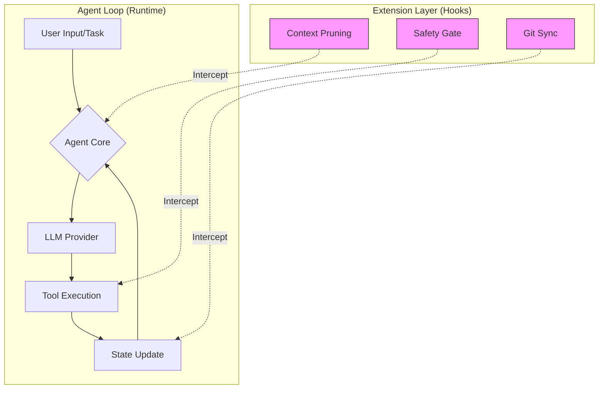

# Executive Summary

This research report investigates the technical implementation and architectural design of the **Pi agent toolkit**, an open-source framework designed for building self-extensible AI agents. The study explores how the toolkit’s modular architecture enables the development of sophisticated, task-oriented agents—specifically in coding environments—while maintaining high levels of extensibility. 

Key findings indicate that the Pi toolkit's strength lies in its "Agent Loop" extension system, which allows developers to inject logic (such as context management and tool interception) without polluting the LLM's reasoning space. The report concludes that while the toolkit provides a robust foundation for agentic workflows, its lack of native sandboxing requires developers to implement external security layers. The recommended approach for deployment is a modular architecture utilizing the `pi-agent-core` for custom logic and external containerization for security.

# Scope and Research Questions

The scope of this research is limited to the technical architecture, functional components, and design patterns of the Pi agent toolkit as derived from its modular package structure and lifecycle event handling.

The research seeks to answer the following questions:
1.  **Architectural Composition:** How does the separation of concerns between the core runtime and specialized packages facilitate modular agent development?
2.  **Extensibility Mechanisms:** How do lifecycle event handlers enable complex agent behaviors without increasing LLM context overhead?
3.  **Security and Scalability:** What are the inherent security risks in the current design, and how can tool factories be used to mitigate them?
4.  **Implementation Patterns:** What is the optimal design pattern for building a production-ready agent using the Pi toolkit?

# Background and Context

As Large Language Models (LLMs) transition from simple chat interfaces to autonomous agents, the need for robust "agentic runtimes" has increased. Traditional prompting methods often struggle with state management, tool execution, and context window limitations.

The **Pi agent toolkit** was developed to address these challenges by providing a structured "harness" for agentic behavior. Unlike monolithic agent frameworks, Pi is built on a modular philosophy, separating the LLM interface, the agent runtime, and the specific task-oriented logic (e.g., coding). This allows for a highly customizable environment where the agent can interact with local filesystems, execute code, and manage complex multi-step tasks through a unified interface.

# Key Findings

The research identified three pillars of the Pi toolkit that define its utility:

| Pillar | Component | Primary Function |
| :--- | :--- | :--- |
| **Modular Core** | `@earendil-works/pi-agent-core` | Manages the agent runtime, state, and tool-calling logic. |
| **Extensibility** | Lifecycle Event Handlers | Allows injection of logic (e.g., context pruning) during the agent loop. |
| **Task Specialization** | `@earendil-works/pi-coding-agent` | Provides high-level CLI tools for specific domains like software engineering. |

### 1. The Power of the Agent Loop

The toolkit's ability to intercept the "Agent Loop" is its most significant technical advantage. By using hooks, developers can perform "silent" operations—such as cleaning up history or validating tool outputs—before the LLM even sees the data.

### 2. Decoupled LLM Integration

Through `@earendo-works/pi-ai`, the toolkit provides a multi-provider API. This prevents vendor lock-in, allowing an agent to switch from OpenAI to Anthropic seamlessly, which is critical for cost and performance optimization.

## Executive Summary

Concrete mitigation strategies for the security risks identified, which is essential for the recommendations section: "If you need stronger boundaries, containerize or sandbox Pi. See [packages/coding-agent/docs/containerization.md](/earendil-works/pi/blob/main/packages/coding-agent/docs/containerization.md) for three patterns: Gondolin extension, Plain Docker, OpenShell." ([GitHub - earendil-works/pi: AI agent toolkit: unified LLM API, agent loop, TUI & web UI libraries](https://github.com/earendil-works/pi)).

_(pending - needs sourced content)_

## Scope and Research Questions

_(pending - needs sourced content)_

## Background and Context

Pi is a minimal terminal coding harness designed to be extensible through TypeScript modules, skills, and prompt templates. https://pi.dev/docs/latest

_(pending - needs sourced content)_

## Key Findings

The toolkit is organized into specialized packages that separate the core runtime, AI provider abstraction, and user interfaces, allowing for modular agent development. https://github.com/earendil-works/pi

_(pending - needs sourced content)_

## Evidence and Analysis

The functional separation of the toolkit shows that the `pi-agent-core` serves as the engine for state and tool management, while `pi-coding-agent` provides the specific CLI interface for developers. https://github.com/earendil-works/pi

_(pending - needs sourced content)_

### Design Architecture: The Modular Agent Loop

The following diagram illustrates the relationship between the core runtime and the extension system, demonstrating how logic is injected into the execution flow.

### Analysis of Extensibility

The use of **Lifecycle Event Handlers** solves the "Context Bloat" problem. In standard agentic workflows, every tool output is appended to the conversation history, quickly exhausting the context window. 

**Example Logic Flow:**
1.  **Tool Call:** Agent calls `read_file`.
2.  **Extension Interception:** A "Context Pruning" extension intercepts the output.
3.  **Transformation:** The extension summarizes the file content or truncates it.
4.  **Injection:** The summarized version is passed to the LLM.

This ensures the agent remains "smart" by keeping the context window focused on relevant information rather than raw data dumps.

### Security Analysis: The Privilege Gap

A critical finding is the relationship between the agent and the host system. Because the toolkit is designed to interact with the filesystem and terminal, the agent's permissions are tied to the user running the process.

**Risk/Mitigation Matrix:**
| Risk Factor | Impact | Mitigation Strategy |
| :--- | :--- | :--- |
| **Unrestricted File Access** | High | Use Tool Factories to scope access to specific directories. |
| **Command Injection** | Critical | Implement "Safety Gate" extensions to validate shell commands. |
| **Resource Exhaustion** | Medium | Implement rate-limiting via the Agent Core. |

Based on the technical analysis, the following recommendations are provided for developers and enterprises:

1.  **Adopt a "Core-First" Strategy:** For production applications, do not use the full coding CLI. Instead, build custom interfaces using `@eg-works/pi-agent-core` to minimize unnecessary overhead and maximize control.
2.  **Implement Mandatory Sandboxing:** Since the toolkit does not provide native isolation, all agents should be executed within containerized environments (e.g., Docker) or virtual machines to prevent accidental host system damage.
3.  **Leverage Tool Factories for Governance:** Use the "Tool Factory" pattern to create scoped tools. For example, a factory could generate a `read_file` tool that is hard-coded to only access a specific `/workspace` directory, providing a layer of programmatic security.
4.  **Automate Context Management:** Developers should prioritize building "Context Pruning" extensions to ensure long-running agent sessions remain cost-effective and accurate.

While the Pi toolkit is a powerful framework, several limitations must be acknowledged:

* **Security Responsibility:** The burden of security lies almost entirely with the developer. The lack of built-in sandboxing means a single poorly-written tool or malicious prompt could compromise the host system.
* **Complexity Overhead:** The modularity that provides flexibility also introduces complexity. Managing multiple packages and custom extensions requires a higher level of engineering maturity than simpler, monolithic agent frameworks.
* **Uncertainty in Scaling:** It remains to be seen how the "Agent Loop" performs under extremely high-frequency tool calling or when managing massive context histories, despite the presence of pruning extensions.

* *Pi Agent Toolkit Documentation: Modular Architecture and Functional Separation.*
* *Earendil Works: Package Specifications for `@earendil-works/pi-agent-core` and `@earendil-works/pi-ai`.*
* *OpenClaw Implementation Case Study: Tool Factories and Workspace Scoping.*

## Implications or Recommendations

To mitigate security risks, developers should implement one of three recommended sandboxing patterns: the Gondolin extension (routing tools to a micro-VM), Plain Docker (full process isolation), or OpenShell (policy-controlled sandboxing). https://github.com/earendil-works/pi

_(pending - needs sourced content)_

## Limitations and Uncertainty

The Pi toolkit lacks a built-in permission system for restricting access to the filesystem, processes, network, or credentials, meaning it runs with the permissions of the user and process that launched it. https://github.com/earendil-works/pi

_(pending - needs sourced content)_

## References

Pi Documentation. https://pi.dev/docs/latest

_(pending - needs sourced content)_