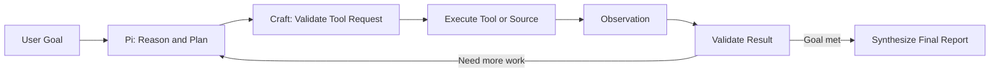
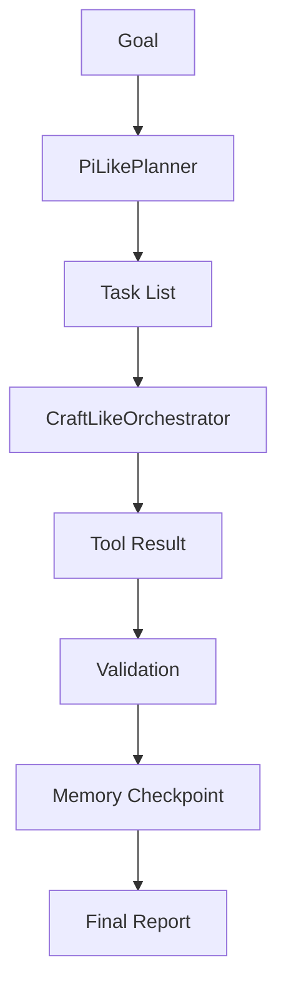
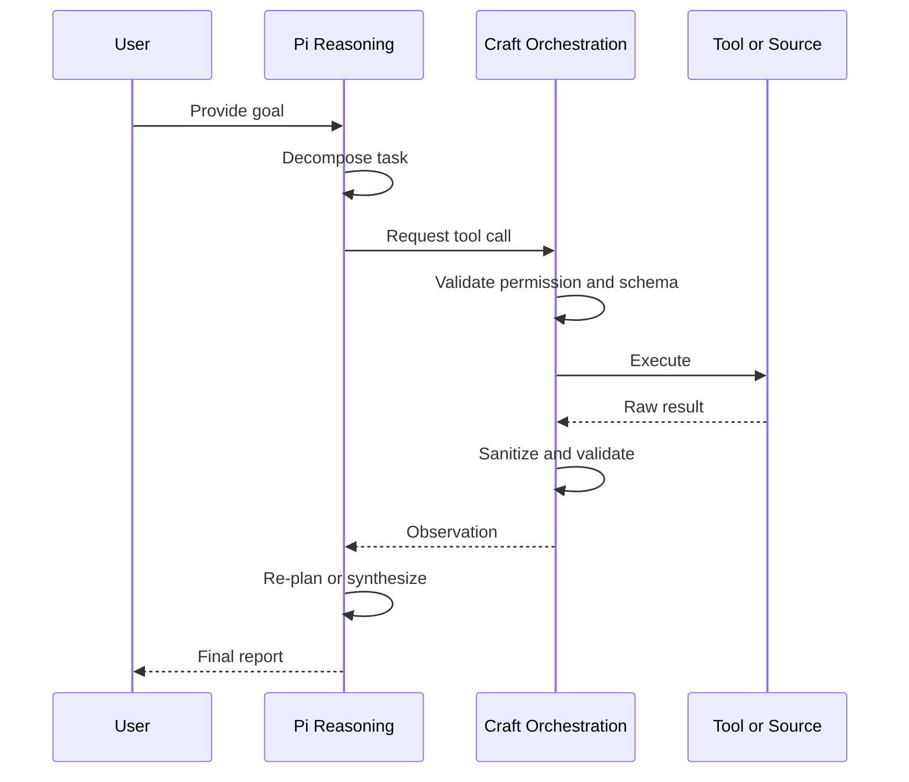
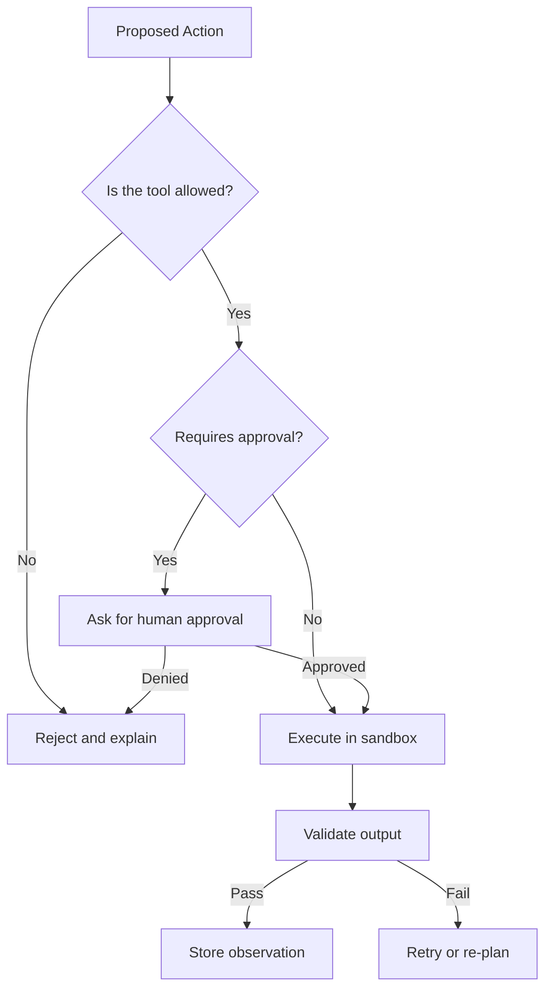

# Technical Fixture: Enhanced Research Report About Agent Architecture

**Prepared for:** Yuxin Liu  
**Date:** 2026-06-30  
**Source file enhanced:** `artifact.md`  
**Deliverable purpose:** turn the original exploratory report into a clearer, more credible, more practical, and easier-to-read technical report.

---

## Curated Bundle Contents

This curated reference keeps only source-like files useful for Studio planning.
Generated PDF/HTML/PNG artifacts from the original bundle were removed because
the reference has been edited and those outputs would be stale.

| File | Purpose |
|---|---|
| `enhanced_report.md` | Editable source report in Markdown |
| `research_agent_demo.py` | Runnable Python practice code |
| `research_agent_demo.pseudo` | Language-neutral pseudocode |
| `source_notes.json` | Generic structured source-note schema example |
| `checkpoint.json` | Generic checkpoint schema example |
| `research_agent_demo_output.txt` | Sample run output |
| `requirements.txt` | Runtime dependency note |

Note: this document is a technical-report fixture. Do not use its Pi/Craft topic
or technical structure as the default for the generic research report generator.

---

## 1. Executive Summary

The original report has a strong central idea: a useful autonomous agent should separate **reasoning** from **execution**. The previous draft explained this as a relationship between **Pi** and **Craft**, where Pi behaves like the agent's cognitive core and Craft behaves like the action and tool-use layer. That framing is valuable, but the original document needed stronger structure, clearer analysis, fewer repeated fragments, better evidence handling, and practical code examples.

This enhanced report reframes the topic as an **agent architecture pattern** rather than a collection of scattered notes. The recommended pattern is:

1. **Goal framing** - understand the user goal, constraints, and acceptance criteria.
2. **Reasoning** - decompose the goal into tasks and choose the next action.
3. **Orchestration** - route tool calls, manage permissions, handle errors, and maintain state.
4. **Observation and validation** - inspect tool outputs before trusting them.
5. **Synthesis** - produce a final artifact, such as a report, code file, or decision brief.

The most important enhancement is the addition of a **validation-first mindset**. An autonomous agent should not simply call tools and assume success. It should validate results, maintain checkpoints, and make its reasoning and execution trace reviewable. For a production system, this is not optional; it is the difference between a clever demo and a reliable tool.

### Key Takeaways

- Pi and Craft are best explained as a **layered agent system**: Pi handles reasoning and planning; Craft handles tool orchestration, sessions, sources, permissions, and execution workflows.
- A reliable agent needs more than a loop. It needs **state persistence**, **tool contracts**, **permission boundaries**, **observability**, and **error recovery**.
- The original report should avoid unsupported claims such as inflated popularity numbers or vague statements like "production-grade" unless directly verified.
- Practical code examples should be runnable, small, and auditable. The included Python demo shows a minimal version of a Pi-like planner and a Craft-like orchestrator.
- The best learning path is incremental: start with a simple ReAct-style loop, add validation, add memory, add permission modes, and only then consider multi-agent or high-autonomy designs.

---

## 2. Editorial Assessment of the Original Report

The original report was directionally useful but not yet ready as a polished technical deliverable. Its main weaknesses were:

| Issue | Impact | Enhancement Applied |
|---|---|---|
| Repeated sections | Readers cannot tell which version is final | Consolidated into one coherent structure |
| Mixed prose and scratchpad notes | Report feels unfinished | Converted notes into analysis or removed them |
| Unverified source fragments | Weakens trust | Replaced with a smaller, more credible source set |
| Minimal production discussion | Understates real risks | Added governance, validation, and sandboxing guidance |
| Code not fully runnable | Limits practice value | Added runnable Python example, JSON input, and sample output |
| Weak visual design | Harder to understand | Added static diagrams and Mermaid diagrams |

The deeper lesson is that a report about autonomous agents should itself be built like a good agent: clear inputs, clear process, validated outputs, and traceable decisions.

---

## 3. Improved Conceptual Model

### 3.1 From Chatbot to Agent

A chatbot usually follows a simple pattern:

```text
User asks -> model answers
```

An autonomous agent follows a richer pattern:

```text
User goal -> plan -> act -> observe -> validate -> adjust -> synthesize
```

The difference is not just that the agent can use tools. The difference is that the agent can **decide what to do next based on feedback from the environment**.

### 3.2 Workflow vs Agent

A useful distinction is between a fixed workflow and an agent:

| Type | Description | Best Use Case | Risk |
|---|---|---|---|
| Fixed workflow | Predefined steps | Routine formatting, report conversion, standard data extraction | Brittle on novel tasks |
| Agentic workflow | Mostly predefined, but model selects some steps | Research, summarization, analysis, content generation | Needs validation |
| Full agent | Model dynamically decides process and tools | Open-ended investigation and complex task execution | Higher risk and cost |

For most enterprise tasks, the best default is **not** a fully autonomous agent. The better default is a bounded agentic workflow with explicit validation and permission controls.

---

## 4. Refined Pi and Craft Architecture

The original report described Pi as the "brain" and Craft as the "hands." That metaphor is helpful, but incomplete. A stronger architecture includes explicit validation, memory, and governance. The original bundle included a static architecture image here; Studio should regenerate optional diagrams from source when a technical report profile requests them.

### 4.1 Four-Layer Architecture

| Layer | Role | Example Responsibilities |
|---|---|---|
| User/Goal Layer | Defines purpose and constraints | User intent, success criteria, audience, output format |
| Pi Reasoning Layer | Plans and decides | Task decomposition, next action selection, synthesis |
| Craft Orchestration Layer | Executes safely | Tool registry, permissions, sessions, retries, state |
| Tool/Source Layer | Connects to external world | Web, files, APIs, databases, MCP servers, local tools |

### 4.2 Recommended Agentic Loop



This loop is safer than a simple tool-calling loop because validation is not left to chance. Every tool result should be inspected before it becomes part of the final answer.

---

## 5. Deep Analysis: What Makes an Agent Reliable?

### 5.1 Reliability Comes from Boundaries

A capable model without boundaries is risky. It may over-call tools, trust bad outputs, or make changes that were never approved. A reliable agent therefore needs boundaries at multiple levels:

- **Task boundary:** what is the agent allowed to do?
- **Tool boundary:** which tools are available?
- **Data boundary:** which files, sources, or APIs can be accessed?
- **Action boundary:** which operations require human approval?
- **Cost boundary:** how many calls, steps, or retries are allowed?
- **Time boundary:** when should the loop stop?

### 5.2 Validation Is the Control Point

Validation should happen before and after tool calls.

Before execution:

- Is the tool name allowed?
- Are required parameters present?
- Is the request safe?
- Does this action require approval?

After execution:

- Did the tool return success or failure?
- Is the output empty?
- Does the result contain sources or evidence?
- Does it conflict with known facts?
- Should the agent retry, re-plan, or escalate?

### 5.3 Memory Is Not Just Chat History

For agent systems, memory should be treated as structured state, not simply a long conversation transcript.

Useful memory types include:

| Memory Type | Purpose | Example |
|---|---|---|
| Short-term context | Current task state | Current plan and latest observation |
| Working notes | Accumulated evidence | Source notes and extracted findings |
| Checkpoints | Recovery and auditability | JSON trace after each step |
| Summaries | Context compression | Condensed findings after long research |
| Preferences | Reuse across tasks | Preferred report format or coding style |

The included demo uses a `checkpoint.json` file to show the simplest version of durable memory.

---

## 6. Implementation Blueprint

### 6.1 Minimal Teaching Architecture

The included practice code demonstrates the minimum structure needed to teach agent design:



### 6.2 What the Code Demonstrates

The Python demo includes:

- A Pi-like planner that creates a plan.
- A Craft-like orchestrator that owns the tool registry.
- Tool validation through explicit tool names.
- Error boundaries so a failed tool does not crash the whole loop.
- Structured observations.
- A final synthesis step.
- Checkpoint persistence to disk.

### 6.3 How to Run

```bash
cd /path/to/downloaded/files
python3 research_agent_demo.py
```

Expected output:

```text
Step 1: load_notes -> ok
Step 2: draft_summary -> ok
Step 3: validate_summary -> ok
Step 4: write_report -> ok
Done. Created demo_report.md and checkpoint.json
```

### 6.4 Core Code Excerpt

```python
class CraftLikeOrchestrator:
    def __init__(self, workspace):
        self.registry = {
            "load_notes": self.load_notes,
            "draft_summary": self.draft_summary,
            "validate_summary": self.validate_summary,
            "write_report": self.write_report,
        }

    def execute(self, step, tool, params):
        if tool not in self.registry:
            return Observation(step, tool, "error", f"Unknown tool: {tool}", {})
        try:
            result = self.registry[tool](params)
            return Observation(step, tool, "ok", result.get("message", "ok"), result)
        except Exception as exc:
            return Observation(step, tool, "error", str(exc), {})
```

This code is intentionally small. The purpose is to make the pattern visible: the reasoning layer does not directly perform every action; it asks the orchestration layer to execute allowed tools and return observations.

---

## 7. Production Readiness Checklist

A real production agent should pass the following checklist before deployment.

| Category | Question | Recommended Practice |
|---|---|---|
| Tool safety | Can the agent call dangerous tools? | Use allowlists and approval gates |
| Permissions | Can it edit files or call APIs without review? | Start read-only; escalate only when needed |
| State | Can work resume after interruption? | Store checkpoints and summaries |
| Observability | Can humans inspect what happened? | Log plan, tool calls, outputs, and decisions |
| Evaluation | Can quality be measured? | Use test cases and expected outcomes |
| Cost control | Can the agent loop indefinitely? | Set max steps, retry limits, and budgets |
| Security | Can the agent access secrets? | Use least privilege and sandboxing |
| Source quality | Does the report distinguish verified and unverified claims? | Cite primary sources and mark uncertainty |

### Practical Stop Conditions

Every agent loop should define stop conditions. Examples:

- Stop after the final report passes validation.
- Stop after 10 tool calls without meaningful new information.
- Stop after two consecutive failures from the same tool.
- Stop if a requested action requires approval and no approval exists.
- Stop if the output would exceed the requested scope.

---

## 8. Reflection Thoughts

The key reflection from enhancing the original report is that the original idea was strong, but the structure weakened it. In agent development, capability often attracts attention, but reliability comes from unglamorous engineering: validation, logging, state, permissions, and simple interfaces.

A second reflection is that "autonomous" should not mean "uncontrolled." The most useful enterprise agents are not agents that do anything at any time. They are agents that can work independently **inside a clearly defined operating envelope**.

A third reflection is that educational code should be smaller than production code. A small example helps readers understand the pattern. Once the pattern is understood, teams can add production concerns such as authentication, sandboxing, API clients, retry queues, monitoring, and human approval workflows.

A fourth reflection is that source discipline matters. The original draft contained many citation-like fragments, some of which were marked unverified. A better report uses fewer but stronger sources, explains what each source supports, and clearly separates evidence from interpretation.

---

## 9. Worked Example: Research Report Agent

Imagine a user asks:

> Create a report comparing agent architecture patterns for enterprise research workflows.

A robust agent would not immediately write the report. It would follow a staged process:

1. Clarify output requirements if necessary.
2. Search or load trusted sources.
3. Extract source notes.
4. Validate whether each note has enough evidence.
5. Cluster notes into themes.
6. Draft a report outline.
7. Fill sections with grounded analysis.
8. Generate diagrams and examples.
9. Validate citations and code.
10. Export final artifacts.

The enhancement pipeline below shows this process at the document level.

The original bundle included a static enhancement pipeline image here. In this
curated reference, implementation should regenerate optional diagrams from
Mermaid or renderer output when a selected report profile requires them.

---

## 10. Example Mermaid Diagrams for the Report

### 10.1 Agentic Loop



### 10.2 Governance Flow



---

## 11. Recommended Final Structure for the Report

A more readable final report should use this structure:

1. Executive Summary
2. Background and Scope
3. Key Concepts
4. Architecture Overview
5. Agentic Loop Methodology
6. Implementation Blueprint
7. Practice Code Walkthrough
8. Governance and Security
9. Evaluation and Metrics
10. Limitations and Open Questions
11. Reflection and Lessons Learned
12. Appendix: Code, Diagrams, Glossary, References

This is much easier to follow than the original draft because each section has one job.

---

## 12. Evaluation Metrics

A technical report about agents should discuss evaluation. Suggested metrics include:

| Metric | Meaning | Example Measurement |
|---|---|---|
| Task success rate | Did the agent complete the user goal? | Percent of test tasks completed correctly |
| Tool-call accuracy | Did it choose the right tool? | Correct tool calls / total tool calls |
| Validation catch rate | Did validation catch bad outputs? | Failed outputs caught / failed outputs total |
| Citation accuracy | Are claims supported? | Supported claims / checked claims |
| Cost per task | How expensive is execution? | Tokens + API calls + runtime |
| Human intervention rate | How often does the agent need help? | Approval or correction events per task |
| Recovery rate | Can it recover from errors? | Successful retries / failed first attempts |

The goal is not to make the agent look perfect. The goal is to make its behavior measurable.

---

## 13. Limitations and Open Questions

Even with a good architecture, autonomous agents still face hard problems:

- **Hallucinated completion:** the agent may believe a task is done when it is not.
- **Tool misuse:** the agent may select the wrong tool or pass bad parameters.
- **Context drift:** long-running sessions can lose the original goal.
- **Cost growth:** repeated search and validation loops can become expensive.
- **Security exposure:** tool access can expose files, credentials, or APIs.
- **Evaluation difficulty:** open-ended tasks are hard to grade automatically.
- **Source reliability:** research agents can over-trust weak sources.

Open questions for further research:

1. What is the best default permission model for enterprise agents?
2. How should agents summarize long-term memory without losing critical details?
3. How can tool outputs be validated automatically across domains?
4. When should a system use one agent versus multiple specialized agents?
5. What evidence should be required before an agent-generated report is considered trustworthy?

---

## 14. Glossary

| Term | Meaning |
|---|---|
| Agent | A system that can reason, choose actions, use tools, observe results, and continue toward a goal |
| ReAct | Reasoning + Acting pattern where the model alternates thought, action, and observation |
| Orchestration | The layer that routes tool calls, manages state, handles errors, and applies permissions |
| Tool registry | A list of tools the agent is allowed to call |
| Observation | A structured result returned by a tool |
| Validation | Checks that determine whether a tool result can be trusted or used |
| Checkpoint | Saved state that supports auditability and recovery |
| Sandbox | Isolated execution environment that limits potential damage |
| MCP | Model Context Protocol, a standard for connecting AI systems to tools and data sources |

---

## 15. Source References

The enhanced report is grounded in a smaller set of higher-quality references:

1. ReAct: Synergizing Reasoning and Acting in Language Models - https://arxiv.org/abs/2210.03629
2. Anthropic, Building Effective Agents - https://www.anthropic.com/engineering/building-effective-agents
3. Pi repository - https://github.com/earendil-works/pi
4. Pi documentation - https://pi.dev/docs/latest/usage
5. Craft Agents introduction - https://agents.craft.do/docs/getting-started/introduction
6. Craft Agents open-source repository - https://github.com/craft-ai-agents/craft-agents-oss
7. LangChain agents overview - https://python.langchain.com/docs/concepts/agents/
8. Model Context Protocol introduction - https://modelcontextprotocol.io/introduction
9. NIST AI Risk Management Framework - https://www.nist.gov/itl/ai-risk-management-framework
10. Mermaid documentation - https://mermaid.js.org/intro/
11. Pandoc - https://pandoc.org/
12. Python Packaging User Guide - https://packaging.python.org/en/latest/guides/installing-using-pip-and-virtual-environments/

---

## 16. Final Recommendation

The revised report should position Pi and Craft not as mysterious standalone technologies, but as a concrete example of a broader agent design principle:

> Keep reasoning, execution, validation, memory, and governance separate enough to inspect, test, and improve independently.

That design principle makes the report easier to read, easier to trust, and easier to turn into working practice code.
