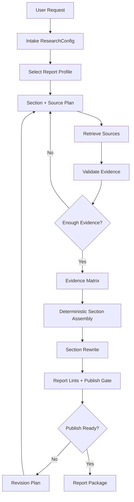

# Generic Research Report Loop

The loop should be a research workflow, not a pure chatbot loop. Use a fixed
workflow when structure is predictable. Use autonomous iteration only when the
topic requires unknown searches, multiple evidence rounds, or quality-gated
revision.

## Workflow

## Loop Stages

| Stage | Purpose | Output | Hard gate |
|---|---|---|---|
| Intake | Understand topic, audience, purpose, report type, source policy, output policy, constraints | `ResearchConfig` | Must identify report goal and target reader |
| Profile | Select template, lint policy, and optional assets | Report profile | Must not force technical/code sections onto non-technical reports |
| Source plan | Convert sections into search questions | Section-query plan | Must include source requirements |
| Retrieval | Gather sources and notes | Source notes | Must record title, URL/source, date when available, claim, relevance |
| Verification | Check reliability, conflicts, and source status | Evidence matrix | Must flag weak/unverified claims |
| Assembly | Build draft from selected template and evidence | Section draft | Must not concatenate worker prose or append evidence walls |
| Section rewrite | Improve one section at a time | Polished sections | Must preserve citations and sourced facts |
| Lint | Detect structural/report-quality failures | Lint list | Hard fails block publishing |
| Revision | Fix low-score or hard-fail areas | Revised report | Must improve gate state or expose blocker |
| Packaging | Produce final bundle | Deliverables | Must include report, evidence, source notes, scorecard, manifest |

## Weak-Model Controls

For weak local models:

- limit action count per worker;
- use JSON/JSONL output contracts;
- use moving windows over target sections;
- assemble deterministically before asking for prose polish;
- reject prose outside schema;
- fail closed when publish-gate hard fails remain.
