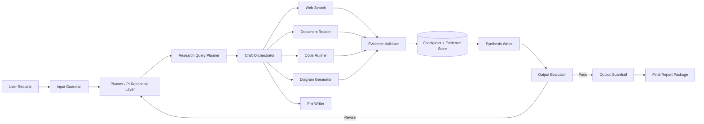

# Production Best-Practice Architecture

## Production design notes

| Layer | Best practice |
|---|---|
| Input guardrail | Block unsafe or impossible requests before expensive processing |
| Planner | Produce explicit plan, ToC, research questions, and stopping conditions |
| Tool orchestration | Validate tool parameters before execution |
| Evidence store | Save source notes, citations, reliability status, and claim mapping |
| Checkpointing | Save progress after every major stage |
| Evaluator | Use weighted scorecard and hard-fail checks |
| Tracing | Record each model call, tool call, guardrail event, and revision |
| Human review | Required for high-impact business, legal, medical, or security reports |
