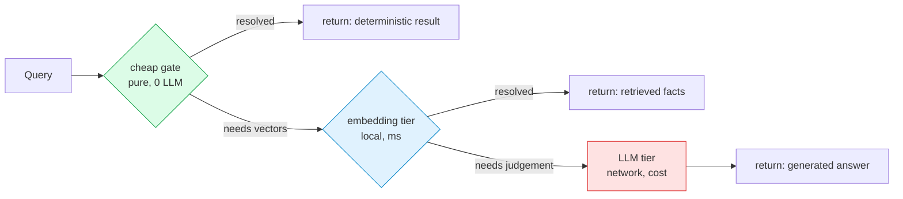
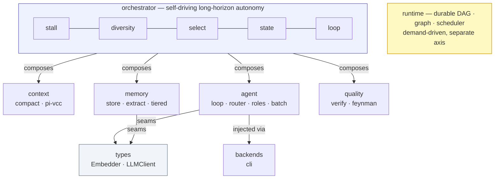
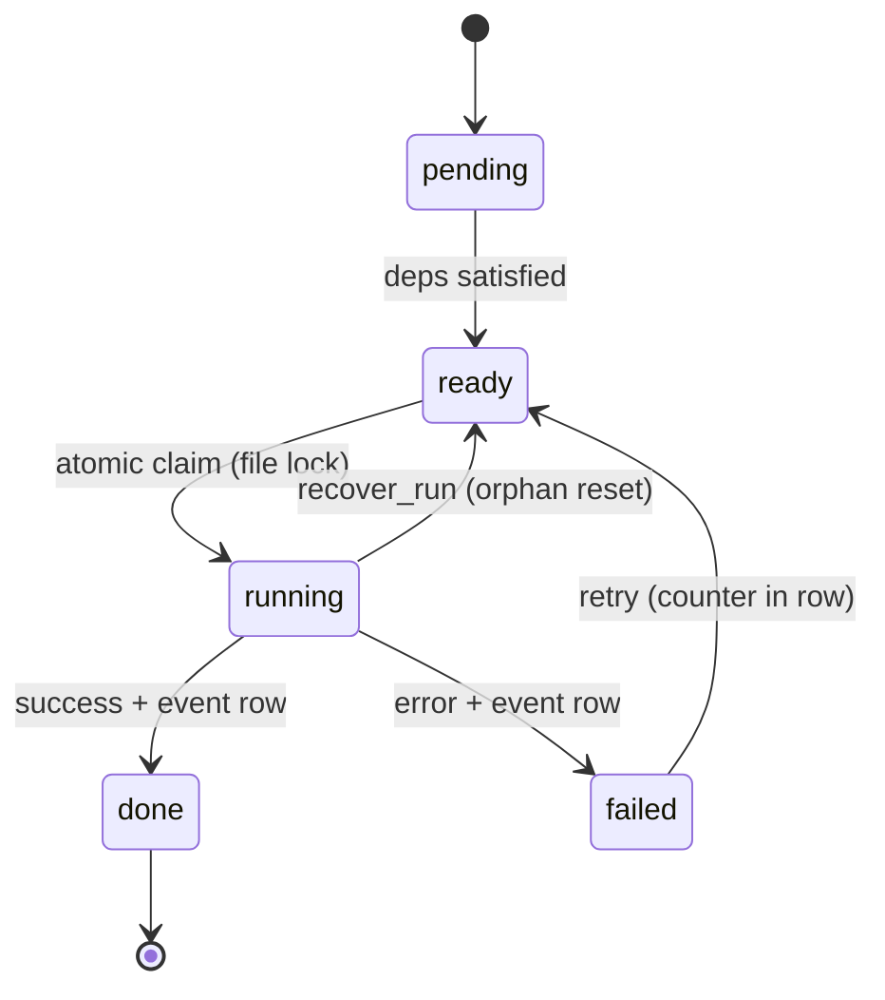
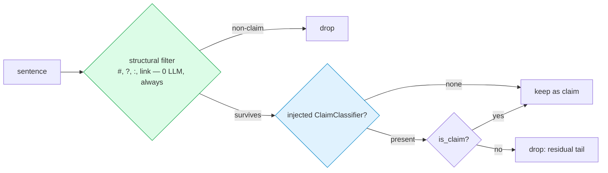
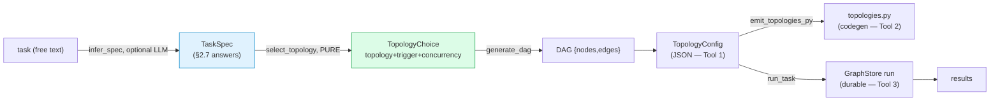
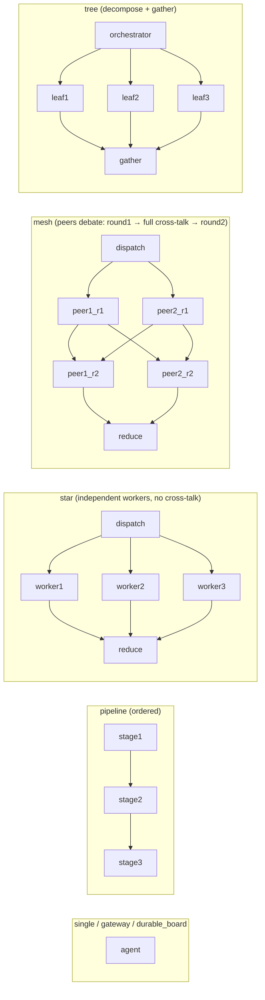
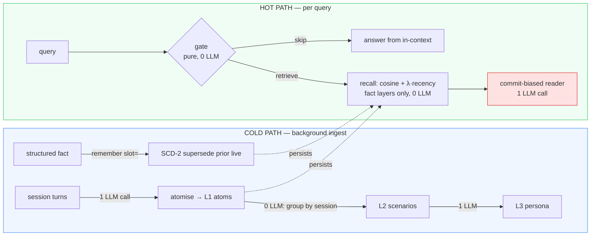
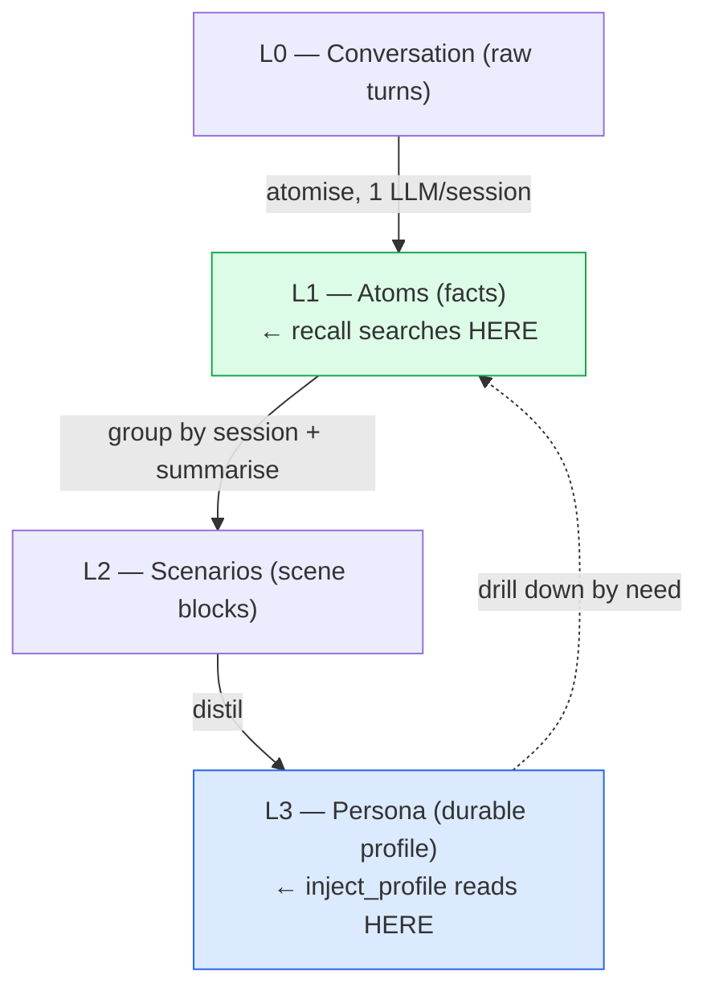
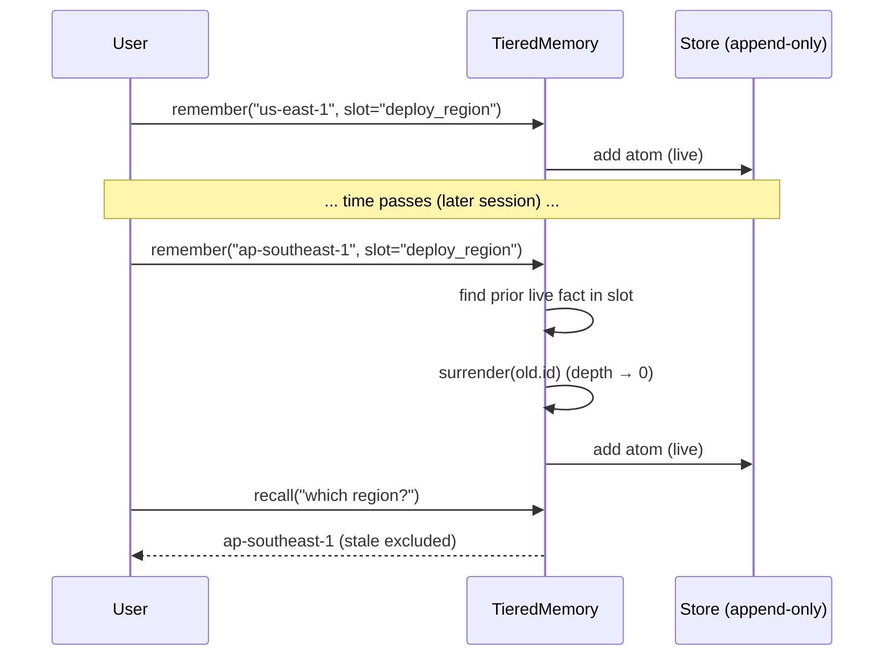
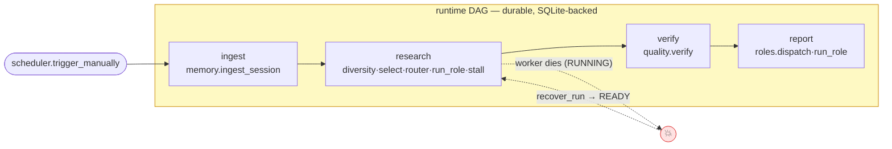

# agentkit: A Deterministic-First Architecture for Practical Agent Systems

> **Design & Engineering Report**
> A lean, dependency-light Python library for building agent systems in which the
> language model is the *last* resort, not the default. Every component is either
> extracted from measured laboratory code or ported from a studied design
> pattern, hardened behind `Protocol` seams, and shipped with a runnable check.
> This document is written as a self-contained technical article: it states the
> central hypothesis, derives the architecture from it, and reports the measured
> evidence for and against each claim.

---

## Abstract

Contemporary agent frameworks route nearly every decision through a large
language model (LLM). This is expensive (one third-party memory agent measured at
**\$5 per question**, **\$2,500 per 500-question benchmark**), slow (LLM-bound
ingest at **3.2 facts/s**), and — counter-intuitively — often *less* accurate,
because retrieval can reach perfect recall while the model still hedges
(`context_recall = 1.000` against `answer_relevancy = 0.749` in our own
measurements). We present **agentkit**, a library organized around a single
axiom: *a cheap, deterministic stage gates the expensive LLM stage.* We show this
axiom was independently rediscovered by four prior systems, adopt it as law, and
apply it across context compaction, tiered memory, a durable workflow runtime, an
act loop, a long-horizon orchestrator, and a verification module. Our central
artifact is a **tiered memory** subsystem that places the LLM on the *cold path*
only: a deterministic gate, depth-aware retrieval, write-time atomisation, and
SCD-2 supersession reduce a "careful" memory pipeline from **3 LLM calls per
query to 1 (−67%), cut latency 73% and tokens 34%, while holding accuracy at
100%**. We further reconcile a seeming contradiction in the memory literature
with controlled local experiments: on a *short* in-context thread, memory adds
tokens for **no** quality gain; on a *long* cross-session workload it flips
accuracy from **0% to 100%** and costs *less* than naïve truncation. A
ten-capability memory integration test, built to be able to fail, passes
**10/10**; a **full-stack** test running all nine modules as a durable,
crash-recoverable DAG passes **15/15 on just 3 LLM calls** (every other stage at
0 LLM). All results are reproduced locally on `gemma-4-26B-A4B-it-heretic-4bit` +
`bge-m3-mlx-fp16`; **75 unit tests pass.**

**Keywords:** agent systems, retrieval-augmented generation, long-term memory,
deterministic gating, context compaction, cost-aware inference.

---

## 1. Introduction

### 1.1 Motivation

An agent system is, mechanically, a controller that decides *when to think with a
model* and *what to put in front of it*. The dominant design instinct is to let
the model make those decisions too — model-driven triage, model-driven query
expansion, model-driven summarisation. The result is the three failure modes that
motivate this work, each one a number we measured:

1. **Cost and latency.** Every model call costs money and wall-clock time. A
   pipeline that triages, expands, re-ranks, atomises, answers, and consolidates
   with the model spends 5–6 calls where 1 would do.
2. **High recall, low accuracy.** With a strong retriever, the *bottleneck moves
   to the reader.* We measured `context_recall = 1.000` yet `answer_relevancy =
   0.749`: the evidence is present, the model under-commits.
3. **Slow ingest and summarisation.** The slow part of memory is not vector
   search ($O(\log n)$ via HNSW) — it is the LLM-bound *extraction* and
   *summarisation* on the write and read paths.

### 1.2 Thesis

> **A cheap deterministic stage should gate the expensive LLM stage, and the
> control logic that decides whether to spend a model call must itself be
> model-free.**

The model judges *content*; arithmetic decides *flow*. This single idea, applied
consistently, addresses all three failure modes: fewer calls (gating), better
accuracy (a commit-biased reader plus relevance-true retrieval), and faster
ingest (deterministic extraction and decay instead of LLM summarisation).

### 1.3 Contributions

- **C1 — An axiom, validated by convergence (§2).** We show four independent
  systems rediscovered the cheap-gate pattern, and formalise it as a tiered cost
  model.
- **C2 — A Protocol-seam architecture (§4).** Embedder, chat client, URL checker,
  and worker spawner are all injected; the same code runs on a local server, a
  hosted API, a CLI subprocess, or a deterministic fake.
- **C3 — Tiered memory with the LLM on the cold path (§6).** Deterministic gate,
  depth-aware rerank, write-time atomisation, hierarchical L0–L3 layering, and
  SCD-2 supersession.
- **C4 — A reconciliation of the "does memory help?" question (§7.3).** Controlled
  local experiments locate the break-even at the context budget.
- **C5 — Reproducible evidence (§7).** Every claim has a runnable script and a
  measured number; failures are reported as honestly as wins.

---

## 2. The Design Axiom

### 2.1 Convergent evidence

The axiom was not invented for agentkit; it was *observed converging* across four
independently designed projects, then adopted deliberately.

| Source | Cheap deterministic stage | Gated LLM stage |
|--------|---------------------------|-----------------|
| pi-vcc [7] | structured extraction + formatting | conversation summarisation |
| Deli\_AutoResearch [8] | arithmetic stall / diversity detection | next-direction generation |
| IdeaScout [9] | rule-based candidate filtering | semantic idea scoring |
| feynman [10] | citation-presence + URL-liveness checks | claim-vs-source judgement |

> **Table 1.** Four systems, one shape. Each spends a deterministic stage first
> and reaches for the model only on what survives. Independent rediscovery is
> evidence, not coincidence.

### 2.2 A tiered cost model

Let a query pass through tiers $T_1, T_2, \dots, T_n$ ordered by unit cost
$c_1 < c_2 < \dots < c_n$ (regex/arithmetic $\ll$ embedding $\ll$ LLM). Let $p_i$
be the probability a query is *resolved* at tier $i$ (and so never reaches
$i{+}1$). The expected cost per query is

$$
\mathbb{E}[c] \;=\; \sum_{i=1}^{n} c_i \, p_i \prod_{j<i}(1-p_j).
$$

Because $c_n$ (the LLM) dominates the cost vector, $\mathbb{E}[c]$ is governed by
$p_n$ — the fraction of queries that reach the model. Every deterministic gate
that raises $\sum_{i<n} p_i$ lowers $p_n$ multiplicatively. *Minimising
model traffic, not optimising the model call, is the dominant lever.* This is the
quantitative form of "the model is the last resort."

### 2.3 The corollary: model-free control

If the stage that *decides whether to call the model* is itself a model call, the
gate cannot reduce $p_n$ — it has already paid $c_n$. Hence:

> **Control logic must be pure** — no clock, no randomness, no I/O, no model.
> Stall assessment, diversity checks, rubric aggregation, citation extraction,
> the retrieval gate: all deterministic functions, unit-testable without a
> network. This purity is enforced by `grep`, not merely by convention (§4, P3).



> **Figure 1.** The deterministic-first cascade. Each query stops at the cheapest
> tier that suffices; only the residue reaches the (red) model tier.

---

## 3. Related Work and Provenance

agentkit is deliberately *synthetic*: it ports proven patterns rather than
inventing new ones, and is explicit about where each came from.

**Context management.** pi-vcc [7] performs deterministic, lossless conversation
compaction; we port its sticky/volatile section-merge contract (§4.2).

**Long-horizon autonomy.** Deli\_AutoResearch [8] contributes execution ≠
evaluation, arithmetic stall/pivot detection, direction diversity, and the
fresh-session + file-state pattern (§4.6).

**Cascaded selection.** IdeaScout [9] contributes the cheap-filter → expensive-
judge cascade, weighted-rubric scoring, and a resumable batch runner (§4.5–4.6).

**Ensembles and verification.** feynman [10] contributes role specialisation over
one loop and a source-grounding Verifier (§4.5, §4.7).

**Memory systems.** We study three contemporary memory projects and adopt one
pattern from each (§6): **Lethe** [3] — a single `depth` axis with deterministic
decay, reported at $R@1=85.4\%$, $R@5=97.4\%$ on LongMemEval-S with *zero API
calls*; **TencentDB Agent Memory** [4] — layered L0→L3 storage and symbolic
offloading, reporting up to **−61.38%** tokens and PersonaMem accuracy **48% →
76%**; **Argus** [5] — triage-first routing and background consolidation (whose
own benchmarking cost — \$5/question — is itself a motivating data point). We
contrast against **mem0** [6], which does not archive on contradiction.

**Benchmarks and techniques.** Our long-memory protocol mirrors **LongMemEval**
[1] (index → retrieve → read; long-context degrades 30–60%). Our deterministic
short-circuit echoes **CRAG** [2]. We test and *reject* **HyDE** [11] on a
saturated corpus (it adds a call for no recall gain). The act loop is **ReAct**
[12]; retrieval quality is measured with **RAGAS** [13].

| Pattern | Source | agentkit home |
|---------|--------|---------------|
| Deterministic compaction; sticky/volatile merge | pi-vcc [7] | `context` |
| Execution ≠ evaluation; stall/pivot; diversity; file-state | Deli [8] | `orchestrator` |
| Cheap-filter → judge cascade; rubric; resumable batch | IdeaScout [9] | `orchestrator/select`, `agent/batch` |
| Role ensemble; Verifier + source-grounding | feynman [10] | `agent/roles`, `quality` |
| Durable DAG; demand-driven triggers; event-sourced replay | lab-04.6 | `runtime` |
| Tiered embedding memory; difficulty routing; ReAct | self-improving-agent-lab | `memory`, `agent` |
| Deterministic `depth` decay / forgetting | Lethe [3] | `memory/tiered` |
| Layered L0–L3 memory; progressive disclosure | TencentDB [4] | `memory/tiered` |
| Triage-first; background consolidation | Argus [5] | `memory/tiered` |

> **Table 2.** Provenance. `runtime`/`memory`/`agent`-loop/`router` are *extracted
> and hardened* from measured lab code; the rest are *native ports* of studied
> patterns.

---

## 4. System Architecture

### 4.1 Overview



> **Figure 2.** Module map. Seven library modules plus two seam modules (`types`,
> `backends`). The `runtime` (yellow) is a deliberately separate orchestration
> axis (§4.4).

### 4.2 Two orchestration axes

agentkit ships two answers to "who starts the work," which compose rather than
compete:

- **`runtime` — demand-driven durability** (Temporal/n8n style). No
  self-prompting; every run is fired by an external trigger and survives process
  death via SQLite. The unit of durability, cost, and replay.
- **`orchestrator` — self-driving autonomy** (AutoGPT done right). Drives itself
  across iterations with anti-loop scaffolding.

A real system uses both: an `orchestrator` loop can be one node inside a
`runtime` DAG, or a `runtime` trigger can launch an `orchestrator` run.

### 4.3 Design principles

1. **P1 — Protocol seams over vendor lock.** Anything pluggable is a
   `typing.Protocol`, injected at construction. The source lab code hardcoded
   `openai.OpenAI` + a local endpoint and so ran in exactly one place; agentkit
   inverts that. This is the single largest hardening upgrade over the source
   material.
2. **P2 — Deterministic-first tiering.** §2. Cheap → embedding → LLM; stop early.
3. **P3 — Purity of control logic.** `stall`, `diversity`, `select`-aggregation,
   `verify`-extraction, the memory `gate`: no time, no randomness, no I/O. Clocks
   and metrics are *passed in*.
4. **P4 — Measured engineering.** Every module ships an assert-based `__main__`
   self-check or a `tests/` file; headline modules ship a benchmark that emits a
   real number. A claim without a runnable artifact does not ship.
5. **P5 — Many small files, lean core.** Modules < 300 lines. `numpy` for memory;
   everything else stdlib; `openai` is an optional extra.
6. **P6 — Immutability at the boundaries.** Results and decisions are frozen
   dataclasses; stores are append-only where history matters.

---

## 5. Module Design

### 5.1 `types` — the seams

Defines the injection points so nothing else depends on a vendor. `Message` is a
plain OpenAI-style dict — the lingua franca every module passes, so no inter-
module adapter is needed. `Embedder` and `LLMClient` are `@runtime_checkable`
Protocols (duck typing over ABCs for frictionless adoption); `ChatResult`
(`text`, `tool_calls`, `total_tokens`) is the vendor-neutral response.

### 5.2 `context` — deterministic compaction *(ports pi-vcc [7])*

Shrinks a long conversation to a bounded, structured brief **without an LLM** —
same input, same output. The pipeline is pure:

$$
\text{normalize} \to \text{filter} \to \text{cut} \to \text{sections} \to
\text{brief transcript} \to \text{format} \to \text{merge}.
$$

`merge(prev,new)` is the multi-compaction contract: *sticky* sections (Goal,
Preferences) accumulate and dedup; *volatile* sections (Files, Outstanding)
replace; Commits accumulate capped; the transcript rolls. Repeated compaction
does **not** progressively hallucinate the way LLM re-summarisation does.

**Why reduction scales.** Sections cap and the transcript window stays flat while
the raw conversation grows linearly. If raw size is $N$ messages and the retained
brief is bounded by a constant $B$, the reduction ratio is
$\rho(N) = 1 - \min(B, N)/N \to 1$ as $N$ grows. Measured (token estimate
$\approx \texttt{len}/4$):

| Messages $N$ | 12 | 40 | 100 | 400 |
|---|---|---|---|---|
| Reduction $\rho$ | ~1% | 10% | 49% | **73.3%** |

> **Table 3.** Compaction is a *long-session* lever, not a short-chat one (≈1.6 ms,
> deterministic, 0 LLM) — precisely the autonomous regime the orchestrator
> targets. `compact()` produces the curated brief each fresh iteration is handed.

### 5.3 `memory` — tiered episodic/semantic/procedural store

Two tiers, deterministic-first: `extract.py` pulls structured bookkeeping facts
(files, commits, preferences, outstanding) with **no embeddings, no LLM**;
`store.py` is `MemoryStore(db_path, embedder)` — SQLite + numpy cosine over an
*injected* `Embedder`. Append-only by design (auditable history). Embedding
failures are non-fatal: `inject_context` returns `""` rather than breaking the
act loop. The full LLM-cold-path treatment is §6.

### 5.4 `runtime` — durable DAG *(demand-driven)*

Executes a node graph such that a process can die anywhere and the run resumes,
because state lives in SQLite, not Python locals.



> **Figure 3.** Per-node state machine. **Durability invariant:** every status
> mutation and its append-only event row commit in the *same* transaction.
> Recovery is a *query* (`nodes WHERE status='ready'`), not a checkpoint format;
> the retry counter lives in the row, defeating the classic AutoGPT retry-storm.
> A cross-process file lock guards the `ready→running` claim so two workers cannot
> grab one node.

### 5.5 `agent` — act loop and configuration layers

- **`loop.py` (`run_agent`)** — a ReAct [12] loop over an injected `LLMClient` +
  tool registry. Preserves structured *and* text-fallback tool-call parsing (for
  small local models), tool-output **quarantine** (untrusted results framed as
  data, never instructions — a prompt-injection guard), and optional memory
  injection.
- **`router.py` (`route`)** — maps step difficulty to a (backend, model) choice;
  cheap steps go to the small local model to preserve rate-limit headroom.
- **`roles.py` *(ports feynman [10])*** — a role is *configuration* over the one
  loop: `(name, system_prompt, tools, difficulty, schema?)`. Four presets
  (Researcher, Reviewer, Writer, Verifier); `dispatch` picks one via a
  deterministic keyword heuristic by default. *Not four engines — four configs +
  one loop + a cheap dispatcher.*
- **`batch.py` *(ports IdeaScout [9])*** — a resumable batch runner: append-only
  JSONL (resume skips done keys), per-item retries, quota vs error backoff; `sleep`
  and `clock` injected so tests never wait.

### 5.6 `orchestrator` — long-horizon autonomy *(ports Deli [8] + IdeaScout [9])*

Pure control (no time/random/I/O): `stall.assess(...)` (0 new findings or metric
drop ⇒ `stale+1`; `stale≥2` ⇒ **pivot**; `stale≥4` ⇒ **escalate**;
`exceeds_budget` caps 15 rounds / 30 min); `diversity.is_novel` (token-Jaccard,
no embeddings); `select` (cheap `prefilter` → `score_and_rank` with an injected
scorer; the LLM scores, arithmetic ranks). I/O lives in `state.py` (file-based
schema, append-only `findings.jsonl`) and `loop.py`, which integrates everything:

> **The key synthesis.** pi-vcc *compacts* a growing context; Deli *discards* it
> and rebuilds from files each iteration. agentkit composes them: `compact()`
> produces the curated state snapshot each fresh iteration is injected with —
> compaction becomes the *handoff artifact* between autonomous iterations, a
> wiring neither source spells out.

### 5.7 `quality` — verification *(ports feynman [10] / Deli pattern D)*

Audits an artifact's claims against cited sources, deterministic-first:
`extract_claims` and `find_uncited` are pure; `check_links` uses an injected
`UrlChecker`; `check_support` (does the source support the claim?) is the *only*
model-gated step and is skipped when no client is supplied. Most verification
value is collected before any LLM call.

**Claim segmentation is two-tier (both shipped).** A cheap structural,
language-agnostic filter (`_is_claim` / `_is_citation_line`: markdown headings
`#`, questions `?`, bare labels `:`, "mostly-a-link" residual; no keyword lists;
verified across English/Chinese/German) always runs first. The residual tail —
marker-less prose non-claims ("Here are the findings.", "Let me explain.") — is
caught by an OPTIONAL injected `ClaimClassifier` seam (the same DI pattern as
`Embedder`/`LLMClient`/`UrlChecker`). Its default adapter is **non-LLM**:
`EmbeddingPrototypeClassifier` reuses the existing `Embedder` (claim vs non-claim
centroids, nearest-centroid cosine) — keyword-free, multilingual, training-free,
measured **6/6 on real bge-m3**. An LLM is one alternative adapter, never
required. Exemplars can also be loaded from a real labelled dataset:
`claimbuster_classifier()` downloads the **ClaimBuster** benchmark (CC-BY-4.0,
cached, not vendored) and builds centroids from its CFS (claim) / NFS (non-claim)
labels. Measured caveat: ClaimBuster is *political-debate* text, so on a
research-assistant probe it scored **3/4** vs **4/4** for the domain-tuned
hand-written defaults — human-labelled exemplars are not automatically better
*across* domains. Use ClaimBuster for political/news content; keep or mix domain
exemplars otherwise. The seam makes either a one-liner.

#### 5.7.1 Claim classification — a pluggable, non-LLM seam

**Problem.** After the cheap structural filter (markdown `#`, `?`, `:`,
mostly-a-link) drops obvious non-claims, a *residual tail* remains: marker-less
prose that reads like a sentence but asserts nothing — "Here are the findings.",
"Let me walk you through the details." Flagging these as "uncited claims" is
noise. The naive fix is "ask an LLM," but that is neither the only nor the
cheapest option (§3, [1]–[3]).

**The cascade.** Classification is two tiers, deterministic-first:



> **Figure 9.** The structural tier is free and always on; the injected
> `ClaimClassifier` is consulted *only* on survivors, and only if supplied — so
> the default path stays pure and the model (or any classifier) is optional.

**The seam.** `ClaimClassifier` is a `@runtime_checkable` Protocol —
`is_claim(sentence: str) -> bool` — injected into `extract_claims(text,
classifier=...)` / `verify(..., classifier=...)`. Same dependency-injection
pattern as `Embedder` / `LLMClient` / `UrlChecker`: the policy is chosen by the
operator, not hardcoded.

**Default adapter — `EmbeddingPrototypeClassifier` (non-LLM).** It reuses the
`Embedder` the library already requires. Given claim exemplars $C$ and non-claim
exemplars $N$, it builds two centroids at construction:

$$
\mu_C = \frac{1}{|C|}\sum_{x \in C} e(x), \qquad
\mu_N = \frac{1}{|N|}\sum_{x \in N} e(x),
$$

where $e(\cdot)$ is the injected embedder. A sentence $s$ is a claim iff it is at
least as close to the claim centroid as to the non-claim one, within a
conservatism margin $\lambda$:

$$
\textsf{is\_claim}(s) \;=\; \Big[\, \cos\!\big(e(s),\,\mu_C\big) \;\ge\;
\cos\!\big(e(s),\,\mu_N\big) \;-\; \lambda \,\Big].
$$

$\lambda > 0$ biases toward *keeping* claims (never silently drop a real one);
embedding failures also default to "claim." Properties: **non-LLM** (no
generation), **keyword-free** (no word lists), **multilingual** (inherits the
embedder's cross-lingual space), **training-free** (a handful of exemplars, no
fitted model file), **cheap** ($O(1)$ embed per sentence, batchable, local ms).
Cosine is pure-Python, so the module stays numpy-free.

**Exemplar sources.** The centroids are only as good as $C$ and $N$. Options:

| Source | What | Use when |
|---|---|---|
| hand-written defaults | ~5+5 in-domain exemplars (`DEFAULT_*_EXAMPLES`) | general / agent-output framing |
| **ClaimBuster loader** | real human labels via `claimbuster_classifier()` (below) | political / news claim text |
| CLEF CheckThat! [—] | multilingual labelled sets (EN/AR/ES/NL/…) | multilingual exemplar packs |
| HF `xlm-roberta…clef21-24` | a fitted multilingual claim model | a non-LLM *alternative adapter* (not exemplars) |

> **Table 10.** Exemplar / adapter sources. All are non-LLM. The classical
> ClaimBuster SVM (POS+NER+TF-IDF) and spaCy dependency rules also implement
> `ClaimClassifier`, but drag in per-language NLP models or a training pipeline —
> against the lean/multilingual goal.

**ClaimBuster loader (`agentkit/quality/claimbuster.py`).** Downloads the
benchmark `groundtruth.csv` ([Zenodo](https://doi.org/10.5281/zenodo.3609356),
CC-BY-4.0) once to `~/.cache/agentkit/` (cached, **not vendored** — licence-
respecting), then maps its human `Verdict` labels onto our split:

| `Verdict` | ClaimBuster class | agentkit role |
|---|---|---|
| `1` | CFS — check-worthy factual sentence | `claim_examples` |
| `-1` | NFS — non-factual (subjective / interrogative) | `nonclaim_examples` |
| `0` | UFS — unimportant factual | ignored |

`parse_exemplars(csv, n)` is a pure, deterministic core (file order, no
randomness) — unit-tested with a fixture, no network. NFS is *defined* as
"sentences that do not contain any factual assertions," i.e. exactly the residual
tail we target.

**feynman-style LLM adapter.** Because the seam is just `is_claim`, feynman's
own mechanism — an LLM judging each sentence in context — is a drop-in adapter:
`LLMClaimClassifier(client)` asks an injected `LLMClient` "claim or non-claim?"
per sentence. It plugs into the *same* `extract_claims(classifier=...)` path. The
trade-off is explicit: highest judgement quality, but **one LLM call per
sentence** — the cost feynman pays for having no deterministic segmenter (§3).

**Measured (real `bge-m3` / `gemma`, same 4-sentence probe incl. a Chinese claim
and two marker-less framing non-claims).**

| Adapter | accuracy | LLM calls | notes |
|---|---|---|---|
| structural only (default) | misses marker-less framing | **0** | always-on cheap tier |
| `EmbeddingPrototypeClassifier`, hand-written defaults | **6/6** | **0** | domain-tuned, embeddings only |
| `EmbeddingPrototypeClassifier`, ClaimBuster (n=40) | **3/4** | **0** | political-debate exemplars; off-domain miss |
| `LLMClaimClassifier` (feynman-style) | **4/4** | **1 / sentence** | best quality, highest cost |

> **Table 11.** The seam turns "which classifier" into a measured operator
> choice. Two lessons: (1) human-labelled exemplars are not automatically better
> — ClaimBuster's political-debate data under-performs the domain-tuned defaults
> on research framing (use it for political/news text). (2) The feynman-style LLM
> adapter is the most accurate here (4/4) but costs a call per sentence, which is
> exactly the per-verification model cost agentkit's deterministic-first design
> set out to avoid — so it is offered as an *option*, not the default. The
> embedding default gets 6/6 at zero LLM calls when its exemplars match the
> domain.

**API.** `ClaimClassifier` (Protocol), `EmbeddingPrototypeClassifier`,
`LLMClaimClassifier` (feynman-style), `DEFAULT_CLAIM_EXAMPLES` /
`DEFAULT_NONCLAIM_EXAMPLES`, `parse_exemplars`,
`load_claimbuster_exemplars`, `claimbuster_classifier` — all exported from
`agentkit.quality`; `extract_claims` / `verify` accept the optional `classifier`.

**References.** [ClaimBuster (ACM KDD'17)](https://dl.acm.org/doi/10.1145/3097983.3098131),
[ClaimBuster dataset (Zenodo)](https://doi.org/10.5281/zenodo.3609356),
[CLEF-2024 CheckThat! Task 1](https://ceur-ws.org/Vol-3740/paper-24.pdf),
[xlm-roberta claim-detection (HF)](https://huggingface.co/SophieTr/xlm-roberta-base-claim-detection-clef21-24),
[Automated Fact-Checking survey](https://arxiv.org/pdf/2109.11427).

### 5.8 `backends` — concrete clients

`CliLLMClient` shells out to a CLI (`codex exec`, `claude -p`) via
`subprocess.run([*argv, prompt])`. **Security:** the prompt is an argv element,
never a shell string; `shell=True` is not used, so there is no shell-injection
surface.

**Standard vendor adapters** *(optional extras — the core stays `numpy`-only).*
Three concrete `LLMClient`s ship behind the `agentkit.types` Protocol seam, so the
same agent code runs on any of them by swapping one constructor:

- `OpenAIChatClient(model, *, base_url=None, api_key=None, …)` + `OpenAIEmbedder(model, …)` —
  any OpenAI-compatible endpoint (local oMLX `:8000`, OpenAI, or Claude via VibeProxy `:8317`).
  Both the **model and the endpoint are constructor parameters**; env-chain defaults
  (`LLM_BASE_URL → OMLX_BASE_URL → :8000`), an `"EMPTY"` key sentinel for keyless local
  servers, and resilient retry are ported from the lab's `shared/llm.py`. `pip install agentkit[openai]`.
- `AnthropicChatClient(model, *, max_tokens=1024, base_url=None, …)` — the **native** Anthropic
  Messages API (system split-out, required `max_tokens`, text-block concat,
  `input_tokens + output_tokens`, `tool_use` mapping). `pip install agentkit[anthropic]`.

The point is the **seam**, not the adapters: `run_agent`, `MemoryStore`,
`SelfImprovingAgent`, the gate's safety check — every LLM call site takes a
`LLMClient`, so oMLX, OpenAI, native Claude, a CLI, or a fake are interchangeable
with no change to agent code. The optional SDKs are lazy-imported, so `import
agentkit` never hard-fails without them — the `pip install` hint surfaces only on
construction. This is the design rule *"pluggable deps are Protocols, never
concrete vendors"* made concrete.

### 5.9 `topology` — rule-driven topology selection + DAG generation + pipeline

**Purpose.** Turn *a task* into *the right process topology* and *a runnable
durable DAG*, driven by the Week 4.6 rules (the 4-trigger × 7-topology design
space §2.5, and the 8-question decision order §2.7). It sits *above* `runtime`:
the generated DAG is exactly the `{"nodes","edges"}` shape `GraphStore` consumes.



> **Figure 10.** The toolchain. Only `infer_spec` (free-text → answers) touches an
> LLM, and it is optional; selection, generation, codegen, and the driver are
> deterministic. `select_topology` is pure — the rules are arithmetic.

**The rule core (`core.py`, pure, 0 LLM).** `select_topology(spec)` walks the
§2.7 questions in priority order, first match wins. The order is load-bearing —
routing (Q7) is resolved *before* per-task topology (the doc's key re-ordering):

| order | question (§2.7) | when it fires | → topology (trigger) |
|---|---|---|---|
| 1 | Q7 multiple entry points | distinct identities/permissions | **gateway** (routing) |
| 2 | Q1 single agent suffices | small / strong-order / fuzzy, or no sub-tasks | **single** (explicit) |
| 3 | Q4/Q8 cross-session / human-loop / recovery | must survive restart or pause | **durable_board** (queue) |
| 4 | Q5 workers challenge each other | multi-hypothesis | **mesh** (explicit) |
| 5 | Q3 independent + needs decomposition | bounded-depth sub-trees | **tree** (explicit) |
| 6 | Q3 independent, flat | run side-by-side, reduce | **star** (explicit) |
| 7 | Q3 ordered (output N feeds N+1) | pipeline-shaped | **pipeline** (explicit) |

> **Table 12.** The §2.7 decision order encoded as a first-match cascade. Each
> verdict carries the rule that fired (rationale + question), so a choice is
> always explainable. `generate_dag` then emits the matching shape:

| topology | DAG shape | concurrency |
|---|---|---|
| single | one `agent` node | 1 |
| pipeline | `stage1→stage2→…` linear | 1 |
| star | `dispatch→{worker_i}→reduce` (independent workers, no cross-talk) | N |
| mesh | `dispatch→{peer_i_r1}→(full cross-talk)→{peer_i_r2}→reduce` + A2A bus | N |
| tree | `orchestrator→{leaf_i}→gather` (join synthesizes leaves), bounded by `max_tree_breadth` | min(N, breadth) |
| gateway / durable_board | minimal single-node (trigger/state-level) | 1 |

**The three tools.**
1. **`config.py` (Tool 1)** — `build_config(spec)` runs select+generate into a
   `TopologyConfig` that serialises to JSON (stdlib, no YAML dep). Round-trip is
   type-faithful (`from_json` re-coerces JSON lists back to the tuple fields).
2. **`emit_topologies_py` (Tool 2)** — config → a Python module mirroring
   `lab-04-6-durable-runtime/src/topologies.py`: a `build()` returning
   `(dag, concurrency)`. The DAG is `str/list/dict` only — valid Python *and*
   JSON — so `json.dumps` is a safe code literal. The emitted module executes and
   reproduces the same `(dag, concurrency)` (tested).
3. **`pipeline.py` (Tool 3)** — `run_task(task, client)`: task → (optional infer)
   → select → generate → **durable parallel run on `GraphStore`** via
   `runtime.run_graph` (N worker threads, `mark_failed` on exception) → per-node
   results, with the *measured* `peak_concurrency` and `wall_s`.

**Optional LLM front-end (`infer.py`).** `infer_spec(task, client)` spends one
LLM call to infer the §2.7 booleans from free text — the same "rules-core,
LLM-front-end" pattern as the ClaimClassifier seam. Conservative on parse failure
(no sub-tasks → `single`).

**Measured (live, real `gemma` on oMLX).** On *"Review this PR for security, test
coverage, performance, and summarize"*: `infer_spec` decomposed it into 4
sub-tasks; `select_topology` chose **tree** (concurrency 4); `run_task` executed
the orchestrator→4-leaf DAG durably to `run_status=done` with a real per-leaf
agent output. The live run **surfaced a real LLM-layer bug**: the model returned
`single_agent_sufficient=true` *while* listing 4 independent sub-tasks — a
self-contradiction that short-circuited Q1 to `single` and ignored the fan-out.
Fix kept the architecture honest: the **pure rule tree is correct and untouched**;
the contradiction is resolved in the *inference adapter* (≥2 independent
sub-tasks ⇒ one agent is not sufficient). 100 tests pass (17 topology).

**Parallel execution (built + measured).** `runtime.pool.run_graph` runs N worker
threads that genuinely overlap independent nodes (star/tree leaves). Threads, not
asyncio: the handlers are synchronous blocking I/O (`client.chat`), and Python
releases the GIL during blocking I/O, so a `ThreadPoolExecutor` overlaps them
without an async rewrite. An in-process `claim_lock` serialises entry into the one
shared `FileLock` (the lab's single-use-fd bug, BCJ-1); `mark_done` opens its own
WAL connection and stays concurrent. Measured (live `gemma`, a star with 6 nodes):

| run | wall | peak_concurrency |
|---|---|---|
| sequential (`concurrency=1`) | 7.5 s | 1 |
| **parallel (`concurrency=4`)** | **5.6 s** | **4** |

> **Table 13.** The pool overlaps for real — `peak_concurrency` rises 1→4 — and
> wall drops 7.5→5.6 s (**1.35×**). The speedup is *backend-bound*, not pool-bound:
> all four workers hit **one local oMLX engine** (a single GPU), so concurrent
> requests get limited true-parallel inference. The honest reading: the topology
> machinery overlaps correctly (peak=4); realising the full star/tree speedup
> needs a backend that serves concurrent requests (multiple model workers, request
> batching, or remote endpoints) — the pool is ready for it.

**All seven topologies, one real web task (`examples/topology_all_demo.py`).**
Each topology was forced (via the §2.7 answers) and run on a *composing*
research task — *"recommend an open-source vector DB for local-first RAG on
Apple Silicon"* — where every node does a real **SearXNG** search + grounded
`gemma` answer, and a context-threading handler feeds each node its upstream
dependencies' findings (so a pipeline chains and a reduce/gather truly
synthesizes):

| topology | nodes | peak | run | answer composed by |
|---|---|---|---|---|
| single / gateway / durable_board | 1 | 1 | done | the single research node |
| pipeline | 3 | 1 | done | `stage3` (chained stage1→2→3) |
| star | 5 | 3 | done | `reduce` (synthesizes 3 independent workers) |
| mesh | 8 | 3 | done | `reduce` (synthesizes a 2-round peer debate over the A2A bus) |
| tree | 5 | 3 | done | `gather` (synthesizes 3 leaves) |

> **Table 14.** All 7 topologies run end-to-end on a live web task. With a task
> that genuinely composes + upstream→downstream threading, the shapes behave
> distinctly: star/mesh/tree reach a coherent "LanceDB" recommendation via their
> join node (peak=3 real overlap), pipeline chains the ordered stages (peak=1).
> Surfaced + fixed here: `tree` originally had **no join** (leaves un-synthesized);
> it now emits `orchestrator→leaves→gather`, matching the lab's hierarchical.

**Worked example (verbatim, live oMLX + SearXNG).** The real per-node trace for
each topology on the task above. Sub-tasks: (1) *identify three candidate
open-source vector DBs*, (2) *compare them on Apple-Silicon support / memory /
speed*, (3) *recommend the best with justification*. Each `[node]` line is the
node's real grounded answer (trimmed):

```text
single / gateway / durable_board  (1 node, peak 1)
  [agent|entry] I recommend ChromaDB … lightweight, easy to install via Python,
                designed for developer-friendly local workflows.

pipeline  (3 nodes, peak 1 — each stage reads the previous)
  [stage1] Candidates: OpenSearch, Apache Cassandra, pgvector.
  [stage2] All run on Apple Silicon, but pgvector is most efficient — it operates
           within PostgreSQL and leverages the unified-memory architecture.
  [stage3] Best = pgvector: its PostgreSQL integration leverages Apple Silicon's
           unified memory more efficiently than distributed alternatives.

star / mesh  (5 nodes, peak 3 — dispatch → 3 parallel workers → reduce)
  [dispatch] (frames the task) … ChromaDB …
  [worker1]  Candidates: ChromaDB, pgvector, OpenSearch.
  [worker2]  ChromaDB better suited to Apple Silicon (lightweight vs Milvus).
  [worker3]  Best = ChromaDB (minimal footprint, ideal for local-first RAG).
  [reduce]   Best = ChromaDB: lightweight, runs efficiently alongside large models.

tree  (5 nodes, peak 3 — orchestrator → 3 leaves → gather)
  [orchestrator] (frames the task) … ChromaDB …
  [leaf1]  Candidates: ChromaDB, pgvector, OpenSearch.
  [leaf2]  ChromaDB superior — minimal footprint on Apple Silicon.
  [leaf3]  Best = ChromaDB.
  [gather] Best = ChromaDB: lightweight, efficient within constrained shared memory.
```

> **Topology changed the conclusion.** The chained **pipeline** recommended
> **pgvector** (stage 2 reasoned about Apple-Silicon efficiency → the
> unified-memory angle → pgvector-in-PostgreSQL), while the fan-out shapes
> (**star/tree/single**) recommended **ChromaDB** from independent per-node picks.
> Same task, same model, same web backend — *different topology, different
> answer*. That is the point of making topology a first-class, rule-selected
> choice rather than a hidden default.

**Per-topology node relationships (`to_mermaid`).** Each shape, rendered from its
generated DAG (`single`/`gateway`/`durable_board` are one node; `star` ≈ `mesh`):



> **Figure 11.** The node relationships per topology, the same shapes
> `generate_dag` emits and `to_mermaid` renders.

**Routing illustration — different tasks → different topologies (live,
`examples/topology_routing_demo.py`).** Each free-text task is inferred
(`infer_spec`), routed by the pure rule tree, and run with a real
SearXNG-search-per-node handler:

| free-text task | inferred | → topology (rule) | result |
|---|---|---|---|
| "What does RAG stand for?" | 2 indep | **star** (Q3) | reduce: "Retrieval-Augmented Generation…" |
| "locate bug → write fix → add test" | 3 ordered | **pipeline** (Q3) | stage3: regression test targeting the failure |
| "review PR: security/perf/tests in parallel" | 3 indep+decomp | **tree** (Q3+) | gather: tooling + findings synthesis |
| "why does the LLM server return HTTP 422?" | 6 indep+decomp | **tree** (Q3+) | gather: payload/hardware/log causes weighed |
| "3-week DB migration, checkpoints + sign-off" | cross-session | **durable_board** (Q4/Q8) | entry: phased plan w/ weekly checkpoints |
| "route Slack/Telegram/email to assistants" | 5 indep, entry-pts | **gateway** (Q7) | entry: router-agent architecture |

> **Table 15.** The rules discriminate across realistic tasks — ordered work →
> pipeline, cross-session → durable_board, multi-entry → gateway (Q7, upstream),
> decomposable → tree. Honest gap: the `infer` front-end never produced `single`
> or `mesh` on these tasks — it over-decomposes (even "define RAG" → 2 sub-tasks)
> and never set `workers_challenge`. The *rules* cover all seven (unit tests +
> Table 14's forced run); the *LLM front-end* naturally hits 5/7 here.

**Mesh = genuine peer communication, not a fan-out (`a2a.MessageBus`).** A star's
workers never see each other; a mesh's peers do. The DAG round-shape (round-1 →
full cross-talk → round-2) is the *acyclic* scaffold, but the actual
communication runs over an in-process **A2A message bus**: each peer BROADCASTS
its round-1 hypothesis, then READS its peers' messages (shared context, excluding
its own) and challenges/refines in round 2; `reduce` synthesizes the transcript.
One bus serves both needs the design calls for — directed messages (A2A) *and* a
shared-context/output blackboard (broadcast + `transcript()`). It is the
dependency-light analog of the networked Agent2Agent protocol (true A2A is
HTTP/JSON-RPC between agent servers; this is the same message shape over a shared
object). Live (`examples/mesh_a2a_demo.py`, *"why does a local LLM server return
HTTP 422?"*):

```text
[peer1 r1] … payload schema mismatch …
[peer2 r1] … context-window / token limits …
[peer3 r1] … concurrent-request handling …
[peer1 r2] While I initially attributed it to a schema mismatch, the peers' findings suggest …
[peer2 r2] While the peers identify structural and concurrency issues, they do not address …
[peer3 r2] While my initial focus was concurrency, [the peers' causes] …
[reduce]   Consensus: a token-limit / context-window violation that mimics schema errors.
```

> Each round-2 peer explicitly references what the *others* said — real
> cross-talk — and the synthesis **emerges from the debate**, not from any single
> peer's first guess. That is what distinguishes mesh from star/tree: workers
> that *communicate and share context*, not just run in parallel.

**API.** `TaskSpec`, `TopologyChoice`, `select_topology`, `generate_dag`,
topology/trigger constants, `TopologyConfig`, `build_config`, `to_json`/`from_json`,
`write_config`/`load_config`, `to_mermaid`, `emit_topologies_py`/`write_topologies_py`,
`infer_spec`, `run_task`, `PipelineResult`, `MessageBus`/`Message` (A2A) — all
from `agentkit.topology`.

---

## 6. Tiered Memory: The LLM on the Cold Path

This is agentkit's central artifact. `TieredMemory` composes over `MemoryStore`
to attack the three failure modes of §1, each lever traced to a measured source.

| Failure mode | Root cause (measured) | Lever | Source |
|---|---|---|---|
| Too many LLM calls | \$5/question [5]; HyDE adds a call for 0 gain (`lab-03-rag-eval`) | pure gate (0 LLM) + 1-call ingest + 0-LLM consolidation | CRAG [2], Argus [5] |
| High recall, low accuracy | `recall=1.0` vs `answer_relevancy=0.749` (`lab-03-rag-eval`) | commit-biased prompt (+30 pt, `lab-03-5-8`) + relevance-true rerank | `lab-03-5-8`, Lethe [3] |
| Slow ingest/summary | LLM-bound ingest, 3.2 facts/s (`lab-02-5-graphrag`); search already $O(\log n)$ | write-time atomise (async) + arithmetic decay | TencentDB [4], Lethe [3] |

> **Table 4.** Three pains, three levers. Search is *not* among the pains — it is
> already $O(\log n)$; the cost is in the model-bound stages around it.

### 6.1 The invariant

> **The LLM touches a query exactly once — to write the final answer.** Gate,
> retrieve, rank, and forget are deterministic; atomisation and consolidation move
> to background ingest.



> **Figure 4.** Hot vs cold path. The only red (LLM) box on the per-query path is
> the final answer; every other hot-path stage is deterministic.

### 6.2 The L0–L3 layer hierarchy *(TencentDB [4])*



> **Figure 5.** Progressive disclosure. Lower layers preserve *evidence*
> (lossless, searched by `recall`); upper layers preserve *structure* (cheap
> standing context via `inject_profile`). The common "what do you know about me?"
> query reads the tiny persona; a specific-fact query drills to atoms.

### 6.3 Depth, decay, and the recency rerank *(Lethe [3])*

Every memory carries a `depth`. New facts inscribe at $d_0 = 1$; depth decays with
age $a$ on a half-life $h$:

$$
d(a) \;=\; d_0 \cdot 2^{-a/h}.
$$

`pin` sets $d = \infty$ (immune to gravity); `surrender` sets $d = 0$ (forgotten,
excluded from recall). Depth is computed from age *at read time* — a pure function
— so the underlying store stays append-only; pin/surrender live in an override
projection over the immutable log.

**The rerank.** Over-fetch on cosine, drop forgotten facts ($d \le 0$), then score

$$
\text{score}(m) \;=\; \cos(q, m) \;+\; \lambda \cdot r(m), \qquad \lambda = 0.08,
$$

where $r(m) \in [0,1]$ is recency **rank-normalised by timestamp across the
candidate set** ($r = 1$ for the newest or any pinned fact). Two design subtleties,
both forced by measurement:

1. **Relative, not absolute, recency.** Using the decayed depth $d(a)$ directly
   fails for old-vs-old contradictions: two stale facts both decay to $\approx 0$,
   so absolute depth cannot separate them. Normalising recency *across the
   candidates* keeps the signal alive at any age.
2. **A gentle tiebreak, not a multiplier.** With small $\lambda$, a clearly
   relevant *old* fact (high $\cos$) is never dislodged by fresher but weakly
   relevant filler — the needle-in-haystack case. Recency only decides *near-ties*.
   Verified: depth rerank gives $R@1 = 1.00$, identical to flat cosine (§7.5).

### 6.4 Contradiction handling: SCD-2 supersession

A rerank *cannot* solve contradiction: a stale fact can be lexically *closer* to
the query than the fresh one (measured — `us-east-1` out-cosined the
`ap-southeast-1` update by more than any safe $\lambda$). The correct mechanism is
write-side **supersession** (the Slowly-Changing-Dimension Type 2 pattern from
`lab-03-5-memory`; the capability mem0 [6] lacks). `remember(text, slot=...)`
surrenders any prior live fact in the same slot:



> **Figure 6.** SCD-2 latest-wins. The log stays append-only; supersession is a
> projection (the old row is surrendered, not deleted), preserving full history
> while recall returns only the current value.

`recall` searches only the **fact layers** (atom/raw), never the derived
scenario/persona — otherwise a surrendered fact would re-surface through a summary
that still mentions it.

### 6.5 The commit-biased reader

The accuracy lever for failure mode 2. LongMemEval [1] "rewards commitment over
calibration": small local models hedge even with the evidence in front of them.
Swapping the reader's system prompt from *"if absent, say I don't know"* to
*"assume the answer is in the context; commit to one specific answer"* was
measured at **+30 points** on a capability-limited model (`lab-03-5-8`), closing
75% of the gap to a frontier model, at 1.5× latency.

---

## 7. Evaluation

All experiments run locally: reader/generator `gemma-4-26B-A4B-it-heretic-4bit`,
embedder `bge-m3-mlx-fp16` (1024-dim), judge `Qwen2.5-Coder-14B-Instruct-MLX-4bit`,
on an OpenAI-compatible oMLX endpoint. Token counts are the model's reported usage
where available, else the $\texttt{len}/4$ estimate. Needle checks are
deterministic substring matches; quality is a blind, position-randomised,
distinct-judge protocol. **75 unit tests pass.**

### 7.1 Compaction scaling

See Table 3: reduction rises from ~1% (12 messages) to **73.3%** (400), in ~1.6 ms,
deterministic, 0 LLM. Compaction is the proven token lever for long sessions.

### 7.2 Reference agent: tiered vs all-LLM baseline

The reference agent (`examples/research_agent.py`) exercises the full stack:
`MemoryStore` recall → `dispatch`/`run_role` → `compact()` handoff →
`orchestrator.run` → `quality.verify`. Measured at `max_rounds = 8`:

| Configuration | Calls | Tokens | Wall | Recall |
|---|---|---|---|---|
| tiered (use\_memory) | 8 | 11,191 | 86.3 s | 8 |
| all-LLM baseline | 8 | 19,724 | 89.0 s | 0 |
| tiered (no\_memory) | 8 | **7,392** | 82.8 s | 0 |

> **Table 5.** **−43.3% tokens** vs baseline (larger than the 22.5% offline
> estimate). *Compaction is the dominant lever:* no-memory tiered is cheapest
> (**−62.5%**). Memory *adds* ~3,800 tokens to inject recall. Wall-time barely
> moves (−3.0%) at this scale — at 8 rounds both make 8 calls and local decode
> dominates; the token saving should convert to time at longer contexts
> (unmeasured). Crossover caveat: the win needs `rounds ≳ 6` (below it, 1768 vs
> 1719); RAG recall is capped at $k=1$ to avoid double-injecting the compacted
> brief.

### 7.3 Does memory pay off? Short vs long workloads

A two-experiment reconciliation of a contradiction in the literature.

**Short thread** (`eval_memory_quality.py`, 5-question build-on-prior thread,
blind distinct judge). With-memory **win-rate 1/4** (1 win, 2 ties, 1 loss); mean
rubric 4.64 vs 4.00, but the +0.64 is a *single* outlier (Q4: 5.0 vs 1.0) and Q1
was outright *worse* with memory (3.56 vs 5.0). **Memory did not earn its ~3,800
tokens here** — the thread fits in context, so retrieval is redundant.

**Long cross-session workload** (`eval_long_memory.py`, mirroring LongMemEval [1]:
8 needle facts in early sessions of a 116-turn / 36-session history, reworded
queries, reader held constant, only the context varies):

| Condition | Accuracy | Tokens |
|---|---|---|
| oracle (needle handed in) | 8/8 (100%) | 664 |
| **memory** (`MemoryStore.search`) | **8/8 (100%)** | 1,883 |
| truncate (recent-window, no-memory) | **0/8 (0%)** | 4,316 |

> **Table 6.** Retrieval `recall@5 = 8/8` (free, 0 LLM). When relevant history
> exceeds the context budget, memory flips accuracy **0% → 100%** *and* costs less
> than truncation (which pays to stuff irrelevant recent filler).

**The reconciliation.** The break-even is the context budget $B$. Let $H$ be the
size of the relevant history. The no-memory truncation agent succeeds iff the
needle lies within the most-recent $B$ tokens, i.e. with probability
$\approx \min(1, B/H)$ for a uniformly placed needle. Memory's recall is
independent of $H$.

```
accuracy
  100% |  oo------------------------  memory (flat in H)
       |   \
       |    \  truncation ~ min(1, B/H)
       |     \
    0% |      `-------o-------------
       +------|-------|------------> relevant history H
              B      (H >> B)
       fits → memory = dead weight | overflows → memory = the whole game
```

> **Figure 7.** Memory is dead weight when $H < B$ (short thread, §7.3a) and the
> whole game when $H \gg B$ (long workload, §7.3b). Same mechanism, opposite
> verdict — the variable is $H/B$, exactly LongMemEval's thesis (long-context
> degrades 30–60%; retrieval recovers it).

### 7.4 Tiered pipeline vs an LLM-heavy pipeline

`eval_tiered_memory.py`: the proposed pipeline against an Argus/mem0-style
"careful" pipeline (LLM triage + HyDE + answer = 3 calls), both run for real on 6
needles in a 12-session history.

| Pipeline | Accuracy | Read calls/q | Latency/q | Tokens |
|---|---|---|---|---|
| heavy (triage + HyDE + answer) | 100% | 3 | 1.6 s | 1,407 |
| **tiered** (gate + depth + commit) | **100%** | **1** | **0.4 s** | **926** |

> **Table 7.** **−67% LLM calls, −73% latency, −34% tokens, accuracy held at
> 100%.** Free Stage A confirmed depth $R@1$ = flat $R@1$ = 1.00 (the gentle
> tiebreak does not regress recall). Ingest = 1 LLM call/session, cold path.

### 7.5 L2/L3 layering

`consolidate()` builds the upper layers; the persona standing context measures
**22 tokens vs 521 for all 42 atoms — 96% smaller** — but retains only **4/6**
needle facts. The lossiness is the *intended* contract (Fig. 5): the cheap persona
serves the common case, and `recall` (atoms, $R@5 = 1.00$, lossless) drills down
for specific facts.

### 7.6 Integration: a ten-capability matrix

`eval_integration.py` drives one evolving multi-session history through every
component. Each capability is a case a no-memory agent structurally fails.

| # | Capability | Component(s) | Result |
|---|---|---|---|
| 1 | cross-session recall | ingest + atomise + recall | PASS (truncation loses it) |
| 2 | contradiction / latest-wins | `remember(slot=)` SCD-2 | PASS (fresh #0, stale gone) |
| 3 | right-to-be-forgotten | `surrender` | PASS (secret vanishes) |
| 4 | pinned safety fact | `pin` | PASS |
| 5 | distractor rejection | recall / cosine | PASS (target rank #0) |
| 6 | persona token win | `consolidate` + `inject_profile` | PASS (97% smaller) |
| 7 | gate skip (0 LLM) | pure `gate` | PASS |
| 8 | working-memory compaction | `context.compact` | PASS (38%) |
| 9 | E2E: memory agent answers | `build_messages` commit | PASS |
| 10 | E2E: truncation agent fails | — | PASS ("I don't know") |

> **Table 8.** **10/10 pass.** The test was built to be able to fail and caught
> two genuine defects first — `recall` leaking surrendered facts via the scenario
> layer (§6.4), and rerank being insufficient for contradiction (§6.4) — before
> they were fixed. A passing integration test that never failed proves nothing;
> this one paid for itself.

### 7.7 Full-stack integration — every module, one durable task

§7.6 proves the memory layer; this proves the *whole tool*. `eval_fullstack.py`
executes a research → verify → report pipeline as a durable `runtime` DAG and
checks all nine modules in one run. The DAG is triggered by the `scheduler`, and
a **simulated crash** (a worker claims the `research` node, then dies before
marking it done) tests recovery.



> **Figure 8.** The full-stack pipeline. Each node body invokes a different
> subsystem; the `research` node alone composes diversity, select, router,
> `run_role`, and stall. The crash arrow is the durability test: `recover_run`
> resets the orphaned node and a second worker resumes to completion.

| Module / capability | Check | Result |
|---|---|---|
| `runtime` DAG + crash recovery | orphan recovered, all nodes `done` | PASS |
| `scheduler` manual trigger | run fired via `trigger_manually` | PASS |
| `memory` tiered ingest + recall | atoms written; needle retrieved | PASS |
| `agent.router` | `route(trivial) ≠ route(critical)` | PASS |
| `agent.roles.dispatch` | "draft report"→Writer, "verify"→Verifier | PASS |
| `agent.loop` / `run_role` | Researcher returns an answer | PASS |
| `agent.batch` | resumable; 2nd run skips 4/4 | PASS |
| `orchestrator.diversity` | novel direction accepted | PASS |
| `orchestrator.select` | best sub-question ranked #0 | PASS |
| `orchestrator.stall` | productive→continue, stall→pivot | PASS |
| `quality.verify` | uncited + dead-link flagged | PASS |
| `context.compact` | 300-turn transcript −58% | PASS |
| `backends.CliLLMClient` | satisfies `LLMClient`, round-trips | PASS |
| end-to-end | verified report references the needle | PASS |

> **Table 9.** **15/15 components pass.** The decisive number: the entire durable
> pipeline consumed **3 LLM calls** (ingest atomise + Researcher + Writer) — every
> other stage (runtime, scheduler, router, dispatch, diversity, select, stall,
> verify, compact, batch, CLI, recall) ran at **0 LLM**. This is the
> deterministic-first axiom (§2) measured across the *whole system*: the model is
> reached only where judgement is genuinely required, and the pipeline survives a
> crash because state lives in SQLite, not Python locals.

### 7.8 Reproducibility

| Script | Produces |
|---|---|
| `examples/run_measured.py` | Table 5 (reference agent, real oMLX) |
| `examples/eval_memory_quality.py` | §7.3a short-thread quality |
| `examples/eval_long_memory.py` | Table 6 (long cross-session) |
| `examples/eval_tiered_memory.py` | Table 7 + §7.5 (tiered vs heavy, L2/L3) |
| `examples/eval_integration.py` | Table 8 (10/10 memory matrix) |
| `examples/eval_fullstack.py` | Table 9 (15/15 full-stack, every module) |
| `examples/research_live.py` | §7.9 live internet research (SearXNG + real verify) |
| `python -m agentkit.memory.tiered` | tiered self-check (0 LLM) |
| `pytest -q` | 75 unit tests |

---

### 7.9 Live internet research — the stack against the real web

`examples/research_live.py` runs the stack against the *live* internet (not a
fixture): the Researcher does real ReAct — search via a local **SearXNG**
instance, page reads via stdlib `urllib` — and `quality.verify` checks the cited
URLs with a **real** `HttpUrlChecker` (HTTP HEAD). On the question *"What is
SearXNG and what are two of its main privacy features?"* the agent issued **2
real `web_search` calls (3 rounds)** and produced a correct, source-cited answer
("free, privacy-respecting, self-hostable metasearch engine … no tracking/
profiling … self-hostable", citing `github.com/searxng/searxng` and
`docs.searxng.org`); the answer was atomised into memory, recalled, compacted,
and rewritten into a briefing by the Writer.

> **The live run earned its keep by surfacing two defects no offline fake could.**
> (1) A **`run_agent` multi-round bug**: structured tool calls were re-sent as
> `(name, args)` *tuples* in the `tool_calls` field — not valid OpenAI tool-call
> dicts — so strict servers (oMLX) rejected round 2 with HTTP 422. Fixed by
> re-feeding tool calls as a text continuation (backend-agnostic); 75 tests stay
> green. A fake client never validates the wire format, so only a real backend
> over a real tool loop could expose it. (2) A **`verify` citation-shape gap (fixed)**:
> the model placed citations on separate "Source:" lines, but `verify`'s detector
> was sentence-local, so it reported "no citation" and never reached the
> link-liveness tier. Fixed: `extract_claims` now splits on newlines and **binds
> a "Source:"/bare-link line to the claim above it**. On the live answer this
> binds real claims to their URLs and runs real HTTP HEAD on them (`dead=0`,
> all live) — the tier that previously never executed. A companion deterministic
> `_is_claim` classifier then filters non-claims structurally — markdown
> headings, questions ("…?"), and bare label/framing lines ("…:"), with no
> keyword lists — so they are not mis-flagged as uncited: on the live
> answer shape the spurious "no citation" findings drop to zero, real claims kept
> and bound, with no fabricated citations.

---

## 8. Discussion

**The model is a cost center, not a controller.** §2.2 makes the case
quantitatively and §7.4 measures it: moving triage and expansion off the model
removed two of three calls with no accuracy loss. The accuracy *gain* available
from a 20-line prompt change (§6.5) further argues that model spend and answer
quality are not the same axis — more calls is not more correct.

**Memory is conditional, and the condition is measurable.** The single most
useful result here (§7.3, Fig. 7) is not "memory helps" or "memory doesn't" but
*when*: at $H/B > 1$. A practitioner can compute this threshold for their workload
and decide whether the memory subsystem earns its tokens before building it.

**Lossy-top, lossless-bottom is the right shape for memory.** §7.5 shows the
persona dropping 2/6 facts is a *feature*, not a bug, because the lossless atom
layer remains directly searchable. The mistake is collapsing the layers.

**Honest negative results are load-bearing.** We report the short-thread null
(§7.3a), the flat wall-time (§7.2), the persona's 4/6 retention (§7.5), and the
two integration defects (§7.6). Each sharpened a design decision.

---

## 9. Limitations and Future Work

- **Local, single-judge measurement.** All numbers are from one local model stack;
  the quality judge is a single distinct model. Directions match the published
  LongMemEval [1] trend, but absolute numbers are not benchmark-grade.
- **Scaled, not full, LongMemEval.** §7.3b is a 116-turn reproduction, not the
  500-question dataset.
- **`VectorStore` Protocol seam (planned).** Storage is the one component still
  baked into `MemoryStore` (SQLite + brute-force numpy, $O(n)$). When recall grows
  past ~$10^4$ vectors, an ANN backend (sqlite-vec, FAISS, or zvec) should be an
  *injected adapter* like the embedder (P1). Not yet built: search is not the
  bottleneck (§6, Table 4).
- **L2/L3 recursion depth.** Consolidation currently builds one persona; deeper or
  topic-clustered personas are the same mechanism applied recursively.
- **Wall-time at scale.** §7.2's −3% should widen with longer contexts where
  prompt-processing dominates; unmeasured.
- **`verify` claim-classifier tuning.** The claim-segmentation seam is built and
  shipped (§5.7.1); the residual is only that its default `EmbeddingPrototypeClassifier`
  is exemplar- and `margin`-dependent — accuracy varies with the claim/non-claim
  exemplar set and the conservatism threshold. Both are constructor-tunable per
  domain; defaults bias toward never dropping a real claim. Future option:
  ship domain exemplar packs or a small fitted classifier adapter.

### 9.6 The self-improving layer *(shipped — see [`REPLAN-agentkit.md`](./REPLAN-agentkit.md))*

The original architecture is *static*: a human writes the roles, tools, and
topology; the deterministic-first axiom governs execution. The self-improving
layer keeps that axiom but makes the **policy surface itself a set of config
files the agent can edit**. It shipped in seven phases (302 tests, including an
end-to-end loop test that drives `from_config` → `run` → gated `improve`
rewriting a role file on disk → `skills` → `forge_tool` → a planned DAG on the
durable runtime). The thesis: *config files are the agent's policy surface; the agent
edits them; a deterministic, non-overridable gate plus a sandbox are the only
things it cannot edit.*

Seven modules, ordered safety-before-capability (all shipped, gate-admitted, tested):

1. `config/` — roles, tools, routing, topology as declarative YAML/JSON.
   Generalizes the `topology/config.py` round-trip (§5.9) that already proves
   "file defines it, runtime emits it."
2. `sandbox/` — a `Sandbox` Protocol (subprocess argv-not-shell, cwd-jail,
   timeout, net-policy; optional Docker). Containment for any generated code.
3. `gates/` — the LEARN gate: syntax → sandbox-execute → regression (eval ≥
   baseline) → safety (LLM hard-reject) → delta → ACCEPT/REJECT/ESCALATE.
   **Not overridable by the LLM** — the same model-free-control discipline as
   §2.3, applied to self-modification.
4. `evolve/` + `skills/` — DGM-style mutation of prompts/config (never weights)
   and a propose→verify→save skill library; every candidate through `gates/`.
5. `planner/` — task → subtask DAG → emitted `runtime` graph config.
6. `evolve/codegen` — agent-authored tools, sandbox-validated with an in-loop
   debugger; read-only tools auto-register, side-effecting tools ESCALATE.
7. `SelfImprovingAgent.from_config(dir)` — the facade.

This extends the central axiom rather than departing from it: the gate that
admits a self-modification is itself model-free, exactly as the control logic
deciding whether to spend a model call is model-free (§2.3). The cost argument
carries over too — the many-call evolve/skill loops are ~free on the
rate-limited oMLX/VibeProxy backends agentkit targets, so self-improvement is
opt-in and backend-aware, not always-on. Full module-by-module plan, build
order, and security model: [`REPLAN-agentkit.md`](./REPLAN-agentkit.md).

### 9.7 Engineering-pattern compliance audit

The library was audited against the curriculum's Engineering Decision Patterns
and Bad-Case Journal — the same documents that motivated its design. Of the 28
auditable patterns, the two that were **VIOLATED** are now fixed: **P39 fan-out
cost ceiling** (`orchestrator/fanout.py` sums child-token cost across a fan-out
and aborts when it crosses a configurable ceiling — the AutoGPT blow-up the
pattern warns about) and **P43 streaming / TTFT** (`run_agent_stream` + a
back-compatible `stream_chat` seam yield partial output before the final
`AgentResult`). The **PARTIAL** patterns are closed: **P42** atomic artifact
writes (temp + `os.replace`), **P45** group-relative experience distillation
(`evolve.distill_group` — keep above-group-mean lessons, weight-free), and the
memory/quality read side (provenance tags, read-earned retention, topic-presence
abstention, a cheap-first keyword→vector ladder, a union-vs-single guard, and
eval-saturation detection). The remaining patterns are genuinely **N/A** —
RAG-corpus tuning, multi-tenant isolation, or proxy deployment — for a
single-tenant, local-first library. On the Bad-Case Journal side, the structural
failure-shapes a library *can* guard against are avoided: silent-success (gates
check a real sandbox `exit_code`, not a script's own summary), hung/stuck
subagents (sandbox timeout + polling safety-net), `FileLock`-under-async-pool
corruption, and the oMLX tool-call-leak (text-fallback parser). Every fix is
deterministic-first and additive — the 235-test baseline grew to 342 with no
regression. A later addition (Phase 8) makes topology **dynamic per step**:
`assign_topologies` derives each plan step's shape from its description
(deterministic keyword cues — compare→MESH, gather→STAR, else→single), and
`run_plan` executes each step under its own topology, threading upstream outputs
downstream. The token-cost ceiling stays optional and off by default — a
cloud-only concern, since local rate-limited backends are not per-token-billed.
Verified end-to-end on a real local oMLX model (a "compare" step ran as a
5-agent MESH, a "write" step as a single agent).

---

## 10. Conclusion

agentkit demonstrates that a single discipline — *gate the model with cheap
deterministic stages, and keep the gate itself model-free* — yields an agent
library that is simultaneously cheaper (−43% to −67% model traffic), faster
(−73% per-query latency on the memory path), and no less accurate (100% held,
+30 pt available from prompt commitment). Its memory subsystem places the LLM on
the cold path, reconciles the "does memory help?" question at a measurable
threshold, and passes a ten-capability memory integration test built to fail. A
full-stack test exercises all nine modules as a durable, crash-recoverable DAG
and passes 15/15 on three LLM calls — the deterministic-first axiom measured
across the entire system. The
recurring lesson across every module is the same: **the model judges content;
arithmetic decides flow.**

---

## References

[1] *LongMemEval: Benchmarking Chat Assistants on Long-Term Interactive Memory.*
arXiv:2410.10813. Index → retrieve → read; long-context LLMs degrade 30–60%.

[2] *Corrective Retrieval-Augmented Generation (CRAG).* Deterministic retrieval
short-circuit; reproduced in `lab-03.7-agentic-rag` (corrective fires 10/10, no
LLM).

[3] *Lethe — local-first AI memory built to forget.* github.com/deeplethe/lethe.
Single `depth` axis; $R@1=85.4\%$, $R@5=97.4\%$ on LongMemEval-S, zero API calls.

[4] *TencentDB Agent Memory.* github.com/TencentCloud/TencentDB-Agent-Memory.
Layered L0–L3 + symbolic offloading; −61.38% tokens, PersonaMem 48%→76%.

[5] *Argus — recursive evidence-gated cognitive runtime.*
github.com/quarqlabs/argus. Triage-first; background consolidation; ≈\$5/question.

[6] *mem0 — memory layer for AI agents.* Cross-checked in `lab-03-5-memory`
(10/14; does not archive on contradiction).

[7] *pi-vcc — deterministic conversation compaction.* github.com/sting8k/pi-vcc.

[8] *Deli\_AutoResearch.* Execution ≠ evaluation; stall/pivot; direction diversity;
fresh-session + file-state.

[9] *research-idea-scout (IdeaScout).* github.com/YangyangQu/research-idea-scout.
Cheap-filter → expensive-judge cascade; resumable batch runner.

[10] *feynman.* github.com/companion-inc/feynman. Role-specialised ensemble +
source-grounding Verifier.

[11] *Precise Zero-Shot Dense Retrieval without Relevance Labels (HyDE).* Tested
and rejected on a saturated corpus in `lab-03-rag-eval` (extra LLM call, no recall
gain).

[12] *ReAct: Synergizing Reasoning and Acting in Language Models.* Yao et al.

[13] *RAGAS: Automated Evaluation of Retrieval-Augmented Generation.* Used in
`lab-03-rag-eval` (context\_recall 1.000, answer\_relevancy 0.749).

---

## Appendix A — Module Status

- **Built & verified:** `types`, `context`, `memory` (+`tiered`), `runtime`,
  `agent` (+`roles`, +`batch`), `orchestrator`, `quality`, `backends`, and the
  reference agent. **75 tests pass**; every module self-checks; `context` and the
  reference agent ship benchmarks.
- **Deferred by design:** the `VectorStore` seam (§9); swapping the $\texttt{len}/4$
  token heuristic for a real tokenizer in benchmarks; deeper L2/L3 recursion.
