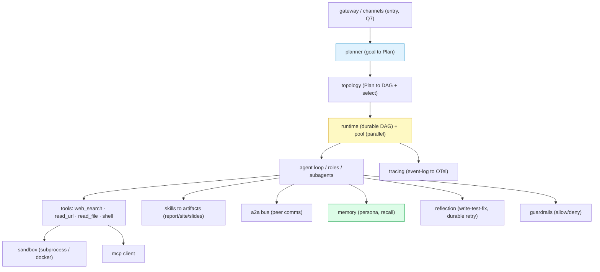

# Proposal — enrich agentkit toward a deer-flow-class SuperAgent

> Goal: be able to build a system with deer-flow's six advertised features using
> **agentkit** primitives. This is a gap analysis + a phased plan. The thesis is
> unchanged: **deterministic-first, Protocol seams, durable execution** — we add
> deer-flow's *capability surface* without importing its heaviness (LangGraph,
> Docker-per-agent, Redis).

## 1. What deer-flow is

`bytedance/deer-flow` (72k★, Python) — *"a long-horizon SuperAgent harness that
researches, codes, and creates, with sandboxes, memories, tools, skills,
subagents and a message gateway; tasks from minutes to hours."* Its harness
package decomposes into these modules:

```
agents · subagents · runtime · sandbox · tools · mcp · skills · reflection
guardrails · persistence · memory(uploads) · tracing · models · config · client
app/{channels, gateway}   contracts/subagent_status_contract.json
```

## 2. Feature → mechanism → agentkit status

| # | deer-flow feature (要点) | deer-flow mechanism | agentkit today | gap |
|---|---|---|---|---|
| 1 | autonomous **planning** + parallel multi-agent | planner + subagents + runtime | `orchestrator` (stall/diversity/select), `topology` (star/tree/mesh), `runtime.pool` (parallel), `agent.roles` | **PARTIAL** — no explicit *Planner* that turns a goal into a multi-step plan/DAG (we have `infer_spec→topology`, not step-level planning) |
| 2 | full-cycle **coding** (write→test→debug→fix loop) | sandbox + reflection | `agent.run_agent` (ReAct), durable retries | **MISSING** — no code/shell **sandbox**; no write→run→observe→fix loop |
| 3 | produce **finished deliverables** (site/report/dashboard/slides) | skills + tools | `agent.roles.WRITER`, `quality.verify` | **PARTIAL** — Writer drafts text; no artifact writers / file output / skill packs |
| 4 | **learns you** (habits/preferences, evolves) | memories | `memory.TieredMemory` (persona L3, `extract_preferences`, depth, SCD-2) | **HAVE** — wire persona auto-inject into every run |
| 5 | read **local files**, deliver final | uploads | — | **MISSING** — no local-file reader/ingest |
| 6 | **web search + terminal + tool calling** | tools + mcp + sandbox | `web_toolkit` (operator-side, demo), `agent` tool registry | **PARTIAL** — web search shown; no shell tool, no MCP client, no tool catalog |

**Verdict.** agentkit already owns the *hard* half deer-flow advertises — the
durable runtime, the topology/selection rules, A2A peer comms, tiered memory,
the parallel pool. What's missing is the **capability surface**: a way for agents
to *execute* (sandbox/shell), *reach tools* (catalog + MCP), *read local files*,
*produce artifacts*, and a *Planner* + *reflection loop* on top. Those are
additive modules behind the existing seam pattern — not a re-architecture.

## 3. What we already have (reuse, don't rebuild)

| capability | agentkit module | serves deer-flow's… |
|---|---|---|
| durable DAG, crash-recovery, retries | `runtime.graph_store` | runtime |
| parallel workers (overlap) | `runtime.pool` | runtime |
| topology selection rules (8-Q) + DAG gen | `topology.core` | planner (shape half) |
| agent ReAct loop + roles + router + batch | `agent.*` | agents / subagents |
| peer comms (A2A bus) + shared context | `topology.a2a` | subagent coordination |
| long-term memory (episodic/semantic/persona) | `memory.tiered` | memories |
| source-grounding verification | `quality.*` | guardrails (partial) |
| vendor seams (Embedder/LLMClient/UrlChecker/ClaimClassifier) | `types`, `backends` | models / client |
| config ↔ code emit, Mermaid | `topology.config` | — |

## 4. Proposed additions (each leverages an existing pattern)

Every new piece is a `typing.Protocol` seam with a deterministic/local default
adapter — the same pattern as `Embedder`/`LLMClient`. Nothing forces a heavy dep.

### Phase 1 — the execution + tool surface (unblocks features 2, 5, 6)

- **`agentkit/sandbox/`** — a `Sandbox` Protocol: `run(cmd|code, *, timeout, cwd) ->
  ExecResult(stdout, stderr, exit_code, duration)`. Default `SubprocessSandbox`
  (argv-not-shell, like `CliLLMClient`; cwd-jailed, timeout, output-capped);
  optional `DockerSandbox` for isolation. **Security is the design point** —
  reuse the `CliLLMClient` argv discipline; never `shell=True`.
  Convergent prior art: youtu-agent's `_BaseEnv` abc puts E2B / SWE-ReX /
  browser / local behind one interface, swapped by config — a second production
  system independently arriving at this Protocol-seam design, which validates
  the `Sandbox`-Protocol choice here and names the concrete backends a
  `DockerSandbox` sibling could grow into (E2B/SWE-ReX for hosted isolation).
- **`agentkit/tools/`** — a small **tool catalog** implementing the existing
  `ToolRegistry` seam: `web_search` (wrap `web_toolkit`), `read_url` (stdlib
  urllib, already in `research_live`), `read_file` (local files: txt/md/csv/pdf →
  text — feature 5), `shell` (→ Sandbox — feature 6). Each is a pure adapter; the
  agent loop already dispatches them.
- **`agentkit/tools/mcp.py`** — an **MCP client** adapter: list + call MCP server
  tools, exposed through the same `ToolRegistry`. Makes "third-party tool
  linkage" (feature 6) a config entry, not code.

### Phase 2 — planner, skills, artifacts (features 1, 3)

- **`agentkit/planner/`** — `plan(goal, client?) -> Plan` where `Plan` is steps +
  dependencies (+ which step is independent/ordered). A deterministic template
  planner for known shapes, plus an LLM planner adapter. **Reuses `topology`**:
  `Plan → TaskSpec/DAG → GraphStore` so planning feeds the durable parallel
  runtime we already have. This is the missing "梳理完整执行方案 then 启动多个分身".
- **`agentkit/skills/`** — a `Skill` = frozen config (name, trigger, ordered
  steps, required tools, output kind) over `run_agent`/`roles` — the same
  config-over-engine pattern as `agent.roles`. Reusable packs: `research_report`,
  `build_site`, `dashboard`, `slides`. A deterministic `dispatch(task)->Skill`
  keyword router (like `roles.dispatch`), optional LLM classifier.
- **`agentkit/artifacts/`** — deliverable writers: `report.md`, a static
  `site/` (HTML), a `dashboard` (data → chart spec → HTML), `slides` (Markdown →
  reveal/PPTX). Turns the Writer's text into *finished* files (feature 3). Files
  are written through the Sandbox/`read_file`'s filesystem seam (auditable).

### Phase 3 — reflection, guardrails, tracing (feature 2 robustness + prod)

- **`agentkit/reflection/`** — the **write→test→fix loop** as a *durable* cycle:
  a `gen → run_tests → critique → fix` sub-DAG where a failed `run_tests` node
  calls `mark_failed`, and `graph_store`'s persistent retry counter requeues
  `gen` — so "自动修复 / 全程自主循环" is the runtime's existing retry primitive,
  not a new while-loop. Reflection verdict is a pure function (like `stall.assess`).
- **`agentkit/guardrails/`** — a `Guardrail` Protocol (allow/deny + reason) run
  before a tool/sandbox call: command allowlist, path jail, network policy,
  cost ceiling. Generalises the existing `quarantine` + `cost`-aware ideas.
- **`agentkit/tracing/`** — a `Tracer` seam over the `executions` event log we
  already write: per-node tokens/wall/exit, exportable (OTel/Phoenix adapter).
  Observability without a hard dep.

### Phase 4 — gateway / channels (feature 6 multi-entry; the GATEWAY topology made real)

- **`agentkit/gateway/`** — the `topology.GATEWAY` cell, implemented: a
  `Channel` Protocol (Slack/Telegram/CLI/HTTP) + a router binding an inbound
  message's identity → an agent/skill, *upstream* of any per-task topology (the
  §2.7 Q7 rule). The `scheduler`'s webhook trigger already models the entry edge.

## 5. Architecture (where the new modules sit)



> Bold/colored = already built (`runtime`, `memory`, and `topology` is the
> planner's shape engine). The rest are the additive seams above.

## 6. Build order + effort

| phase | modules | unblocks features | leans on |
|---|---|---|---|
| 1 | `sandbox`, `tools` (+`read_file`,`shell`), `tools/mcp` | 2, 5, 6 | `ToolRegistry` seam, `CliLLMClient` argv discipline |
| 2 | `planner`, `skills`, `artifacts` | 1, 3 | `topology`, `agent.roles`, durable DAG |
| 3 | `reflection`, `guardrails`, `tracing` | 2 (robust), prod | `graph_store` retries, `stall.assess`, `executions` log |
| 4 | `gateway`/`channels` | 6 (multi-entry) | `topology.GATEWAY`, `scheduler` webhook |

Phase 1 is the highest-leverage: a Sandbox + a tool catalog turns the existing
loop/roles/runtime into something that can *actually do work* (run code, read
files, search) — features 2/5/6 — which is the bulk of deer-flow's "干活".

## 7. Deliberately NOT building (scope discipline)

- No LangGraph / framework dependency — agentkit stays seam-based.
- No Docker-per-agent or Redis by default — `SubprocessSandbox` + SQLite/file-lock
  already give durable, bounded, single-host execution; Docker/Redis are optional
  adapters behind the same seams.
- No bespoke frontend — agentkit is a library; a UI is an operator concern.

## 8. The one-line pitch

agentkit already is the durable, rule-driven, multi-topology *brain*; deer-flow's
edge is its *hands* (sandbox, tools, files, artifacts) and a *planner*. Add those
as Protocol-seam modules (Phase 1–2) and agentkit can host a deer-flow-class
SuperAgent — deterministic-first, local, dependency-light.
